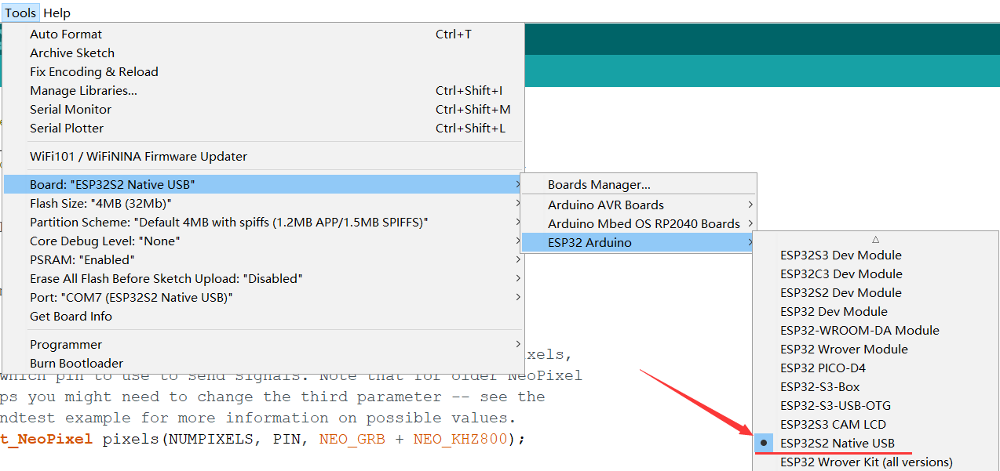

# Environment construction

> Refer to [arduino-esp32 DOC Getting Started » Installing](https://docs.espressif.com/projects/arduino-esp32/en/latest/installing.html)

## Install support using the Arduino IDE

Here's how to install the Arduino-ESP32 directly from the Arduino IDE.

> Starting with Arduino IDE version 1.6.4, Arduino allows installing third-party platform packages using the Boards Manager. There are packages for Windows, macOS, and Linux.

Arduino IDE download link: https://www.arduino.cc/en/software

> The UI of Arduino IDE 2.0 is slightly different from Arduino IDE 1.8.x. This article is written based on version 1.8.13, but it does not affect the reference of users who use version 2.0.

To install the esp32 platform package using Boards Managaer, follow these steps:

- Install current upstream Arduino IDE 1.8 or higher.

- Start Arduino and open the File > Preferences window and find Additional Board Manager URLs.


- Stable version link:
```
https://raw.githubusercontent.com/espressif/arduino-esp32/gh-pages/package_esp32_index.json
```
- Development version link:
```
https://raw.githubusercontent.com/espressif/arduino-esp32/gh-pages/package_esp32_dev_index.json
```
- Enter one of the release links above after Additional Board Manager URLs. You can add multiple URLs, one per line.


Open Tools > Board > Board Manager from the menu to search and install the esp32 platform.


After restarting the arduino IDE, you can see that there is an ESP32 Arduino option in the development board option.

Select the model `ESP32S2 Native USB`, and then refer to the content shown in the figure below to configure it again. Improper configuration will not work, please be sure to configure it according to the content shown in the figure below!

