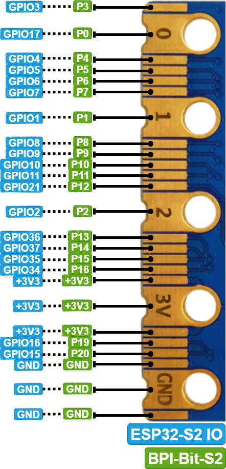

# 板载资源的使用

本章主要是通过一些示例项目，阐述 BPI-Bit-S2 的外设的基本使用方法，通过下面的项目，您可以进行修改完成您的自己的项目。

> 上传代码时需要将 BPI-Bit-S2 开发板置于bootloader模式。

确保有一根type-c数据线，一端连接到PC，拿起开发板，保持上面无任何连线或外围硬件，按住Boot按钮，将type-c数据线与开发板连接，松开Boot按钮，在 Tools > Ports中选择新出现的端口。

点击 Upload 即可将代码编译并上传到开发板中。

## 项目一 WS2812

 BPI-Bit-S2 使用25颗WS2812彩灯。 本项目是点亮 BPI-Bit-S2 的RGB彩灯的实验。

### 所需元件

BPI-Bit-S2 主板 X 1


>注意：该项目不需要连接其他传感器。

### 输入代码

打开 Arduino IDE。尽管可以直接复制代码，我们还是建议您自己手动输入代码熟悉下。 （这个程序需要Adafruit_NeoPixel库，需要在[GitHub](https://github.com/adafruit/Adafruit_NeoPixel)下载，解压到Arduino\ Library 文件夹下）代码如下:

<details>
<summary>展开查看</summary>

<pre><code>
// NeoPixel Ring simple sketch (c) 2013 Shae Erisson
// Released under the GPLv3 license to match the rest of the
// Adafruit NeoPixel library

#include <Adafruit_NeoPixel.h>
#ifdef __AVR__
 #include <avr/power.h> // Required for 16 MHz Adafruit Trinket
#endif

// Which pin on the Arduino is connected to the NeoPixels?
#define PIN        18 // On Trinket or Gemma, suggest changing this to 1

// How many NeoPixels are attached to the Arduino?
#define NUMPIXELS 25 // Popular NeoPixel ring size

// When setting up the NeoPixel library, we tell it how many pixels,
// and which pin to use to send signals. Note that for older NeoPixel
// strips you might need to change the third parameter -- see the
// strandtest example for more information on possible values.
Adafruit_NeoPixel pixels(NUMPIXELS, PIN, NEO_GRB + NEO_KHZ800);

#define DELAYVAL 500 // Time (in milliseconds) to pause between pixels

void setup() {
  // These lines are specifically to support the Adafruit Trinket 5V 16 MHz.
  // Any other board, you can remove this part (but no harm leaving it):
#if defined(__AVR_ATtiny85__) && (F_CPU == 16000000)
  clock_prescale_set(clock_div_1);
#endif
  // END of Trinket-specific code.

  pixels.begin(); // INITIALIZE NeoPixel strip object (REQUIRED)
}

void loop() {
  pixels.clear(); // Set all pixel colors to 'off'

  // The first NeoPixel in a strand is #0, second is 1, all the way up
  // to the count of pixels minus one.
  for(int i=0; i < NUMPIXELS; i++) { // For each pixel...

    // pixels.Color() takes RGB values, from 0,0,0 up to 255,255,255
    // Here we're using a moderately bright green color:
    pixels.setPixelColor(i, pixels.Color(25, 25, 25));

    pixels.show();   // Send the updated pixel colors to the hardware.

    delay(DELAYVAL); // Pause before next pass through loop
  }
}
</code></pre>
</details>

输入完成后，点击“编译”检查代码有无错误。确保没有错误后就可以开始上传了，点击“上传”之后 IDE  会把代码发送给 BPI-Bit-S2 主板。复位后WS2812灯会开始亮绿灯，

>注意：如果需要其他颜色，可以修改代码中的RGB值。

### 代码分析

本项目使用 BPI-Bit-S2 集成的WS2812灯，默认GPIO是18。

```
#define PIN        18
```

设置GPIO引脚号

```
#define NUMPIXELS 25 
```

设置灯的个数，如果您想连接更多WS2812 彩灯，可以换一个IO，并修改灯的数量。 

## 项目二 触摸传感器

BPI-Bit-S2 提供了多达 11 个可用的电容式传感器 GPIO，能够探测由手指或其他物品直接接触或接近而产生的电容差异。这种低噪声特性和电路的高灵敏度设计适用于较小的触摸板，可以直接用于触摸开关。本项目阐述了如何通过Arduino 代码获取 BPI-Bit-S2 的触摸传感器状态，并打印状态。

### 所需元件

BPI-Bit-S2 主板 X 1


>注意：该项目不需要连接其他传感器。

### 输入代码

打开 Arduino IDE。尽管可以直接复制代码，我们还是建议您自己手动输入代码熟悉下。  

代码如下:

<details>
<summary>展开查看</summary>

<pre><code>
 void setup() 
{ 
  Serial.begin(115200); 
      delay(1000); // give me time to bring up serial monitor 
      Serial.println("BPI-Bit-S2 Touch Test");    
}  
void loop(){ 
  Serial.println(touchRead(T2));  // get value using T0->D9  
  delay(100); 
} 

</code></pre>
</details>

输入完成后，点击“编译”检查代码有无错误。确保没有错误后就可以开始上传了，点击“上传”之后 IDE  会把代码发送给 BPI-Bit-S2 主板。打开 Arduino IDE 串口监视器，并用手触摸 GPIO2（T2 对应的是GPIO2），可以看到会打印出的数据突然变小，如下图所示： 


### 代码分析

获取触摸传感器的 GPIO 状态，只需要调用 touchRead 函数，函数原型如下：

```
 uint16_t touchRead(uint8_t pin)
```

返回“0”表示没有触摸，“1”表示触摸。其中 pin 是 T0~T9，对应到 BPI-Bit-S2的引脚如下表所示：



<table>
   <tr>
      
   </tr>
   <tr>
      <td>触摸传感器序号 </td>
      <td>对应的 ESP32 硬件 </td>
      <td>BPI-Bit-S2</td>
   </tr>
   <tr>
      <td>T1</td>
      <td>GPIO1</td>
      <td>P1</td>
   </tr>
   <tr>
      <td>T2 </td>
      <td>GPIO2 </td>
      <td>P2</td>
   </tr>
   <tr>
      <td>T3 </td>
      <td>GPIO3</td>
      <td>P3</td>
   </tr>
   <tr>
      <td>T4 </td>
      <td>GPIO4</td>
      <td>P4</td>
   </tr>
   <tr>
      <td>T5 </td>
      <td>GPIO5</td>
      <td>P5</td>
   </tr>
   <tr>
      <td>T6 </td>
      <td>GPIO6</td>
      <td>P6</td>
   </tr>
   <tr>
      <td>T7 </td>
      <td>GPIO7</td>
      <td>P7</td>
   </tr>
   <tr>
      <td>T8 </td>
      <td>GPIO8</td>
      <td>P8</td>
   </tr>
   <tr>
      <td>T9 </td>
      <td>GPIO9</td>
      <td>P9</td>
   </tr>
   <tr>
      <td>T10</td>
      <td>GPIO10</td>
      <td>P10</td>
   </tr>
   <tr>
      <td>T11</td>
      <td>GPIO11</td>
      <td>P11</td>
   </tr>
</table>

## 项目三 串口实验

在最开始的章节中，我们上传了一个 Blink 闪烁程序来测试板子上的 LED 状态灯。现在，我们使用 UART 串口，每秒打印一次计时数据。

### 所需元件

BPI-Bit-S2 主板 X 1


### 硬件连接 

此项目不需要其他传感器，所以只需要把BPI-Bit-S2用USB连到电脑就能用。

### 输入代码 

打开 Arduino IDE。尽管可以直接复制代码，我们还是建议您自己手动输入代码熟悉下。 

代码如下:  

<details>
<summary>展开查看</summary>

<pre><code>
void setup() 
{
  Serial.begin(115200);         //设置串口通信波特率
} 
void loop() 
{
  static unsigned long i = 0;   //定义变量i
  Serial.println(i++);          //i加一后输出i
  delay(1000);                  //延时1秒
} 
</code></pre>
</details>

输入完成后，点击“编译”检查代码有无错误。确保没有错误后就可以开始上传了，点击“上传”之后 IDE 会把代码发送给 BPI-Bit-S2 主板。上传完成之后，你需要按一下复位键，这样代码就能正常运行了

### 实验现象

完成之前步骤的上传后，打开 Arduino IDE 自带的串口监视器，可以看到如下的打印信息： 


## 项目四 PWM(呼吸灯)

呼吸灯，即让 BPI-Bit-S2 通过 PWM 驱动 LED 灯，实现 LED 的亮度渐变，看起来就像是在呼吸一样。关于 PWM 的解释，请阅览知识扩展部分。 

### 所需元件

BPI-Bit-S2 主板 X 1


LED X 1 (建议串联一个电阻限流)


### 硬件连接

将LED连接到BPI-Bit-S2的GPIO17就可以了，长的那个脚接GPIO17，短的接到GND

### 输入代码 

打开 Arduino IDE。尽管可以直接复制代码，我们还是建议您自己手动输入代码熟悉下。 
代码如下: 

<details>
<summary>展开查看</summary>

<pre><code>
#define LED_CHANNEL_0     0    //设置通道0 
#define LED_TIMER_13_BIT  13   //设置13位定时器
#define LED_BASE_FREQ     5000 //设置定时器频率位5000Hz 
#define LED_PIN            13  //设置LED灯 

int brightness = 0;    // LED亮度
int fadeAmount = 1;    // LED数量
 
//设置led灯的亮度 
void ledcAnalogWrite(uint32_t value, uint32_t valueMax = 255) { 
  //计算占空比 
  uint32_t duty = (LED_BASE_FREQ / valueMax) * min(value, valueMax); 
  //设置占空比 
  ledcWrite(LED_CHANNEL_0, duty); 
}  
void setup() { 
  ledcSetup(LED_CHANNEL_0, LED_BASE_FREQ, LED_TIMER_13_BIT);   ledcAttachPin(LED_PIN, LED_CHANNEL_0); 
}  
void loop() { 
  ledcAnalogWrite(brightness);   brightness += fadeAmount; 
 
  if (brightness <= 0 || brightness >= 255) { 
       fadeAmount = -fadeAmount; 
  }   
  delay(30); 
}

</code></pre>
</details>

输入完成后，点击“编译”按钮检查代码是否有错误。确定没有错误后可以开始上传了，点击“上传”按钮 。IDE 会把代码发送给 BPI-Bit-S2 主板。上传完成后您就可以看见Type-C旁边的LED 灯开始“呼吸”了！
现在让我们来回顾一下代码和硬件，看看它是如何工作。

### 知识学习

什么是 PWM 控制信号？ 

PWM（pulse-width modulation）脉冲宽度调制，MCU（微控制器）通过对开关器件的通断进行控制，使输出端得到一系列幅值相等的脉冲，用这些脉冲来代替正弦波或所需的波形。如下图所示：


其中，tON 是高电平持续时间，tPWM 是 PWM 波的周期，tPWM-tON 是低电平持续时间，占空比是指高电平持续时间占整个周期的比例，即 D=ton/tPWM 。

### 代码分析

BPI-Bit-S2 的 PWM 比普通的 Arduino UNO 高级的多，设置上不能简单的使用analogWrite 函数来驱动 PWM，而是需要设置 timer 函数，以及相关的频率参数等才能工作。 

```
#define LEDC_CHANNEL_0     0
```

定义了定时器使用的通道，BPI-Bit-S2 总共有 16 个通道，这里用的是通道 0。

```
#define LEDC_TIMER_13_BIT  13
```

定义了定时器为 13 位定时器，即定时器最大计数为 2 的 13 次方。 

```
#define LEDC_BASE_FREQ     5000
```

这是设置定时器的频率，单位是 Hz。接下来的 brightness 和 fadeAmount 参数分别表示 PWM 的占空比和每次变化的数值。 

```
void ledcAnalogWrite(uint32_t value, uint32_t valueMax = 255)
```

这个函数是计算 PWM 占空比和设置 PWM 占空比，类似 Arduino 的 analogWrite 函数，可以看到，传递参数的最大值是 255，这是为了和 analogWrite 兼容。 

```
ledcSetup(LEDC_CHANNEL_0, LEDC_BASE_FREQ, LEDC_TIMER_13_BIT); 
	       ledcAttachPin(LED_PIN, LEDC_CHANNEL_0);
```

这两个函数是 BPI-Bit-S2 定时器设置函数，函数原型及原理这里不讲述，如果您感兴趣可以看看底层源码（源码地址：C:\Users\“your-PC”\AppData\Local\Arduino15\packages\esp32\ hardware\ adafruit_metro_esp32s2 \0.0.3\libraries\ESP32\），这里只需要知道怎么用这些函数来设置相关的 timer 就可以了。 

关于什么是 PWM 信号，在前面已经阐述过了，这里不再说明。 

>注意：BPI-Bit-S2 的任何引脚都可以配置成 PWM 输出，您可以尝试着修改代码，完成您的项目。

## 项目五 ADC 

ADC（模数转换器即 A/D 转换器），是指将模拟信号转变成数字信号。BPI-Bit-S2 的ADC 是13位的，最大输出值为 8191，而 Arduino UNO 是 10 位的，最大输出值是 1023，因此，在精度上比Arduino UNO 要高，而且转换速率快，且在使用上兼容 Arduino analogRead 函数，直接读取即可。

### 所需元件 

模拟角度传感器 X 1


面包板 X 1


BPI-Bit-S2 主板 X 1


### 硬件连接 

 把 电位计插接到 BPI-Bit-S2 主板上，然后将模拟角度传感器插接到 IO2（实验中用的是IO2）。  元件连接好后，使用 USB 线连接 BPI-Bit-S2 和电脑。 

 ### 输入代码

 打开 Arduino IDE。尽管可以直接复制代码，我们还是建议您自己手动输入代码熟悉下。代码如下: 

<details>
<summary>展开查看</summary>

<pre><code>
 void setup() { 
  // put your setup code here, to run once: 
  Serial.begin(115200); 
}  
void loop() { 
  // put your main code here, to run repeatedly:   
  Serial.println(analogRead(2));  
  delay(100); 
}

</code></pre>
</details>

 输入完成后，点击“编译”检查代码有无错误。确保没有错误后就可以开始上传了，点击“上传”之后IDE 会把代码发送给 BPI-Bit-S2 主板。上传完成后，打开 Arduino IDE 的串口监视器，旋转模拟角度传感器，可以看到串口监视器中的数值变化，如下图所示：

 


### 代码分析

由于BPI-Bit-S2 的 ADC 在使用上完全兼容 Arduino，因此这里不再对analogRead 函数进行过多的讲解。 
 
注意：如果您对 Arduino 的基本函数不是特别熟悉，您可以[点击链接](https://www.arduino.cc/en/Tutorial/BuiltInExamples)进行学习。 

## 项目六 I2C

BPI-Bit-S2 的 I2C 可以配置到任意 I/O 口，您可以通过传递相关参数进行配置。为了方便使用，我们已经将 I2C 进行了默认配置，在使用上完全兼容 Arduino，默认配置引脚可以在第一章简介中查看到。本项目是基于 I2C 默认配置，驱动 OLED 显示屏。 

所需元件

I2C OLED-12864 显示屏 X 1 


面包板 X 1


BPI-Bit-S2 主板 X 1


### 硬件连接

把BPI-Bit-S2 主板插到面包板上，然后将 OLED显示屏插接到 I2C 接口。（SDA是33，SCL是34）元件连接好后，使用 USB 线连接 BPI-Bit-S2 和电脑。

### 输入代码 

打开 Arduino IDE。尽管可以直接复制代码，我们还是建议您自己手动输入代码熟悉下。代码如下:

<details>
<summary>展开查看</summary>

<pre><code>
#include <Wire.h> 
   int UG2864Address = 0x3C;//OLED UG2864器件7位地址 
 
prog_char F8X16[][16] PROGMEM =
{
  0x00,0x00,0x00,0x00,0x00,0x00,0x00,0x00,0x00,0x00,0x00,0x00,0x00,0x00,0x00,0x00,// 0
  0x00,0x00,0x00,0xF8,0x00,0x00,0x00,0x00,0x00,0x00,0x00,0x33,0x30,0x00,0x00,0x00,//!1
  0x00,0x10,0x0C,0x06,0x10,0x0C,0x06,0x00,0x00,0x00,0x00,0x00,0x00,0x00,0x00,0x00,//"2
  0x40,0xC0,0x78,0x40,0xC0,0x78,0x40,0x00,0x04,0x3F,0x04,0x04,0x3F,0x04,0x04,0x00,//#3
  0x00,0x70,0x88,0xFC,0x08,0x30,0x00,0x00,0x00,0x18,0x20,0xFF,0x21,0x1E,0x00,0x00,//$4
  0xF0,0x08,0xF0,0x00,0xE0,0x18,0x00,0x00,0x00,0x21,0x1C,0x03,0x1E,0x21,0x1E,0x00,//%5
  0x00,0xF0,0x08,0x88,0x70,0x00,0x00,0x00,0x1E,0x21,0x23,0x24,0x19,0x27,0x21,0x10,//&6
  0x10,0x16,0x0E,0x00,0x00,0x00,0x00,0x00,0x00,0x00,0x00,0x00,0x00,0x00,0x00,0x00,//'7
  0x00,0x00,0x00,0xE0,0x18,0x04,0x02,0x00,0x00,0x00,0x00,0x07,0x18,0x20,0x40,0x00,//(8
  0x00,0x02,0x04,0x18,0xE0,0x00,0x00,0x00,0x00,0x40,0x20,0x18,0x07,0x00,0x00,0x00,//)9
  0x40,0x40,0x80,0xF0,0x80,0x40,0x40,0x00,0x02,0x02,0x01,0x0F,0x01,0x02,0x02,0x00,//*10
  0x00,0x00,0x00,0xF0,0x00,0x00,0x00,0x00,0x01,0x01,0x01,0x1F,0x01,0x01,0x01,0x00,//+11
  0x00,0x00,0x00,0x00,0x00,0x00,0x00,0x00,0x80,0xB0,0x70,0x00,0x00,0x00,0x00,0x00,//,12
  0x00,0x00,0x00,0x00,0x00,0x00,0x00,0x00,0x00,0x01,0x01,0x01,0x01,0x01,0x01,0x01,//-13
  0x00,0x00,0x00,0x00,0x00,0x00,0x00,0x00,0x00,0x30,0x30,0x00,0x00,0x00,0x00,0x00,//.14
  0x00,0x00,0x00,0x00,0x80,0x60,0x18,0x04,0x00,0x60,0x18,0x06,0x01,0x00,0x00,0x00,///15
  0x00,0xE0,0x10,0x08,0x08,0x10,0xE0,0x00,0x00,0x0F,0x10,0x20,0x20,0x10,0x0F,0x00,//016
  0x00,0x10,0x10,0xF8,0x00,0x00,0x00,0x00,0x00,0x20,0x20,0x3F,0x20,0x20,0x00,0x00,//117
  0x00,0x70,0x08,0x08,0x08,0x88,0x70,0x00,0x00,0x30,0x28,0x24,0x22,0x21,0x30,0x00,//218
  0x00,0x30,0x08,0x88,0x88,0x48,0x30,0x00,0x00,0x18,0x20,0x20,0x20,0x11,0x0E,0x00,//319
  0x00,0x00,0xC0,0x20,0x10,0xF8,0x00,0x00,0x00,0x07,0x04,0x24,0x24,0x3F,0x24,0x00,//420
  0x00,0xF8,0x08,0x88,0x88,0x08,0x08,0x00,0x00,0x19,0x21,0x20,0x20,0x11,0x0E,0x00,//521
  0x00,0xE0,0x10,0x88,0x88,0x18,0x00,0x00,0x00,0x0F,0x11,0x20,0x20,0x11,0x0E,0x00,//622
  0x00,0x38,0x08,0x08,0xC8,0x38,0x08,0x00,0x00,0x00,0x00,0x3F,0x00,0x00,0x00,0x00,//723
  0x00,0x70,0x88,0x08,0x08,0x88,0x70,0x00,0x00,0x1C,0x22,0x21,0x21,0x22,0x1C,0x00,//824
  0x00,0xE0,0x10,0x08,0x08,0x10,0xE0,0x00,0x00,0x00,0x31,0x22,0x22,0x11,0x0F,0x00,//925
  0x00,0x00,0x00,0xC0,0xC0,0x00,0x00,0x00,0x00,0x00,0x00,0x30,0x30,0x00,0x00,0x00,//:26
  0x00,0x00,0x00,0x80,0x00,0x00,0x00,0x00,0x00,0x00,0x80,0x60,0x00,0x00,0x00,0x00,//;27
  0x00,0x00,0x80,0x40,0x20,0x10,0x08,0x00,0x00,0x01,0x02,0x04,0x08,0x10,0x20,0x00,//<28
  0x40,0x40,0x40,0x40,0x40,0x40,0x40,0x00,0x04,0x04,0x04,0x04,0x04,0x04,0x04,0x00,//=29
  0x00,0x08,0x10,0x20,0x40,0x80,0x00,0x00,0x00,0x20,0x10,0x08,0x04,0x02,0x01,0x00,//>30
  0x00,0x70,0x48,0x08,0x08,0x08,0xF0,0x00,0x00,0x00,0x00,0x30,0x36,0x01,0x00,0x00,//?31
  0xC0,0x30,0xC8,0x28,0xE8,0x10,0xE0,0x00,0x07,0x18,0x27,0x24,0x23,0x14,0x0B,0x00,//@32
  0x00,0x00,0xC0,0x38,0xE0,0x00,0x00,0x00,0x20,0x3C,0x23,0x02,0x02,0x27,0x38,0x20,//A33
  0x08,0xF8,0x88,0x88,0x88,0x70,0x00,0x00,0x20,0x3F,0x20,0x20,0x20,0x11,0x0E,0x00,//B34
  0xC0,0x30,0x08,0x08,0x08,0x08,0x38,0x00,0x07,0x18,0x20,0x20,0x20,0x10,0x08,0x00,//C35
  0x08,0xF8,0x08,0x08,0x08,0x10,0xE0,0x00,0x20,0x3F,0x20,0x20,0x20,0x10,0x0F,0x00,//D36
  0x08,0xF8,0x88,0x88,0xE8,0x08,0x10,0x00,0x20,0x3F,0x20,0x20,0x23,0x20,0x18,0x00,//E37
  0x08,0xF8,0x88,0x88,0xE8,0x08,0x10,0x00,0x20,0x3F,0x20,0x00,0x03,0x00,0x00,0x00,//F38
  0xC0,0x30,0x08,0x08,0x08,0x38,0x00,0x00,0x07,0x18,0x20,0x20,0x22,0x1E,0x02,0x00,//G39
  0x08,0xF8,0x08,0x00,0x00,0x08,0xF8,0x08,0x20,0x3F,0x21,0x01,0x01,0x21,0x3F,0x20,//H40
  0x00,0x08,0x08,0xF8,0x08,0x08,0x00,0x00,0x00,0x20,0x20,0x3F,0x20,0x20,0x00,0x00,//I41
  0x00,0x00,0x08,0x08,0xF8,0x08,0x08,0x00,0xC0,0x80,0x80,0x80,0x7F,0x00,0x00,0x00,//J42
  0x08,0xF8,0x88,0xC0,0x28,0x18,0x08,0x00,0x20,0x3F,0x20,0x01,0x26,0x38,0x20,0x00,//K43
  0x08,0xF8,0x08,0x00,0x00,0x00,0x00,0x00,0x20,0x3F,0x20,0x20,0x20,0x20,0x30,0x00,//L44
  0x08,0xF8,0xF8,0x00,0xF8,0xF8,0x08,0x00,0x20,0x3F,0x00,0x3F,0x00,0x3F,0x20,0x00,//M45
  0x08,0xF8,0x30,0xC0,0x00,0x08,0xF8,0x08,0x20,0x3F,0x20,0x00,0x07,0x18,0x3F,0x00,//N46
  0xE0,0x10,0x08,0x08,0x08,0x10,0xE0,0x00,0x0F,0x10,0x20,0x20,0x20,0x10,0x0F,0x00,//O47
  0x08,0xF8,0x08,0x08,0x08,0x08,0xF0,0x00,0x20,0x3F,0x21,0x01,0x01,0x01,0x00,0x00,//P48
  0xE0,0x10,0x08,0x08,0x08,0x10,0xE0,0x00,0x0F,0x18,0x24,0x24,0x38,0x50,0x4F,0x00,//Q49
  0x08,0xF8,0x88,0x88,0x88,0x88,0x70,0x00,0x20,0x3F,0x20,0x00,0x03,0x0C,0x30,0x20,//R50
  0x00,0x70,0x88,0x08,0x08,0x08,0x38,0x00,0x00,0x38,0x20,0x21,0x21,0x22,0x1C,0x00,//S51
  0x18,0x08,0x08,0xF8,0x08,0x08,0x18,0x00,0x00,0x00,0x20,0x3F,0x20,0x00,0x00,0x00,//T52
  0x08,0xF8,0x08,0x00,0x00,0x08,0xF8,0x08,0x00,0x1F,0x20,0x20,0x20,0x20,0x1F,0x00,//U53
  0x08,0x78,0x88,0x00,0x00,0xC8,0x38,0x08,0x00,0x00,0x07,0x38,0x0E,0x01,0x00,0x00,//V54
  0xF8,0x08,0x00,0xF8,0x00,0x08,0xF8,0x00,0x03,0x3C,0x07,0x00,0x07,0x3C,0x03,0x00,//W55
  0x08,0x18,0x68,0x80,0x80,0x68,0x18,0x08,0x20,0x30,0x2C,0x03,0x03,0x2C,0x30,0x20,//X56
  0x08,0x38,0xC8,0x00,0xC8,0x38,0x08,0x00,0x00,0x00,0x20,0x3F,0x20,0x00,0x00,0x00,//Y57
  0x10,0x08,0x08,0x08,0xC8,0x38,0x08,0x00,0x20,0x38,0x26,0x21,0x20,0x20,0x18,0x00,//Z58
  0x00,0x00,0x00,0xFE,0x02,0x02,0x02,0x00,0x00,0x00,0x00,0x7F,0x40,0x40,0x40,0x00,//[59
  0x00,0x0C,0x30,0xC0,0x00,0x00,0x00,0x00,0x00,0x00,0x00,0x01,0x06,0x38,0xC0,0x00,//\60
  0x00,0x02,0x02,0x02,0xFE,0x00,0x00,0x00,0x00,0x40,0x40,0x40,0x7F,0x00,0x00,0x00,//]61
  0x00,0x00,0x04,0x02,0x02,0x02,0x04,0x00,0x00,0x00,0x00,0x00,0x00,0x00,0x00,0x00,//^62
  0x00,0x00,0x00,0x00,0x00,0x00,0x00,0x00,0x80,0x80,0x80,0x80,0x80,0x80,0x80,0x80,//_63
  0x00,0x02,0x02,0x04,0x00,0x00,0x00,0x00,0x00,0x00,0x00,0x00,0x00,0x00,0x00,0x00,//`64
  0x00,0x00,0x80,0x80,0x80,0x80,0x00,0x00,0x00,0x19,0x24,0x22,0x22,0x22,0x3F,0x20,//a65
  0x08,0xF8,0x00,0x80,0x80,0x00,0x00,0x00,0x00,0x3F,0x11,0x20,0x20,0x11,0x0E,0x00,//b66
  0x00,0x00,0x00,0x80,0x80,0x80,0x00,0x00,0x00,0x0E,0x11,0x20,0x20,0x20,0x11,0x00,//c67
  0x00,0x00,0x00,0x80,0x80,0x88,0xF8,0x00,0x00,0x0E,0x11,0x20,0x20,0x10,0x3F,0x20,//d68
  0x00,0x00,0x80,0x80,0x80,0x80,0x00,0x00,0x00,0x1F,0x22,0x22,0x22,0x22,0x13,0x00,//e69
  0x00,0x80,0x80,0xF0,0x88,0x88,0x88,0x18,0x00,0x20,0x20,0x3F,0x20,0x20,0x00,0x00,//f70
  0x00,0x00,0x80,0x80,0x80,0x80,0x80,0x00,0x00,0x6B,0x94,0x94,0x94,0x93,0x60,0x00,//g71
  0x08,0xF8,0x00,0x80,0x80,0x80,0x00,0x00,0x20,0x3F,0x21,0x00,0x00,0x20,0x3F,0x20,//h72
  0x00,0x80,0x98,0x98,0x00,0x00,0x00,0x00,0x00,0x20,0x20,0x3F,0x20,0x20,0x00,0x00,//i73
  0x00,0x00,0x00,0x80,0x98,0x98,0x00,0x00,0x00,0xC0,0x80,0x80,0x80,0x7F,0x00,0x00,//j74
  0x08,0xF8,0x00,0x00,0x80,0x80,0x80,0x00,0x20,0x3F,0x24,0x02,0x2D,0x30,0x20,0x00,//k75
  0x00,0x08,0x08,0xF8,0x00,0x00,0x00,0x00,0x00,0x20,0x20,0x3F,0x20,0x20,0x00,0x00,//l76
  0x80,0x80,0x80,0x80,0x80,0x80,0x80,0x00,0x20,0x3F,0x20,0x00,0x3F,0x20,0x00,0x3F,//m77
  0x80,0x80,0x00,0x80,0x80,0x80,0x00,0x00,0x20,0x3F,0x21,0x00,0x00,0x20,0x3F,0x20,//n78
  0x00,0x00,0x80,0x80,0x80,0x80,0x00,0x00,0x00,0x1F,0x20,0x20,0x20,0x20,0x1F,0x00,//o79
  0x80,0x80,0x00,0x80,0x80,0x00,0x00,0x00,0x80,0xFF,0xA1,0x20,0x20,0x11,0x0E,0x00,//p80
  0x00,0x00,0x00,0x80,0x80,0x80,0x80,0x00,0x00,0x0E,0x11,0x20,0x20,0xA0,0xFF,0x80,//q81
  0x80,0x80,0x80,0x00,0x80,0x80,0x80,0x00,0x20,0x20,0x3F,0x21,0x20,0x00,0x01,0x00,//r82
  0x00,0x00,0x80,0x80,0x80,0x80,0x80,0x00,0x00,0x33,0x24,0x24,0x24,0x24,0x19,0x00,//s83
  0x00,0x80,0x80,0xE0,0x80,0x80,0x00,0x00,0x00,0x00,0x00,0x1F,0x20,0x20,0x00,0x00,//t84
  0x80,0x80,0x00,0x00,0x00,0x80,0x80,0x00,0x00,0x1F,0x20,0x20,0x20,0x10,0x3F,0x20,//u85
  0x80,0x80,0x80,0x00,0x00,0x80,0x80,0x80,0x00,0x01,0x0E,0x30,0x08,0x06,0x01,0x00,//v86
  0x80,0x80,0x00,0x80,0x00,0x80,0x80,0x80,0x0F,0x30,0x0C,0x03,0x0C,0x30,0x0F,0x00,//w87
  0x00,0x80,0x80,0x00,0x80,0x80,0x80,0x00,0x00,0x20,0x31,0x2E,0x0E,0x31,0x20,0x00,//x88
  0x80,0x80,0x80,0x00,0x00,0x80,0x80,0x80,0x80,0x81,0x8E,0x70,0x18,0x06,0x01,0x00,//y89
  0x00,0x80,0x80,0x80,0x80,0x80,0x80,0x00,0x00,0x21,0x30,0x2C,0x22,0x21,0x30,0x00,//z90
  0x00,0x00,0x00,0x00,0x80,0x7C,0x02,0x02,0x00,0x00,0x00,0x00,0x00,0x3F,0x40,0x40,//{91
  0x00,0x00,0x00,0x00,0xFF,0x00,0x00,0x00,0x00,0x00,0x00,0x00,0xFF,0x00,0x00,0x00,//|92
  0x00,0x02,0x02,0x7C,0x80,0x00,0x00,0x00,0x00,0x40,0x40,0x3F,0x00,0x00,0x00,0x00,//}93
  0x00,0x06,0x01,0x01,0x02,0x02,0x04,0x04,0x00,0x00,0x00,0x00,0x00,0x00,0x00,0x00,//~94
};
 
 
char ch_buf[17]={0};
int RES = 6;//Gadgeteer PIN6
int DC = 7;//Gadgeteer PIN3
 
void Writec(unsigned char COM)
{
  Wire.beginTransmission(UG2864Address);
  Wire.write(0x00);
  Wire.write(COM);
  Wire.endTransmission();
}
 
void Writed(unsigned char DATA)
{
  Wire.beginTransmission(UG2864Address);
  Wire.write(0x40);
  Wire.write(DATA);
  Wire.endTransmission();
}
 
void SSD1306()
{
  Writec(0XAE);//display off
  Writec(0X00);//set lower column address
  Writec(0X10);//set higher column address
  Writec(0X40);//set display start line
  Writec(0XB0);//set page address
  Writec(0X81);//set contract control
  Writec(0XCF);// VCC Generated by Internal DC/DC Circuit
  Writec(0XA0);//set segment remap  column address 127 is mapped to SEG0
  Writec(0XA6);//normal / reverse   normal display
  Writec(0XA8);//multiplex ratio
  Writec(0X3F);//1/64
  Writec(0XC0);//Com scan direction remapped mode. Scan from COM[N-1] to COM0
  Writec(0XD3);//set display offset
  Writec(0X00);
  Writec(0XD5);//set osc division
  Writec(0X80);
  Writec(0XD9);//set pre-charge period
  Writec(0X11);
  Writec(0XDa);//set COM pins
  Writec(0X12);
  Writec(0X8d);/*set charge pump enable*/
  Writec(0X14);
  Writec(0Xdb);//Set VcomH
  Writec(0X20);
  Writec(0XAF);//display ON
}
void fill(unsigned char dat)
{
  unsigned char i,j;
  
  Writec(0x00);//set lower column address
  Writec(0x10);//set higher column address
  Writec(0xB0);//set page address
  
  for(j=0;j<8;j++)
  {
    Writec(0xB0+j);//set page address
    Writec(0x00);//set lower column address
    Writec(0x10);//set higher column address
    for(i=0;i<128;i++)
    {
      Writed(dat);
    }
  }
}
 
void show_string(unsigned char x,unsigned char y,char *s)
{
  unsigned char i,j,lower,higher;
  char *t;
  t=s;
  lower=y%16;
  higher=y/16;
  if((x>3) || (y>120))
    return;
  Writec(0xB0+x*2);//set page address
  Writec(lower);//set lower column address
  Writec(0x10+higher);//set higher column address
  for(j=0;*s!='\0';j++)
  {
    
    for(i=0;i<8;i++){
      ch_buf[i] = pgm_read_word(&F8X16[*s-32][i]);
    }
    for(i=0;i<8;i++)
      Writed(ch_buf[i]);
    s++;
  }
  Writec(0xB0+x*2+1);//set page address
  Writec(lower);//set lower column address
  Writec(0x10+higher);//set higher column address
  s=t;
  for(j=0;*s!='\0';j++)
  {
    for(i=0;i<8;i++){
      ch_buf[i] = pgm_read_word(&F8X16[*s-32][i+8]);
    }
    for(i=0;i<8;i++)
      Writed(ch_buf[i]);
    s++;
  }
}
 
 
 
void oled_init(void)
{
  pinMode(RES,OUTPUT);//RES
  pinMode(DC,OUTPUT);//D/C#
  
  digitalWrite(DC,LOW);
  Wire.begin();
  digitalWrite(RES,HIGH);   delay(100);
  digitalWrite(RES,LOW);    delay(100);
  digitalWrite(RES,HIGH);   delay(100);
  SSD1306();
  fill(0x00);
}
 
void setup() {
  oled_init();
}
 
 
void loop()
{
      fill(0x00);
      show_string(0,12,"BananaPi");
 
      show_string(2,12,"banana-pi.org");
      while(1);
}


</code></pre>
</details>

输入完成后，点击“编译”检查代码有无错误。确保没有错误后就可以开始上传了，点击“上传”之后 IDE  	会把代码发送给 BPI-Bit-S2 主板。上传完成后，OLED 显示屏会显示“BananaPi banana-pi.org”字样。

### 代码分析

本项目的代码相对于前面的项目较多，主要是基于 I2C 通信对 OLED 显示屏底层寄存器的直接驱动。

```
void Writec(unsigned char COM)
```

设置寄存器函数，通过 I2C 对 OLED 显示屏设置，I2C 使用方法完全兼容 Arduino。 

```
void Writed(unsigned char DATA)
```

写数据函数，I2C 使用方法完全兼容 Arduino。 

>注意：BPI-Bit-S2 的 I2C 与 Arduino 完全兼容，主要是调用 Wire 库文件使用。

## 项目七 SPI

在很多传感器中，都使用 SPI 通信，因为 SPI 通信速率相对于 I2C 更快，没有地址冲突的弊端。SPI，是  一种高速的、全双工、同步的通信总线，而 BPI-Bit-S2 的 SPI 可以配置到所有 I/O，您可以阅览底层  代码进行使用（初学者不建议使用）。为了更好的使用体验，BPI-Bit-S2 默认情况下配置了IO35、IO36、IO37 为 SPI 口，在使用上则完全兼容 Arduino。 本项目使用 BPI-Bit-S2，通过 SPI 读取 BME280 温湿度传感器的数据，示例中使用的是BME280 库文件，关于 SPI 驱动您可以阅览 BEM280 库文件，[点击链接](https://github.com/DFRobot/DFRobot_BME280)下载 BME280 库文件。 

### 所需元件 

BME280 温湿度传感器 X 1


>注意：BME280 传感器本身支持 I2C 和 SPI 通信，这里我们采用 SPI 通信。 

面包板 X 1


BPI-Bit-S2 主板 X 1


### 输入代码

打开 Arduino IDE。尽管可以直接复制代码，我们还是建议您自己手动输入代码熟悉下。 （这个程序需要DFRobot_BME280库，需要在[GitHub](https://github.com/DFRobot/DFRobot_BME280)下载，解压到Arduino\ Library 文件夹下 ）代码如下：

<details>
<summary>展开查看</summary>

<pre><code>
/*!
 * read_data_spi.ino
 *
 * Download this demo to test read data from bme280, connect sensor through spi interface
 * Connect cs pin to io 2
 * Data will print on your serial monitor
 *
 * Copyright   [DFRobot](http://www.dfrobot.com), 2016
 * Copyright   GNU Lesser General Public License
 *
 * version  V1.0
 * date  12/03/2019
 */

#include "DFRobot_BME280.h"
#include "Wire.h"

typedef DFRobot_BME280_SPI    BME;    // ******** use abbreviations instead of full names ********

# define PIN_CS   2

BME   bme(&SPI, PIN_CS);   // select TwoWire peripheral and set cs pin id

#define SEA_LEVEL_PRESSURE    1015.0f

// show last sensor operate status
void printLastOperateStatus(BME::eStatus_t eStatus)
{
  switch(eStatus) {
  case BME::eStatusOK:    Serial.println("everything ok"); break;
  case BME::eStatusErr:   Serial.println("unknow error"); break;
  case BME::eStatusErrDeviceNotDetected:    Serial.println("device not detected"); break;
  case BME::eStatusErrParameter:    Serial.println("parameter error"); break;
  default: Serial.println("unknow status"); break;
  }
}

void setup()
{
  Serial.begin(115200);
  bme.reset();
  Serial.println("bme read data test");
  while(bme.begin() != BME::eStatusOK) {
    Serial.println("bme begin faild");
    printLastOperateStatus(bme.lastOperateStatus);
    delay(2000);
  }
  Serial.println("bme begin success");
  delay(100);
}

void loop()
{
  float   temp = bme.getTemperature();
  uint32_t    press = bme.getPressure();
  float   alti = bme.calAltitude(SEA_LEVEL_PRESSURE, press);
  float   humi = bme.getHumidity();

  Serial.println();
  Serial.println("======== start print ========");
  Serial.print("temperature (unit Celsius): "); Serial.println(temp);
  Serial.print("pressure (unit pa):         "); Serial.println(press);
  Serial.print("altitude (unit meter):      "); Serial.println(alti);
  Serial.print("humidity (unit percent):    "); Serial.println(humi);
  Serial.println("========  end print  ========");

  delay(1000);
}


</code></pre>
</details>

 输入完成后，点击“编译”检查代码有无错误。确保没有错误后就可以开始上传了，点击“上传”之后 IDE  会把代码发送给 BPI-Bit-S2 主板。打开 Arduino 串口监视器，可以看到打印信息如下： 


### 代码分析

 本项目采用的是 BME280 库文件，在 Item-5.ino 文件中并没有对 SPI 底层进行操作，不过，BPI-Bit-S2  ESP32-S3 的 SPI 使用完全兼容 Arduino。 

