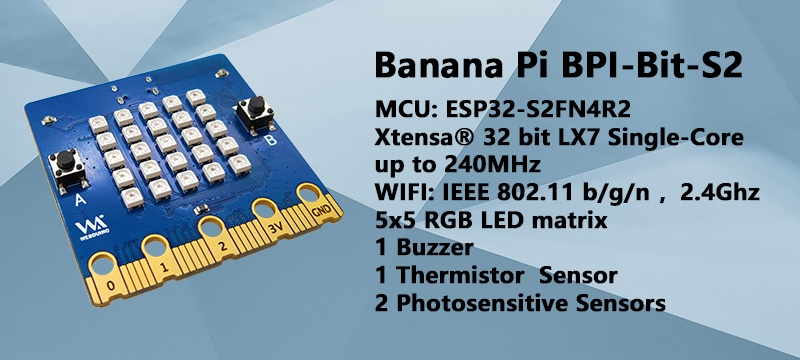

# 【 BPI-Bit-S2 开发板 】

## 介绍

BPI-Bit-S2 开发板 是 BPI-Bit 的后继型号，继承了大部分硬件功能。

IO与micro:bit兼容，可以使用大部分micro:bit的周边配件。

支持 Webduino, Arduino, MicroPython & CircuitPython 编程环境 ，适合应用于STEAM教育领域。

在 [开箱 Bit-S2 开发板](Unboxing/Introduction.md) 页面查看详情。

## 使用 CircuitPython 编程

> 推荐通过CircuitPython快速上手BPI-Bit-S2 开发板。

CircuitPython是MicroPython的一个教育友好型的开源衍生产品，由Adafruit Industries支持与开发。

在易用性上，它在MicroPython的基础上更进一步。

使用CircuitPython固件的开发板连接PC时，PC将会立即得到一个USB存储磁盘，将python脚本文件复制进此磁盘即可让程序在此开发板上运行。

这就做到了让用户开箱即用，因为绝大多数现代个人操作系统和家用PC都是支持USB存储磁盘的。

当然为了能使用REPL，至少还是需要安装一个串口通信软件，或是支持这个功能的文本编辑器，例如Mu编辑器。

CircuitPython 社区提供极其丰富的外设驱动库，API文档，教程。即使没有编程基础，没有硬件基础，从零开始也可快速上手。

CircuitPython不支持定时器，硬件中断等一些特定用于微控制器的库，也不支持多线程的_thread 库，仅提供编写并发代码的 asyncio 库。

在CircuitPython所支持的微控制器和其Blinka所支持的单板计算机(SBCs)中，代码具有很好的可移植性，这得益于它在统一API上的努力。

## 使用 MicroPython 编程

MicroPython是Python 3编程语言的精益高效实现，包括 Python 标准库的一小部分，并且经过优化，可在微控制器和有限的硬件资源中运行。

由 Damien P. George 于 2013年 众筹开源。

它与使用C程序开发微控制器最明显的差异性，就是验证代码时无需漫长的编译。

使用串口通信软件，通过REPL(read-eval-print-loop)输入命令来控制微控制器，和Python的REPL一样。

也可使用一些工具将 python 脚本文件上传到微控制器内运行。

它对Python 3 的实现，包括了支持多线程的 _thread 库，编写并发代码的 asyncio 库。

它尽可能与普通Python兼容，允许您轻松地将代码从桌面端移植到微控制器。

同时它还具备一些特定用于微控制器的库，以便充分利用微控制器芯片内的硬件功能，例如定时器，硬件中断，WiFi等，这取决于具体的硬件。

在具备上述特性的同时，它的硬件开销很少，最低只需 256k 的代码空间和 16k 的 RAM 即可运行。

如果你了解Python，很大程度上你就已经了解MicroPython了。

在另一方面，你深入地学习MicroPython，也能提升你对Python的理解。

## 使用 Arduino 编程

Arduino 是一个开源嵌入式软硬件开发平台，用来供用户制作可交互式的嵌入式项目。

Arduino 集成开发环境（IDE）是此平台的软件核心，使用C/C++编程语言开发项目。

Arduino 最大的特性就是提供统一的API来开发所有它所支持的微控制器，具有非常良好的代码可移植性和可复用性。

此外它简化了搭建开发环境的过程，所有它所支持的微控制器的开发环境都可一键安装配置。

它还提供简单的一键式机制来编译和上传程序到微控制器中运行。

Arduino IDE中还集成了很多例程，辅有大量的注释，能帮助用户快速上手。

Arduino 社区中积累的大量的优秀开源项目可供参考与学习，还有相当多的芯片制造商提供的驱动库与API。

## 使用 Webduino 编程

> BPI-Bit-S2 出厂已安装 Webduino 固件。

[webduino在线积木编程平台](https://webbit.webduino.io/blockly/?demo=default)

[ webduino积木编程平台 Windows安装版](https://ota.webduino.io/WebBitInstaller/WebBitSetup.exe)

[webduino在线教学手册](https://webbit.webduino.io/tutorials/doc/zh-cn/education/index.html)

## 资料与资源

- [官方WIKI](https://wiki.banana-pi.org/BPI-Bit-S2_STEAM_%E6%95%99%E8%82%B2%E5%BC%80%E5%8F%91%E6%9D%BF) 

- [GitHub: BPI-BPI-Bit-S2 开发板原理图PDF](https://github.com/BPI-STEAM/BPI-BIT-Lite-Doc/blob/main/sch/BPI-BIT-Lite-V0.2.pdf) 

## 样品购买

- [官方速卖通](https://www.aliexpress.us/item/3256804809903732.html)

- [官方淘宝](https://item.taobao.com/item.htm?spm=a213gs.success.result.1.d1187a86CepiGC&id=693462857865)

- OEM&OEM 定制服务 ： sales@banana-pi.com