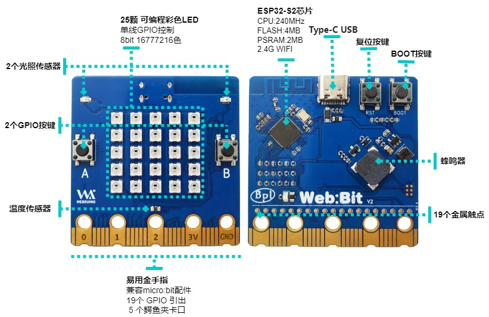

# 【 开发板介绍 】

BPI-Bit-S2 开发板 是 BPI-Bit 的后继型号，继承了大部分硬件功能。

IO与micro:bit兼容，可以使用大部分micro:bit的周边配件。

支持 Webduino, Arduino, MicroPython & CircuitPython 编程环境 ，适合应用于STEAM教育领域。

## 关键特性

* ESP32-S2
* 25颗全彩LED灯
* 1个温度传感器
* 1个蜂鸣器
* 2个光敏传感器
* 正面两个背面一个可编程按键
* Type-C USB接口
* 外形尺寸 5x5cm
* 金手指IO定义与micro:bit完全兼容

## 硬件

### 示意图

### 硬件规格

| Features              | Specs                                                                              |
|-----------------------|------------------------------------------------------------------------------------|
| MCU                   | ESP32-S2FN4R2，Xtensa® 32 bit LX7 Single-Core Processer                            |
| Frequency             | 240MHz MAX                                                                         |
| operating temperature | -40℃~+85℃                                                                          |
| ROM                   | 128 KB                                                                             |
| SRAM                  | 320 KB                                                                             |
| FLASH ROM             | 4 MB                                                                               |
| PSRAM                 | 2 MB                                                                               |
| WIFI                  | IEEE 802.11 b/g/n ，2.4Ghz                                                         |
| GPIO                  | 19 available GPIO pins have been introduced                                        |
| Peripheral functions  | ADC,TOUCH,PWM,SPI,I2C,I2S,Pulse counter, RMT,TWAI® Controller,SD/MMC,LCD_CAMERA    |
| External crystal      | 40Mhz                                                                              |
| Buzzer                | 8.5x8.5mm buzzer                                                                   |
| LED                   | 25 WS2812 rgb LED, single line GPIO control; 1 monochrome LED, controlled by GPIO0 |
| Photosensitive sensor | 2 photosensitive sensor                                                            |
| Thermistor sensor     | 1 thermistor sensor                                                                |
| IO                    | 19 pins Goldfinger IO,19 pins contacts on the back                                 |
| Key                   | 2 programmable keys,1 BOOT key,1 Reset key                                         |
| USB                   | USB Type-C interface，full speed USB OTG,USB-ACM                                   |
| Operating voltage     | 3.3V                                                                               |
| Power                 | USB Type-C input 5V，or Goldfinger IO input 3.3V power supply                      |
| Size                  | 5 * 5 cm                                                                           |

### 板载外设GPIO分配及信号类型

|    板载外设   | GPIO分配 |       信号类型      |
|:-------------:|:--------:|:-------------------:|
| 光敏传感器(L) | GPIO 12  | Analog Input        |
| 光敏传感器(R) | GPIO 13  | Analog Input        |
| 按键 A        | GPIO 38  | Digital Input       |
| 按键 B        | GPIO 33  | Digital Input       |
| 按键 BOOT     | GPIO 0   | Digital Input       |
| 温度传感器    | GPIO 14  | Analog Input        |
| 蜂鸣器        | GPIO 17  | PWM(Digital Output) |
| RGB_LED       | GPIO 18  | Digital Output      |

### 5*5 全彩LED灯顺序

BPI-Bit-S2 有25颗 WS2812 全彩LED灯, 单GPIO控制. 每颗LED的三原色像素都可以实现 8bit 256级亮度显示，及实现16777216色全彩显示，扫描频率不低于400Hz/s。

|   |    |    |   |   |
|:--:|:--:|:--:|:-:|:-:|
| 20 | 15 | 10 | 5 | 0 |
| 21 | 16 | 11 | 6 | 1 |
| 22 | 17 | 12 | 7 | 2 |
| 23 | 18 | 13 | 8 | 3 |
| 24 | 19 | 14 | 9 | 4 |

### 金手指引脚定义

### SPI与I2C预设引脚

| Function | Pin Name | GPIO Num |
|----------|----------|----------|
| SPI_SCK  | P13      | GPIO36   |
| SPI_MISO | P14      | GPIO37   |
| SPI_MOSI | P15      | GPIO35   |
| SPI_CS   | P16      | GPIO34   |
| I2C_SCL  | P19      | GPIO16   |
| I2C_SDA  | P20      | GPIO15   |

### 供电

BPI-Bit-S2支持两种供电方式：

1. Type-C USB：使用USB线供电，连接电脑USB接口或其他5V USB充电器即可为开发板供电。

2. 金手指：开发板底部金手指包含电源接口，同时具有输入和输出功能，使用3.3V供电，正极接3V3，负极接GND。

## 资料与资源

- [GitHub: BPI-BPI-Bit-S2 开发板原理图PDF](https://github.com/BPI-STEAM/BPI-BIT-Lite-Doc/blob/main/sch/BPI-BIT-Lite-V0.2.pdf) 

