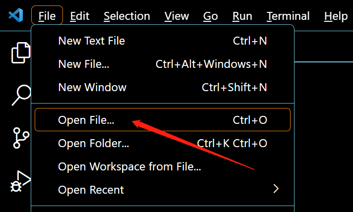

## Connect to the development board

### Use mpremote in terminal

Click the Terminal/terminal of VScode to create a new terminal window and enter commands in the terminal.

If you are using other editors, or only use the local terminal of the system, you can also use it directly.


`--help` can view all available commands of mpremote:
```
mpremote --help
```

Command to list all serial interfaces:
```
mpremote connect list
```

Connect the serial port where the development board is located and enter the MicroPython REPL:
```
mpremote connect COM1 repl
```

`COM1` is the format of the serial interface in Windows systems, it may be `/dev/ttyACM0` in Linux, and it may be `/dev/cu.usbmodem01` in MacOS.

After entering the REPL, you can enter MicroPython code to make it run on the development board.
```python
>>>print("Hello")
```

The way to exit the REPL is the keyboard shortcut `ctrl + ]`.

### Use mpbridge in terminal

The main function of the mpbridge tool is to synchronize a local folder with the file system in the development board, so we first determine the folder to be synchronized.

Create a new folder in a location you think is suitable locally on the PC, or select a folder, and then open the folder in VScode.




Then open a terminal in VScode, and you can enter the path where this folder is located in the terminal.


If you are using the default terminal, you can enter this path with `cd [absolute path to target folder]`.

```sh
PS C:\Users\Wind> cd D:\temp\temp
PS D:\temp\temp>
```

Command to list all serial interfaces using mpbridge tool:
```
mpbridge list
```

Use the mpbridge tool to synchronize files, the command is as follows, pay attention to modify `COM1` to the actual corresponding serial port of the development board:
```
mpbridge dev --auto-reset hard COM1
```


When the synchronization is completed, you will be prompted to press the `Enter` key. 

After pressing the key, the development board will be hard reset, and the terminal will enter the MicroPython REPL.

After pressing the keyboard shortcut `ctrl + ]` to exit the REPL, the file will be synchronized again immediately. At this time, you can choose to press `ctrl + C` to exit.

Every sync, mpbridge will automatically perform these file operations:

1. Pull the files that are not in the local but exist in the device to the local.
2. Push files that are not in the device but exist locally to the device.
3. Check the hash of the files both in the local and the device,and then push the different files from the local to the device.

