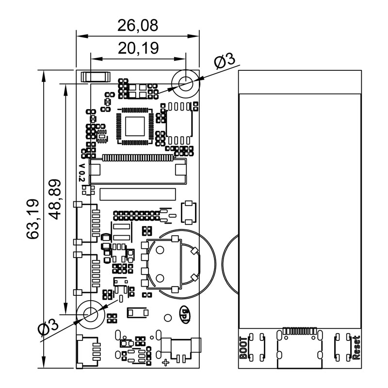

## Introduction

BPI-Centi-S3 is a small-sized ESP32-S3 development board with an 1.9-inch LCD onboard, suitable for the development of Internet of Things application projects including color display, interactive control, wireless communication, and sensor data acquisition.

Using the Espressif ESP32-S3 chip, it supports 2.4 GHz Wi-Fi and Bluetooth® Low Energy (Bluetooth® LE) dual-mode wireless communication.

Within the compact board, it also provides an additional rotary encoder, a buzzer, a WS2812 color LED, and all other available pins for external peripherals connection to meet diverse needs.

Support both USB and external 3.7V lithium battery power input. With the board's designed battery voltage detection circuit, it can automatically detect and switch to USB power supply when both are connected. And also supports USB charging mode, convenient for power management.

## Key Features

* ESP32-S3, Xtensa® 32 bit LX7 Processor
* 2M PSRAM, 8M FLASH
* 2.4G WIFI, Bluetooth 5, Bluetooth mesh
* GPIO, PWM, I2C, SPI, RMT, I2S, UART, USB, JTAG
* 1 * ST7789 TFT LCD, 1.9-inch, 170*320 resolution, 8bit 8080 parallel port
* 1 * Rotary Encoder
* 1 * Buzzer
* 1 * full color LED
* 1 * SH 1mm 4-Pin I2C connector
* 2 * SH 1mm 6-Pin 
* 1 * USB Type-C connector
* 1 * MX 1.25mm 2-Pin battery connector, supports charging
* 2 * M3 Screw Mounting Holes

## Hardware

### Hardware Interface Schematic Diagram

### Hardware Specifications

|                              |                                                                  |
|:----------------------------:|:----------------------------------------------------------------:|
| SoC                          | ESP32-S3, Xtensa® 32-bit LX7 dual-core processor                 |
| Clock Frequency              | 240MHz MAX                                                       |
| Internal ROM                 | 384 KB                                                           |
| Internal SRAM                | 320 KB                                                           |
| Onboard FLASH ROM            | 8MB                                                              |
| On-chip PSRAM                | 2MB                                                              |
| WIFI                         | IEEE 802.11 b/g/n, 2.4Ghz frequency band, 150Mbps                |
| bluetooth                    | Bluetooth 5, Bluetooth mesh                                      |
| External crystal oscillator  | 40Mhz                                                            |
| RTC and Low­Power Management | Power Management Unit (PMU) + Ultra-­Low-­Power Coprocessor(ULP) |
| GPIO                         | 9 available GPIOs have been exported to the SH socket        |
| Support Peripherals          | I2C, SPI, PWM, UART, RMT, I2S, SD                                |
| SH 1mm socket            | 1 * 4Pin, 2 * 6Pin                                               |
| USB                          | 1 * Full Speed USB 2.0 OTG, Type-C Female                        |
| USB Serial/JTAG Controller   | 1, USB full speed standard, CDC-ACM, JTAG                        |
| TFT LCD size                  | 1.9 inches                                                       |
| TFT LCD resolution            | 170 * 320 RGB                                                    |
| TFT LCD control chip          | ST7789V3                                                         |
| TFT LCD interface             | 8bit 8080 parallel port                                          |
| Encoder                      | 1 * Incremental Rotary Encoder, support pressing function        |
| Buzzer                       | 1                                                                |
| Color LED                    | 1 * WS2812 2020 LED                                              |
| Button                       | RST Button, BOOT Button                                          |
| Screw Holes                  | 2 * M3 Screw Holes                                               |
| Machine working temperature  | -20℃ ~ +60℃                                                      |
| Working voltage              | 3.3V                                                             |
| USB input voltage            | 3.3V~5.5V                                                        |
| Maximum discharge current    | 2A@3.3V DC/DC                                                    |
| Battery connector            | MX 1.25mm 2-Pin                                                  |
| USB charging                 | Support                                                          |
| Maximum charging current     | 500mA                                                            |

### Hardware Dimensions

### LCD Wiring Definition

|      |                                                           |
|:---------------------------:|:---------------------------------------------------------:|
| ESP_LCD_BLK                 | GPIO2                                                     |
| ESP_LCD_RES                 | GPIO3                                                     |
| ESP_LCD_CS                  | GPIO4                                                     |
| ESP_LCD_D/C                 | GPIO5                                                     |
| ESP_LCD_WR                  | GPIO6                                                     |
| ESP_LCD_RD                  | GPIO7                                                     |
| ESP_LCD_D0                  | GPIO8                                                     |
| ESP_LCD_D1                  | GPIO9                                                     |
| ESP_LCD_D2                  | GPIO10                                                    |
| ESP_LCD_D3                  | GPIO11                                                    |
| ESP_LCD_D4                  | GPIO12                                                    |
| ESP_LCD_D5                  | GPIO13                                                    |
| ESP_LCD_D6                  | GPIO14                                                    |
| ESP_LCD_D7                  | GPIO15                                                    |
| ESP_TP_RESET                | GPIO16                                                    |
| II2C_SCL                    | GPIO17                                                    |
| II2C_SDA                    | GPIO18                                                    |
| ESP_TP_INT                  | GPIO21                                                    |

### Peripheral Wiring Definition

|     |              |
|:---------------------------------:|:------------:|
| RST button                        | RST(CHIP_PU) |
| BOOT button                       | GPIO0        |
| BAT_ADC battery voltage detection | GPIO1        |
| Buzzer                            | GPIO36       |
| EC_KEY Rotary Encoder             | GPIO35       |
| EC_A Rotary Encoder               | GPIO37       |
| EC_B Rotary Encoder               | GPIO47       |
| WS2812B-2020                      | GPIO48       |
