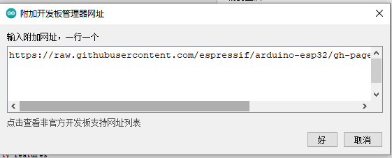
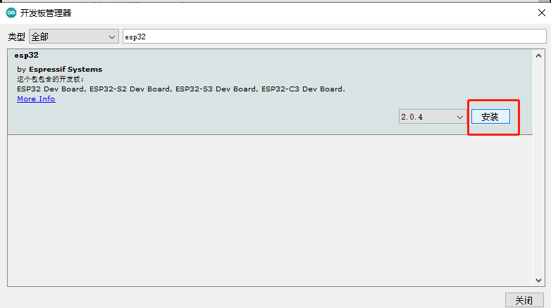
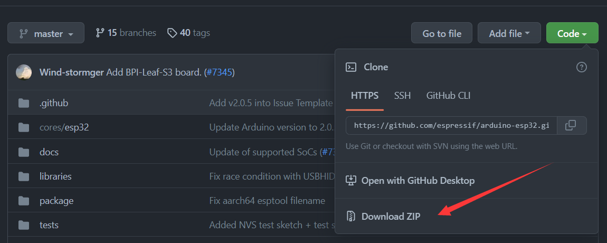
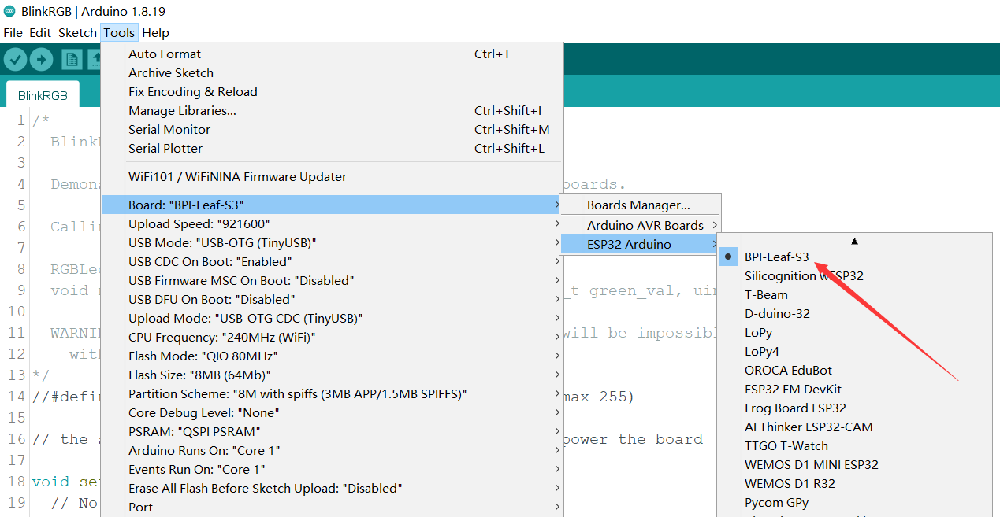

## 环境搭建

这篇文章将会指引您安装Centi-S3的Arduino支持。


> 参考[arduino-esp32 DOC Getting Started » Installing](https://docs.espressif.com/projects/arduino-esp32/en/latest/installing.html)

### 使用Arduino IDE安装支持

这是直接从 Arduino IDE 安装 Arduino-ESP32 的方法。

> 从 Arduino IDE 版本 1.6.4 开始，Arduino 允许使用 Boards Manager（开发板管理器）安装第三方平台包。有适用于 Windows、macOS 和 Linux 的软件包。

Arduino IDE 下载地址：https://www.arduino.cc/en/software

> Arduino IDE 2.0与Arduino IDE 1.8.x的UI有些许差异，本文基于1.8.13版本编写，但不影响使用2.0版本的用户参考。

要使用 Boards Managaer（开发板管理器）安装esp32平台包，请执行以下步骤：

- 安装当前上游 Arduino IDE 1.8 或更高版本。

- 启动 Arduino 并打开 File（文件）> Preferences（首选项）窗口，找到Additional Board Manager URLs（附加开发板管理器网址）。


- 稳定版链接：
```
https://espressif.github.io/arduino-esp32/package_esp32_index.json
```
- 开发版链接：
```
https://espressif.github.io/arduino-esp32/package_esp32_dev_index.json
```
- 在Additional Board Manager URLs后面输入上述发布链接之一。您可以添加多个 URL，一行一个。



从菜单打开 Tools（工具） > Board（开发板）> Board Manager（开发板管理器） 搜索并安装esp32平台。



重启arduino IDE之后可以看到在开发板选项中多了ESP32 Arduino选项。

选择 `ESP32S3 Dev Module` 这个型号，再参照下图所示的内容进行配置一遍即可，配置不当可能是无法使用的，请一定要参照下图所示的内容进行配置！

| Setting                  | Value                            |
| :----------------------- | :------------------------------- |
| USB CDC On Boot          | Enabled                          |
| CPU Frequency            | 240MHz (WiFi)                    |
| Core Debug Level         | None                             |
| USB DFU On Boot          | Enabled (Requires USB-OTG Mode)  |
| Erase All Flash Before Sketch Upload | Disabled             |
| Events Run On            | Core 1                           |
| Flash Mode               | QIO 80MHz                        |
| Flash Size               | 8MB (64Mb)                       |
| JTAG Adapter             | Integrated USB JTAG              |
| Arduino Runs On          | Core 1                           |
| USB Firmware MSC On Boot | Disabled                         |
| Partition Scheme         | 8M with spiffs (3MB APP/1.5MB SPIFFS) |
| PSRAM                    | QSPI PSRAM                       |
| Upload Mode              | UARTO / Hardware CDC             |
| Upload Speed             | 921600                           |
| USB Mode                 | Hardware CDC and JTAG            |

或直接选择 `BPI-Leaf-S3` 这个型号，默认设置即可直接使用。

### 从GitHub下载或克隆arduino-esp32仓库，手动安装

> 仅限Windows系统。

- 打开GitHub页面：https://github.com/espressif/arduino-esp32
- 点击`Code`按钮,点击`Download ZIP`即可用最简单的方式将仓库下载到本地，建议初学者使用此方法。

- 也可通过GitHub Desktop或Git克隆master分支到本地。
  - [安装和配置GitHub Desktop](https://docs.github.com/cn/desktop/installing-and-configuring-github-desktop)
  - [git 中文手册](https://git-scm.com/book/zh/v2)
- 解压zip文件到Arduino IDE安装路径的`/hardware/espressif/`路径中，将解压出的文件夹重命名为`esp32`。

- 打开 `/hardware/espressif/esp32/tools`路径， 并双击运行` get.exe` 。

- `get.exe` 完成后，您应该会在目录中看到以下文件。

- 重启arduino IDE之后可以看到在开发板选项中多了ESP32 Arduino选项。

