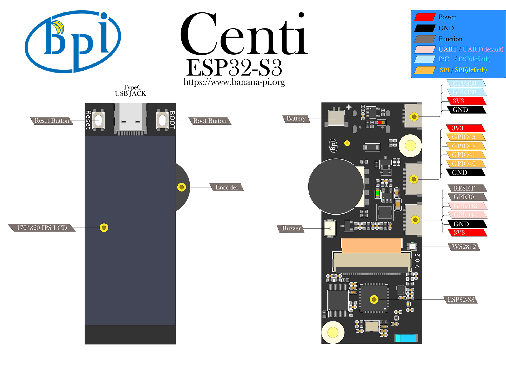

## 介绍

BPI-Centi-S3 是一个板载1.9英寸彩屏的小尺寸ESP32-S3开发板，适合用于彩色显示，交互控制，无线通信，传感器数据采集等物联网综合应用项目的开发。

使用Espressif ESP32-S3芯片，支持 2.4 GHz Wi-Fi 和低功耗蓝牙 (Bluetooth® LE) 双模无线通信。

在紧凑的空间下依旧提供一个增量型旋转编码器，一个蜂鸣器，一个WS2812彩灯，及其他所有可用引脚引出，满足多样化的需求。

支持USB和外接3.7V锂电池两种供电方式，可实现双电源下自动切换电源功能，并支持USB充电方式，配置了电池电压检测电路，方便进行电量管理。

### 关键特性

* ESP32-S3，Xtensa® 32 bit LX7
*  2M PSRAM , 8M FLASH
* 2.4G WIFI ，Bluetooth 5 ，Bluetooth mesh
* GPIO , PWM , I2C , SPI , RMT , I2S , UART ，USB , JTAG
* 1 * ST7789 屏幕，1.9英寸，170*320分辨率，8bit 8080并口
* 1 * 旋转编码器
* 1 * 蜂鸣器
* 1 * 全彩色LED
* 1 * JST SH 1mm 4-Pin I2C连接座
* 2 * JST SH 1mm 6-Pin
* 1 * USB Type-C
* 1 * MX 1.25mm 2-Pin 电池连接座，支持充电
* 2 * M3螺丝孔

## 硬件

### 硬件接口示意图

### 硬件规格

|                        |                                            |
|:----------------------:|:------------------------------------------:|
| SoC 主控芯片           | ESP32-S3，Xtensa® 32 位 LX7 双核处理器       |
| 主频                   | 240MHz MAX                                 |
| 片上 ROM               | 384 KB                                     |
| 片上 SRAM              | 320 KB                                     |
| 板载 FLASH ROM         | 8MB                                        |
| 片上外设PSRAM          | 2MB                                        |
| WIFI                   | IEEE 802.11 b/g/n ，2.4Ghz频带，150Mbps    |
| 蓝牙                   | Bluetooth 5 ，Bluetooth mesh               |
| 外部晶振               | 40Mhz                                      |
| RTC 和低功耗管理       | 电源管理单元 (PMU)+ 超低功耗协处理器 (ULP)   |
| GPIO                   | 已引出9个可用GPIO到JST SH 插座             |
| 支持外设               | I2C, SPI, PWM, UART, RMT, I2S, SD          |
| JST SH 1mm 插座        | 1 * 4Pin，2 * 6Pin                         |
| USB                    | 1 * 全速USB 2.0 OTG，Type-C母口            |
| USB Serial/JTAG 控制器 | 1，USB 全速标准，CDC-ACM ，JTAG            |
| 屏幕尺寸               | 1.9 英寸                                   |
| 屏幕分辨率             | 170 * 320 RGB                              |
| 屏幕控制芯片           | ST7789V3                                   |
| 屏幕接口               | 8bit 8080 并口                             |
| 编码器                 | 1 * 增量型旋转编码器，支持按压功能            |
| 蜂鸣器                 | 1                                          |
| 彩色LED                | 1 * WS2812 2020                            |
| 按钮                   | RST 按钮，BOOT按钮                          |
| 整机工作温度           | -20℃ ~ +60℃                               |
| 工作电压               | 3.3V                                       |
| USB输入电压            | 3.3V~5.5V                                  |
| 最大放电电流           | 2A@3.3V DC/DC                              |
| 电池连接座             | MX 1.25mm 2-Pin                            |
| USB充电                | 支持                                       |
| 最大充电电流           | 500mA                                      |

### 硬件尺寸

### 屏幕接线定义

|      |                                                           |
|:---------------------------:|:---------------------------------------------------------:|
| ESP_LCD_BLK                 | GPIO2                                                     |
| ESP_LCD_RES                 | GPIO3                                                     |
| ESP_LCD_CS                  | GPIO4                                                     |
| ESP_LCD_D/C                 | GPIO5                                                     |
| ESP_LCD_WR                  | GPIO6                                                     |
| ESP_LCD_RD                  | GPIO7                                                     |
| ESP_LCD_D0                  | GPIO8                                                     |
| ESP_LCD_D1                  | GPIO9                                                     |
| ESP_LCD_D2                  | GPIO10                                                    |
| ESP_LCD_D3                  | GPIO11                                                    |
| ESP_LCD_D4                  | GPIO12                                                    |
| ESP_LCD_D5                  | GPIO13                                                    |
| ESP_LCD_D6                  | GPIO14                                                    |
| ESP_LCD_D7                  | GPIO15                                                    |
| ESP_TP_RESET                | GPIO16                                                    |
| II2C_SCL                    | GPIO17                                                    |
| II2C_SDA                    | GPIO18                                                    |
| ESP_TP_INT                  | GPIO21                                                    |

### 外设接线定义

|                      |              |
|:--------------------:|:------------:|
| RST按键              | RST(CHIP_PU) |
| BOOT按键             | GPIO0        |
| BAT_ADC 电池电压检测 | GPIO1        |
| 蜂鸣器               | GPIO36       |
| EC_KEY 旋转编码器    | GPIO35       |
| EC_A 旋转编码器      | GPIO37       |
| EC_B 旋转编码器      | GPIO47       |
| WS2812B-2020         | GPIO48       |
