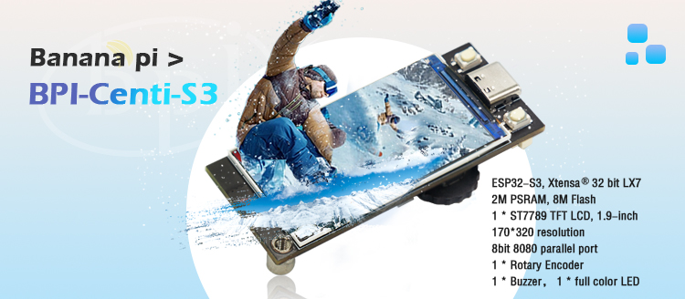

## 介紹

BPI-Centi-S3 是一個板載1.9英寸彩屏的小尺寸ESP32-S3開發板，適合用於彩色顯示，交互控制，無線通信，傳感器數據採集等物聯網綜合應用項目的開發。

使用Espressif ESP32-S3芯片，支持 2.4 GHz Wi-Fi 和低功耗藍牙 (Bluetooth® LE) 雙模無線通信。

在緊湊的空間下依舊提供一個增量型旋轉編碼器，一個蜂鳴器，一個WS2812彩燈，及其他所有可用引腳引出，滿足多樣化的需求。

支持USB和外接3.7V鋰電池兩種供電方式，可實現雙電源下自動切換電源功能，並支持USB充電方式，配置了電池電壓檢測電路，方便進行電量管理。

### 關鍵特性

* ESP32-S3，Xtensa® 32 bit LX7
*  2M PSRAM , 8M FLASH
* 2.4G WIFI ，Bluetooth 5 ，Bluetooth mesh
* GPIO , PWM , I2C , SPI , RMT , I2S , UART ，USB , JTAG
* 1 * ST7789 屏幕，1.9英寸，170*320分辨率，8bit 8080並口
* 1 * 旋轉編碼器
* 1 * 蜂鳴器
* 1 * 全彩色LED
* 1 * SH 1mm 4-Pin I2C連接座
* 2 * SH 1mm 6-Pin
* 1 * USB Type-C
* 1 * MX 1.25mm 2-Pin 電池連接座，支持充電
* 2 * M3螺絲孔

## 硬件

### 硬件接口示意圖

### 硬件規格

|                        |                                            |
|:----------------------:|:------------------------------------------:|
| SoC 主控芯片           | ESP32-S3，Xtensa® 32 位 LX7 雙核處理器       |
| 主頻                   | 240MHz MAX                                 |
| 片上 ROM               | 384 KB                                     |
| 片上 SRAM              | 320 KB                                     |
| 板載 FLASH ROM         | 8MB                                        |
| 片上外設PSRAM          | 2MB                                        |
| WIFI                   | IEEE 802.11 b/g/n ，2.4Ghz頻帶，150Mbps    |
| 藍牙                   | Bluetooth 5 ，Bluetooth mesh               |
| 外部晶振               | 40Mhz                                      |
| RTC 和低功耗管理       | 電源管理單元 (PMU)+ 超低功耗協處理器 (ULP)   |
| GPIO                   | 已引出9個可用GPIO到SH 插座             |
| 支持外設               | I2C, SPI, PWM, UART, RMT, I2S, SD          |
| SH 1mm 插座        | 1 * 4Pin，2 * 6Pin                         |
| USB                    | 1 * 全速USB 2.0 OTG，Type-C母口            |
| USB Serial/JTAG 控制器 | 1，USB 全速標準，CDC-ACM ，JTAG            |
| 屏幕尺寸               | 1.9 英寸                                   |
| 屏幕分辨率             | 170 * 320 RGB                              |
| 屏幕控制芯片           | ST7789V3                                   |
| 屏幕接口               | 8bit 8080 並口                             |
| 編碼器                 | 1 * 增量型旋轉編碼器，支持按壓功能            |
| 蜂鳴器                 | 1                                          |
| 彩色LED                | 1 * WS2812 2020                            |
| 按鈕                   | RST 按鈕，BOOT按鈕                          |
| 整機工作溫度           | -20℃ ~ +60℃                               |
| 工作電壓               | 3.3V                                       |
| USB輸入電壓            | 3.3V~5.5V                                  |
| 最大放電電流           | 2A@3.3V DC/DC                              |
| 電池連接座             | MX 1.25mm 2-Pin                            |
| USB充電                | 支持                                       |
| 最大充電電流           | 500mA                                      |

### 硬件尺寸

### 屏幕接線定義

|      |                                                           |
|:---------------------------:|:---------------------------------------------------------:|
| ESP_LCD_BLK                 | GPIO2                                                     |
| ESP_LCD_RES                 | GPIO3                                                     |
| ESP_LCD_CS                  | GPIO4                                                     |
| ESP_LCD_D/C                 | GPIO5                                                     |
| ESP_LCD_WR                  | GPIO6                                                     |
| ESP_LCD_RD                  | GPIO7                                                     |
| ESP_LCD_D0                  | GPIO8                                                     |
| ESP_LCD_D1                  | GPIO9                                                     |
| ESP_LCD_D2                  | GPIO10                                                    |
| ESP_LCD_D3                  | GPIO11                                                    |
| ESP_LCD_D4                  | GPIO12                                                    |
| ESP_LCD_D5                  | GPIO13                                                    |
| ESP_LCD_D6                  | GPIO14                                                    |
| ESP_LCD_D7                  | GPIO15                                                    |
| ESP_TP_RESET                | GPIO16                                                    |
| II2C_SCL                    | GPIO17                                                    |
| II2C_SDA                    | GPIO18                                                    |
| ESP_TP_INT                  | GPIO21                                                    |

### 外設接線定義

|                      |              |
|:--------------------:|:------------:|
| RST按鍵              | RST(CHIP_PU) |
| BOOT按鍵             | GPIO0        |
| BAT_ADC 電池電壓檢測 | GPIO1        |
| 蜂鳴器               | GPIO36       |
| EC_KEY 旋轉編碼器    | GPIO35       |
| EC_A 旋轉編碼器      | GPIO37       |
| EC_B 旋轉編碼器      | GPIO47       |
| WS2812B-2020         | GPIO48       |
