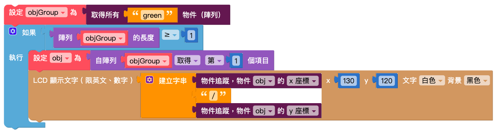

# 物件追蹤

1. 先依照上面步驟，將訓練過的物件追蹤模型下載到 Web:AI 開發板中。

2. 開啟 Web:AI 程式積木平台。

3. 使用「設定模型」積木，輸入模型名稱，
在陣列內放入和分類數量相同的積木，按照模型列表的**分類順序**輸入**分類名稱**。
並將寬、高都輸入 224。

   >- 使用 Webduino 影像訓練平台訓練的模型尺寸為 224*224。
   >- 使用開發板預設的模型請輸入 320*240。
   >- 自行使用其它工具訓練，則需輸入各別的尺寸。

   

4. 在下方加入「無限重複」積木，裡面放入「開始偵測物件」積木和「LCD 顯示文字」積木。

   

5. 編輯物件追蹤的相關程式，讓偵測時可以讀取到模型 ( 陣列 ) 內的分類，並且在螢幕上顯示需要的數值，如下圖設定：

   

6. 將編輯好的程式放在「開始偵測物件」積木下方。

   

7. 程式編輯完成後，按下右上角「執行」按鈕，出現「正在努力搬運 Blockly 中…」和「正在組裝積木…」，讀取結束後 Web:AI 開發板會自動開啟辨識畫面。

8. 使用鏡頭對準辨識物件就能看到白框顯示辨識結果和座標。

   
