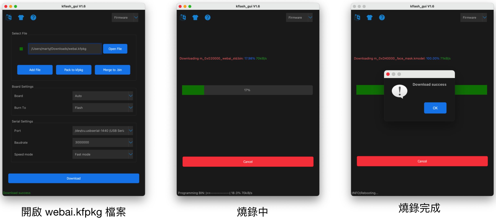

# 四、使用 IDE 开发 Web:AI

Web:AI 开发板除了可以用图形编程平台操作外，甚至也支持直接在 IDE 上编写 Python 程序，并通过开发板执行。

> IDE：Integrated Development Environment ( 整合开发环境 )，一种辅助开发软体的应用程序，是用于提供程序开发环境的应用程序，一般包括代码编辑器、编译器、调试器和图形用户界面等工具。集成了代码编写功能、分析功能、编译功能、调试功能等一体化的开发软件服务套。

### 脚位定义

### 主芯片 ( K210 ) & Wi-Fi 芯片 ( ESP8285 )

## 开发环境介绍

Web:AI 开发板可配合[Sipeed公司](https://maixpy.sipeed.com/) 推出的MaixPy IDE 使用，该IDE 虽然没有开源，但提供了程序编写整合开发环境，可以编写MicroPython代码并传送到Web:AI开发板中执行，欢迎参考下方操作步骤。

开发环境画面如下：

## 使用 kflash_gui 更新标准版固件

需要先使用 kflash_gui 将 Web:AI 固件文件烧录至开发板中，才能通过 MaixPy IDE 使用 Web:AI 功能。

> 烧录前请先通过 USB 线将 Web:AI 开发板接上电脑。

### 使用 kflash_gui 烧录

1. 下载 Web:AI 固件文件 [固件文件](https://drive.google.com/file/d/1c819ka2ng8UgqVvTEjVFMPiEBrzDYyxO/view?usp=sharing)。

2. 下载 [kflash_gui](https://github.com/sipeed/kflash_gui/releases/tag/v1.6.7)，点击执行，开启 webai.kfpkg 固件文件，等待下载完毕后就烧录完成了。

   

3. kflash_gui 参数设定画面如下，如果烧录异常，可尝试调整烧录的速度

   

## 使用 MaixPy IDE 执行指令

### 1. 下载 MaixPy IDE：

点击 [MaixPy IDE](https://drive.google.com/drive/u/0/folders/1AhEgANgd8PxQOlZgmxWc8JhbpstaIXDS) 下载，安装后开启 MaixPy IDE 应用程序，进入开发环境画面。

### 2. 新建文件：

点击左侧侧边栏「新建文件」按钮 ( 白色资料图示 )，在页面中可以自行输入 Python 程序码。可以直接复制下方的程序码示例，粘贴在编辑画面中，执行示例演示。

### 3. 选择开发板：

点击上方「工具」>「选择开发板」>「Sipeed Maix Bit ( with Mic )」，代表选择控制 Web:AI 开发板。

### 4. 开启终端

1. 点击上方「工具」>「开启终端」>「新终端」

   

2. 选择「连线到序列埠」

   

### 5. 开启 Web:AI

1. 开启终端后，会看到如下画面：

   

2. 在 IDE 中输入程序码，按下执行，即可在直接终端中查看执行结果。

## 程序示例

使用 Python 程序时，可以直接复制下方的程序码示例，粘贴在编辑画面中，执行示例演示。

## 传感器

### 示例：摄像头 Sensor

- 程序内容：使用 Web:AI 内建的摄像头捕捉画面，实时显示到 LCD 屏幕中。

~~~python=
from webai import *

pic = webai.snapshot()
webai.show(img=pic)
~~~

## 屏幕 LCD 显示

### 示例：显示文字

- 程序内容：输入指定的文字、位置、样式，并显示在 LCD 屏幕上。

- ==lcd.draw_string( x 座标 , y 座标 , " 文字 " , 文字颜色 , 背景颜色 )==

~~~python=
from webai import *

webai.draw_string(30,10,"测试 OK",scale=2)
~~~

### 示例：画线

- 程序内容：设定线段的 2 个端点位置、颜色、宽度，绘制在 LCD 屏幕上。也可同时绘制多条线段。

- ==img.draw_line( x 座标 , y 座标 , x 座标 , y 座标 , 颜色 , 线段宽度 )==

~~~python=
from webai import *

webai.img = image.Image()
webai.img.draw_line(10,150,310,150,color=lcd.RED,thickness=20)
webai.show(img=webai.img)
~~~

## 按钮

### 示例：按钮控制

- 程序内容：按 L 按钮显示 A，按 R 按钮显示 B。

- ==webai.draw_string( x 座标 , y 座标 , " 英文数字 ", 文字缩放 )==

~~~python=
from webai import *
# state=1:click_down , state=2:click_up , state=3:long_press
def click(name,state):
    webai.img.clear()
    if name == 'btnL' and state == 1:
        webai.draw_string(60, 100, "A", scale=4)
    if name == 'btnR' and state == 1:
        webai.draw_string(280, 100, "B", scale=4)

webai.img = image.Image()
webai.addBtnListener(click)
~~~

### 示例：按钮控制 - 监听所有按钮事件

按键事件总共有 7 种事件

L(左键): name=='btnL' , state==1:按下 , state==2:放开 , state==3:长按超过2秒
R(右键): name=='btnR' , state==1:按下 , state==2:放开 , state==3:长按超过2秒
L + R : state == 4 (左右按键一起按)
~~~python=
from webai import *
# state=1:click_down , state=2:click_up , state=3:long_press
def click(name,state):
    webai.img.clear()
    # 按下左键
    if name == 'btnL' and state == 1:
        webai.draw_string(60, 100, "A", scale=4)
    # 放开左键
    if name == 'btnL' and state == 2:
        webai.draw_string(60, 100, " ", scale=4)
    # 长按左键超过2秒
    if name == 'btnL' and state == 3:
        webai.draw_string(50, 100, "A!", scale=4)

    # 按下右键
    if name == 'btnR' and state == 1:
        webai.draw_string(220, 100, "B ", scale=4)
    # 按下右键
    if name == 'btnR' and state == 2:
        webai.draw_string(220, 100, " ", scale=4)
    # 长按右键超过2秒
    if name == 'btnR' and state == 3:
        webai.draw_string(210, 100, "B!", scale=4)
        
    # 左键+右键一起按
    if state == 4:
        webai.draw_string(50, 100, "A + B", scale=4)
        
webai.img = image.Image()
webai.addBtnListener(click)
~~~

### 示例：按钮拍照显示照片

- 示例程序：
    1. 按下 L 按钮进行拍照并写入文件 
    2. 长按 R 按钮将照片显示在 LCD 屏幕上
    3. 再按一下 R 按钮恢复拍摄模式

~~~python=
from webai import *

def click(name,state):
    global show
    if name == 'btnL' and state == 2:
        webai.img = webai.snapshot()
        webai.img.save('myImg.jpg')
        print("save OK")
    if name == 'btnR' and state == 1:        
        show = False
    if name == 'btnR' and state == 3:
        show = True
        webai.show(file = 'myImg.jpg')

show = False
webai.addBtnListener(click)
while True:
    if not show:
        webai.img = webai.snapshot()
        webai.show(img = webai.img)
~~~

## 脚位控制

### 示例：读取脚位的模拟量

- 读取 pin4 模拟量信号，数值介于 0~1023 ，电压是 0~1V。

- 程序内容：用手触碰引脚 ( pin4 )，就可以看到屏幕显示数值上升到 1023。

~~~python=
from webai import *
while True:
    val = webai.adc()
    img = image.Image()
    img.draw_string(120, 100, str(val), scale=4)
    lcd.display(img)
    time.sleep(0.1)
    lcd.clear()
~~~

## 外接扬声器、T-Flash存储卡

### 使用扬声器播放音频文件

- 程序内容：播放 wav 格式的音频文件。

~~~python=
from webai import *
webai.speaker.setVolume(100)
webai.speaker.play(filename='logo.wav',sample_rate=11025)
~~~

## Wi-Fi 设定

### 设定开发板连线 Wi-Fi

- 程序内容：通过 Wi-Fi 连上网络，如果试了三次都连不上，就显示异常。
    - 第二行：设定 Wi-Fi 的 SSID 和 PWD
    - 第六行：储存 Wi-Fi 设定
    - 第七行：开发板重开机

~~~python=
from webai import *
wifi = {
'ssid':'webduino.io',
'pwd':'webduino'
}
webai.cfg.put('wifi', wifi)
webai.reset()
~~~

## MQTT

> 建议使用 Webduino 提供的程序库，比较方便使用。

### MQTT 订阅资料

- 程序内容：订阅频道 " subTest "。
    - 第三行：在屏幕上显示广播讯息

可通过Web:Bit示例程序发布讯息进行测试。
https://webbit.webduino.io/blockly/?demo=default#7qZr95m27k8qO
~~~python=
from webai import *
def msg(topic, msg):
    webai.lcd.clear()
    webai.draw_string(130, 100, "%s"%msg, scale=2, x_spacing=10)
webai.mqtt.sub('subTest', msg)
~~~

### MQTT 发行资料

- 程序内容：向频道 " subTest " 传送 " Hello Web:AI "。
    - 第一行：完成 MQTT 连线
    - 第二行：传送一份资料

~~~python=
from webai import *
webai.mqtt.pub('subTest','Hello Web:AI')
~~~

## 下载文件(模型文件、SPIFFS..等) 烧录到指定的 flash address

下面这示例程序是更新webAI文件系统。
~~~python=
url = 'http://share.webduino.io/storage/download/0605_143342.696_m_0x400000_maixpy_spiffs.img'
webai.cloud.download(url,address=0x400000,redirect=False,showProgress=True)
~~~
## 通过 UART 和 Arduino通信

Arduino 可以通过 UART 和 Web:AI 连线传送资料，下面程序示例是让 ESP8266 传送字符给 Web:AI 进行显示。

<iframe src="https://www.youtube.com/embed/c9VH46zGpps" allowfullscreen width="100%" style="aspect-ratio:728/410;border:none " ></iframe>

~~~python=
from machine import UART
import sensor, image, time, lcd
from fpioa_manager import fm
from Maix import GPIO

fm.register(24, fm.fpioa.UART1_TX, force=True)
fm.register(25, fm.fpioa.UART1_RX, force=True)
uart = UART(UART.UART1, 57600, timeout=5000,read_buf_len=2048)
lcd.init()
img = image.Image()
img.draw_string(100,100,'Go',scale=3)
lcd.display(img)
while True:
    while uart.any():
        myLine = uart.readline()
        img.draw_string(100,100,myLine,scale=3)
        lcd.display(img)
        img.clear()
~~~

Arduino
~~~c=
void setup() {
  Serial.begin(57600);
  pinMode(15, OUTPUT);
}

void loop() {
  Serial.println('A');
  digitalWrite(15, HIGH);
  delay(500);
  Serial.println('B');
  digitalWrite(15, LOW);
  delay(500);
}