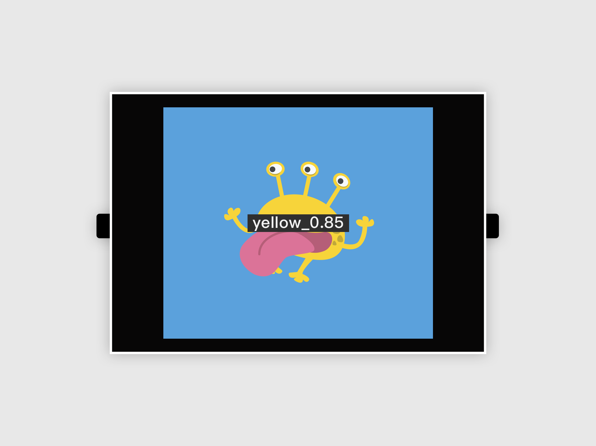

# 影像分类

Web:AI 影像辨识分为**影像分类** 以及**物件追踪**，可以使用Web:AI 开发板拍摄影像上传至Webduino 影像训练平台进行影像训练，将训练完成的模型下载，再使用程序积木执行影像辨识。

本章节将会介绍「影像分类」积木的使用方式。

## 下载影像分类模型

在使用影像分类之前，需要先训练好模型，并下载至开发板中，训练流程欢迎参考：[三、影像训练](https://bpi-steam.com/WebAI/zh/Train/Train.html)。

按照步骤下载后，就可以使用「影像分类」积木进行操作了。

## 设定影像分类模型

在操作影像分类前，需要先使用「设定影像分类模型」积木对模型作设定。

- 模型：影像分类使用的模型。
- 分类：模型中的分类，使用半形逗号「,」分隔。
- 镜头反转：在使用特定外壳时会有前后镜头功能，因此需要勾选让镜头反转，避免画面上下颠倒。

    > 如果是使用无外壳的 Web:AI 开发板，使用预设的不勾选。
- 宽高：影像的尺寸大小。如果是使用自行训练的模型，需要手动输入；如果是使用 [Webduino 影像训练平台](https://vision.webduino.io/) 训练的模型，使用的尺寸则会是：
    - 宽：224
    - 高：224

在「设定影像分类模型」积木中可以选择要使用的模型，**选择的模型必须和下载到开发板中的板子一致**，才能顺利进行辨识。

选择模型方式又会依据使用的平台及建立方式而不同，如下：

- ### 选择模型 ( 网页版 )

    点击「模型」，可以从下拉选单中选择想使用的模型，选单中的模型会根据 [Webduino 影像训练平台](https://vision.webduino.io/) 列出可使用的影像分类模型。

   

- ### 选择模型 ( 安装版 )

   在「模型」中手动输入，并将「分类」框选复制后贴上。

   > 因为分类的顺序会影像到是否能正常辨识，为确保顺序正确，建议直接将分类框选复制。

   

- ### 选择模型 ( 新增自订模型 )

   如果是自行将模型烧录进开发板，或是将模型文件放在 SD 卡中，就需要使用「新增自订模型」，如下方步骤：

   1. 点击「新增自订模型」。
   2. 输入模型名称，按下确定。
   3. 模型选单中出现自订模型，后方会标示 **( 自订 )**
   4. 在「分类」填入自订模型的分类顺序

## 开始辨识影像

使用「开始辨识影像」积木来触发影像辨识的进行。
因为这块积木代表触发 1 次影像分类，如果需要重复触发，就需要在外层放上「无限循环」积木。

## 取得辨识到的影像名称

当开始辨识时，可以使用「取得辨识到的影像名称」积木来显示辨识到的分类名称。

例如：使用模型「monster」，里面的分类是「green,yellow,red,blue」，那么「取得辨识到的影像名称」积木就会是「green,yellow,red,blue」中的其中一个。

## 取得辨识到的影像信心度

当开始辨识时，可以使用「取得辨识到的信心度」积木来显示辨识到的信心度。
信心度最高为 100、最低为 0，信心度越高，表示越符合模型中所有的特征。

> 因为影像训练辨识的结果会落在一个区间范围内，若信心度为 90%，代表有 90% 的机率真正的结果会落在这个区间范围内。

## 示例：影像分类

1. 先从 [Webduino 影像训练平台](https://vision.webduino.io/) 下载要进行影像训练的模型，如示例是使用模型「monster」。

    > 有关如何训练影像模型，欢迎参考：[三、影像训练](https://bpi-steam.com/WebAI/zh/Train/Train.html)。

    

2. 使用「设定影像分类模型」积木，选择使用的模型。

    

3. 使用「无限循环」积木，放入「开始辨识影像」积木、「显示文字」积木。

    

4. 在「显示文字」积木内放入要显示的影像分类信息，示例为显示：**分类名称_信心度**。

    

5. 将积木组合，按下**执行**即可以在Web:AI上执行影像分类。

    

    