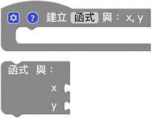
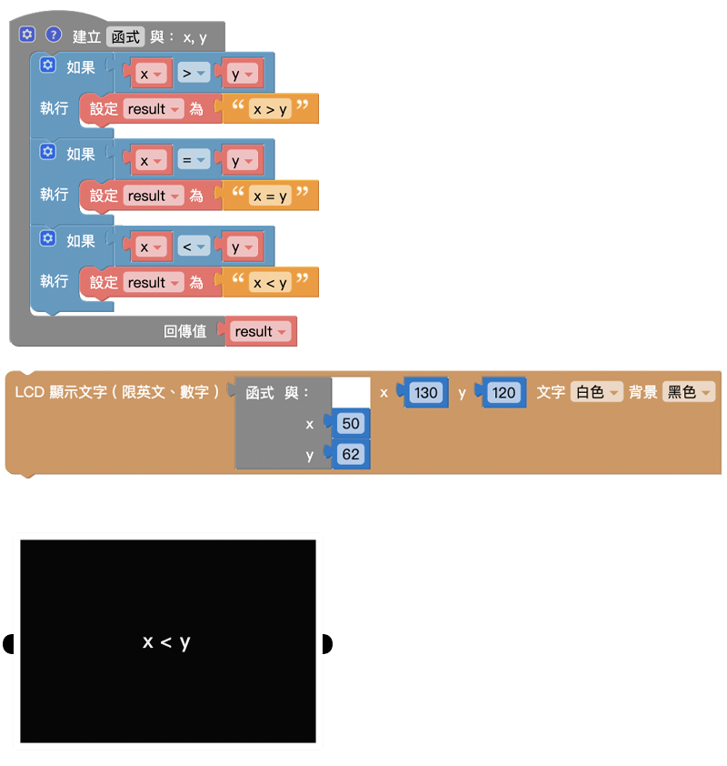

# 函数

函数积木可以帮助我们简化或管理较为复杂的程序逻辑，因为在写程序的时候，常会遇到需要重复撰写并执行的代码，如果每重复一次都得重写一次，势必会造成整份程序逻辑的复杂度，通过函数，将这些重复的程序集中管理，需要使用的时候再去呼叫函数，就可以执行对应的内容。

## 建立函数

「建立函数」积木可以将许多重复会用到的程序积木包装成函数。

### 「函数」积木使用流程

使用建立函数积木并不会执行函数，因为函数是定义「需要执行的内容」，建立完成函数积木内容后，在函数积木的目录里，就会出现对应的执行函数积木，使用这块积木才表示执行这个函数。

函数流程：

1. 建立函数
2. 执行函数

### 示例：建立并执行函数

1. 使用「建立函数」积木，放入「LCD 显示文字」积木
2. 使用「函数」积木
3. 按下执行，可以看到 Web:AI 屏幕显示 **Hello World**。

### 函数内变量

除了单纯的使用函数，我们也可以建立「函数内的变量」，点选函数积木前方的小齿轮，就可以新增变量。

新增函数内的变量后，执行函数时也会看到放入变量数值的缺口。 ( 有几个函数内的变量就会有几个缺口 )

也会看到在「变量」积木列表同时新增了 x、y 变量。

### 示例：使用函数内变量作运算

1. 使用「建立函数」积木，放入「LCD 显示文字」积木，显示 **x 和 y 相乘** 的结果。
2. 使用「函数」积木，放入 **变量 x、y**。
3. 输入 x = 58、y = 63。
4. 按下执行，可以看到 Web:AI 屏幕显示 3654。

## 建立返回值函数

「建立返回的函数」积木可以让执行的函数，变成单纯的**数值**。

使用「建立返回值函数」，会发现执行函数时积木前方多了一个作为组合用的形状。
( 下图是延伸前一段建立函数内数的函数 )

### 示例：x、y 不同的运算结果

1. 使用「建立返回值函数」积木，返回值为 **x 和 y 相加**。
2. 使用「按钮开关」积木和「LCD 显示文字」积木，分别用来显示不同的运算结果。
3. 放入「函数」积木，设定不同的 x、y 值。
4. 执行后，按下 L、R 按钮，可以看到 Web:AI 屏幕显示不同的运算结果。

## 函数内判断并返回值

「函数内判断并返回值」积木必须和「建立返回值函数」的积木搭配，其作用为在某指定判断条件下成立则使函数返回指定数值。

> 「函数内判断并返回值」积木必须放在「建立函数」积木内才能正常运作。

### 示例：判断 x、y 大小 ( 1 )

通过这个积木，搭配函数内的变量，就可以通过传入的变量数值，最后返回 x 和 y 哪个比较大的结果。

### 示例：判断 x、y 大小 ( 2 )

因为「函数内判断并返回值」积木具备逻辑判断的功能，所以也可以使用逻辑积木加上一个变量来做判断，就能做出一模一样的效果。

