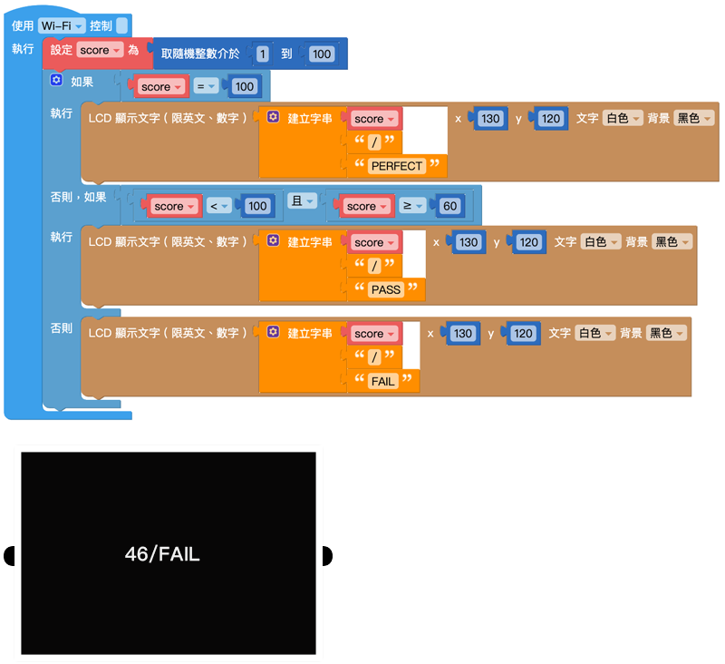

# 逻辑

在日常生活里，不论是写程序、数学计算，法庭攻防，甚至是路上交通、买卖东西或要不要起床，都包含许多「逻辑」的成分。逻辑可做许多的条件和判断，当满足了某些条件就会执行某件事，例如听见闹钟响就该起床、看到绿灯才可以行进…等状况，就是一些简单的逻辑判断。

## 逻辑判断

如果事件满足判断条件(判断返回值为「真」或「ture」)，就会执行对应的内容。

-如果：接**判断条件**

-执行：接**执行内容**

### 增加条件

点选左上方的「蓝色小齿轮」，可以新增逻辑判断的条件，点一下可以打开，再点一下可以关闭。

### 判断条件：如果、否则如果、否则

「否则」的判断条件为当「如果」和「否则如果」的条件都没有满足，就会执行「否则」的内容。

逻辑判断条件位置：

-「如果」：在第一层

-「否则如果」：位在中间

-「否则」：在最后

如果只有两个条件，例如非A即B，就可以单纯使用「如果」和「否则」就可以，甚至可以不使用「否则」，这样在条件外就不会进行任何动作。

## 判断条件式

判断条件式主要会放在逻辑的「判断条件」缺口内，提供不同情境的逻辑判断。

判断的条件主要分为：等于(=)、不等于(≠)、小于(<)、小于等于(≦)、大于(>)、大于等于(≧)。

将「判断条件式」放入「如果」、「否则如果」、「否则」积木后方，即可设定执行条件。

### 示例：判断成绩是否及格(1)

1.以下方「判断成绩是否及格」为示例，设定「变量score」为随机0~100数值，并判断是否及格。

-变量score≧60：显示PASS

-变量score < 60：显示FAIL

2.完成后按下执行。

## 逻辑运算符

「逻辑运算符」积木为逻辑判断提供了更弹性的判断条件，当中包含了「和」与「或」。

-和：必须2个判断条件式都满足，才会执行动作，

-或：只要满足其中一个判断条件式，就会执行动作。

逻辑判断出现「如果否则」的时候，常会用到逻辑运算符，而逻辑运算符可以搭配判断条件的积木使用。

### 示例：判断成绩是否及格(2)

1.这次的示例多增加一个项目是当成绩是100时，让屏幕显示「PERFECT」。

2.判断条件如下：

-「变量score」= 100:PERFECT

- 100 >「变量score」≧60:PASS

- 60≧「变量score」：FAIL

3.在「否则如果」后方放入「逻辑运算符」，让条件为score介于60~100之间。

4.完成后按下执行，可以看到屏幕显示成绩与结果。

## 真/假

「真/假」积木主要表示ture(真)与false(假)两个值，目的是在数字、文字之外多一些判断的条件，同时也可以将ture和false提交给变量。

## 空

编辑程序的时候，会遇到某个变量或是某个数值变成空值(null)的情况，这时就可以使用空值的积木判断，用法和「真/假」积木类似。

## 非

「非」积木表示「不是什么」，通常会和「真/假」或「空值」的积木搭配使用。

如果把积木接在「非」的积木后面，状态就会相反过来，例如空就会变成非空、真就会变假，假就会变真，依此类推。

## 三元逻辑运算符

「三元逻辑运算符」积木是针对只有「两种条件」，并针对根据条件传回「两个表达式」的其中一个。

### 示例：判断成绩是否及格(3)

1.使用相同的「判断成绩是否及格」示例，因为判断结果只有「及格」、「不及格」2种，所以可以使用「三元逻辑运算符」积木。

2.设定「变量result」储存结果，

-测试：「变量score」≧60

-如果为真：显示PASS

-如果为假：显示FAIL

3.开始执行后，按下L按钮，屏幕会显示分数及结果。

