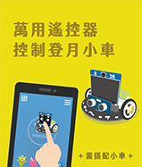
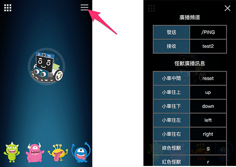

# 教学示例卡使用教学

教学示例卡是Web:AI为各教育单位提供的程序示例，只要使用开发板扫描QRcode，就能立即体验AI人工智能，并快速在课堂中进行示例演示。

## 教学视频

欢迎参考下方教学视频：

<iframe src="https://www.youtube.com/embed/Qgtthh7d9xQ" allowfullscreen width="100%" style="aspect-ratio:728/410;border:none " ></iframe>

## 介绍

教学示例包含：

A.人脸追踪

B.语音互动

C.小怪兽追踪

D.口罩侦测

E.登月小车追踪小怪兽

F.万用遥控器控制登月小车

>「登月小车追踪小怪兽」及「万用遥控器控制登月小车」示例需要搭配登月小车作使用。欢迎参考：[MoonCar登月小车](https://store.webduino.io/products/webbit-mooncar)。

## 使用教学

1.使用Web:AI开发板进入QRcode模式

>关于如何进入QRcode模式，欢迎参考：[操作模式：QRcode模式教学](https://bpi-steam.com/WebAI/zh/Unboxing/Mode.html#QRcode%E6%A8%A1%E5%BC%8F)。

2.拿出教学示例卡，翻到背面的QRcode。

3.使用Web:AI开发板的镜头扫描卡片上的QRcode。

5.扫描成功后即可应用教学示例。

## A.人脸追踪

以人脸的五官来作为模型，经过机器学习后可以辨识出画面中的人脸。

不限定人脸数量，但可能会受到环境光照的影响而产生些许误差。

>-关于人脸追踪，欢迎参考：[人脸追踪积木](https://bpi-steam.com/WebAI/zh/Programming/Advanced/Face.html)。

## B.语音互动

基于「语音辨识」的原理实现的语音互动，开发板中放入了男性、女性、Google小姐等语音，侦测到声音频率变化而做出对应的效果。

包含3种不同互动，只要对着Web:AI说出「你好吗？」、「自拍」、「你是谁？」，就会产生不同的互动效果

>因为每个人的声音模型都不同，如果侦测不灵敏，可以使用Google小姐来说出指令。

### 1.你好吗？

LCD屏幕随机显示1只小怪兽及情绪，并通过麦克风发出对应的音效。

### 2.自拍

Web:AI开发板开启摄像镜头，对着自己拍一张照片并显示在LCD屏幕上。

### 3.你是谁？

梦想成为科技教具的Web:AI会自我介绍给大家听!

>-关于语音辨识，欢迎参考：[语音辨识积木](https://bpi-steam.com/WebAI/zh/Programming/Advanced/Speech.html)。

## C.小怪兽追踪

采用「物件追踪」的技术辨识并追踪4只小怪兽，根据画面中的小怪兽显示信息。

###下载物件追踪模型时：

示例小卡使用的小怪兽模型是预设在开发板中的物件追踪模型，如果从[图像训练平台](https://vision.webduino.io/)下载物件追踪模型会将小怪兽模型覆盖。

若是要再次使用，就需要将开发板恢复固件。

>-关于物件追踪，欢迎参考：[四、训练图像分类、物件追踪](https://bpi-steam.com/WebAI/zh/Programming/Advanced/Object.html)。

>-关于恢复固件，欢迎参考：[初始化设定 ( 第一次使用请看这里 )](https://bpi-steam.com/WebAI/zh/Unboxing/Initialization.html)。

## D.口罩侦测

配合疫情时事，以人脸模型和配戴口罩的人脸模型做出的口罩侦测。

-当侦测到人脸配戴口罩，显示「安全!」。

-当侦测到人脸**未**配戴口罩，显示「危险!」。

>-关于口罩侦测，欢迎参考：[人脸追踪积木](https://bpi-steam.com/WebAI/zh/Programming/Advanced/Face.html)。

## E.登月小车追踪小怪兽

登月小车结合「物件追踪」技术，辨识4只颜色的小怪兽，让魔幻LED发出相对应颜色的光，并且依据LCD屏幕中小怪兽的位置来控制登月小车的前进、左转、右转，让小车追着小怪兽行驶。

## F.万用遥控器控制登月小车

想要直接操控登月小车吗？

「Webduino万用遥控器」可以直接滑动网页中的小车图案，用最简单的方式控制小车的移动。

### 操作步骤

1.使用Web:AI开发板扫描「万用遥控器控制小车QRcode」，进入「万用遥控器控制小车」模式。

进入后可以看到屏幕显示QRcode及「请用手机扫描」。

2.使用手机扫描屏幕上的QRcode，进入Webduino万用遥控器界面。

(也可以直接点击[Webduino万用遥控器](https://webduinoio.github.io/webduino-remote/index.html)连接进入)

3.点击右上角菜单按钮，开启设定画面。

4.在「发送」字段输入**DeviceID/PING**。

(如：DeviceID为**1a23b4**，则是输入**1a23b4/PING**)

5.输入完毕后，点击右上角✕符号关闭，即可滑动中央的小车图案来操控小车移动。

