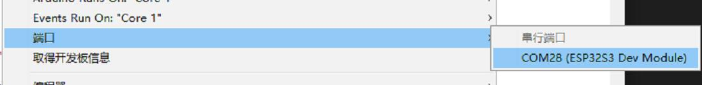

# Use of onboard resources

This chapter mainly describes the basic usage of the peripherals of the Leaf-S3 main control board through some sample projects. Through the following projects, you can modify and complete your own projects.
The Leaf-S3 peripherals mainly include: UART, I2C, SPI, ADC, PWM, DAC, etc.

## Preparation before starting

The typec on the BPI-Leaf-S3 development board uses the native USB interface of ESP32-S3 instead of the traditional USB to TLL chip.

In order for your development board to download programs correctly, you need to set the BPI-Leaf-S3 to download mode, there are two methods:

- Connect to the computer via USB, press the BOOT button, then press the Reset button and release, and finally release the BOOT button.

- In the state of disconnecting all power supplies, press and hold the BOOT button, then plug the development board into the computer, and finally release the BOOT button.

At this time, you can see more than one COM port in the device manager


Select this port in the IDE



## Project 1 Serial port experiment

In the very first chapter, we uploaded a Blink program to test the LED status lights on the board. Now, we use the UART serial port and print the timing data every second.

### Required components

Leaf-S3 Motherboard X 1


### Hardware connection

No other sensors are required for this project, so just connect the Leaf-S3 to a computer via USB and it will work.

### Enter code

Open the Arduino IDE. Although it is possible to copy the code directly, we recommend that you enter the code manually to familiarize yourself with it.

code show as below:  

<details>
<summary>Expand to view</summary>

````
void setup()
{
  Serial.begin(115200); //Set serial communication baud rate
}
void loop()
{
  static unsigned long i = 0; //define variable i
  Serial.println(i++); //output i after adding one
  delay(1000); // delay 1 second
}

````
</details>

After the input is complete, click "Compile" to check the code for errors. After making sure there are no errors, you can start uploading. After clicking "Upload", the IDE will send the code to the Leaf-S3 motherboard. After the upload is complete, you need to press the reset button so that the code can run normally

### Experimental phenomena

After completing the upload in the previous steps, open the serial monitor that comes with the Arduino IDE, and you can see the following print information:


## Project 2 PWM (breathing light)

Breathing light, that is, let Leaf-S3 drive the LED light through PWM to realize the brightness gradient of the LED, which looks like it is breathing. For an explanation of PWM, please read the Knowledge Extension section.

### Required components

Leaf-S3 Motherboard X 1


LED X 1 (recommended to connect a resistor in series to limit current)


### Hardware connection

Just connect the LED to GPIO13 of Leaf-S3, the long one is connected to GPIO13, and the short one is connected to GND

### Enter code

Open the Arduino IDE. Although it is possible to copy the code directly, we recommend that you enter the code manually to familiarize yourself with it.
code show as below: 

<details>
<summary>Expand to view</summary>

````
#define LED_CHANNEL_0 0 //Set channel 0
#define LED_TIMER_13_BIT 13 //Set 13-bit timer
#define LED_BASE_FREQ 5000 //Set the timer frequency bit to 5000Hz
#define LED_PIN 13 //Set LED light

int brightness = 0; // LED brightness
int fadeAmount = 1; // number of LEDs
 
//Set the brightness of the led light
void ledcAnalogWrite(uint32_t value, uint32_t valueMax = 255) {
  //calculate duty cycle
  uint32_t duty = (LED_BASE_FREQ / valueMax) * min(value, valueMax);
  //set duty cycle
  ledcWrite(LED_CHANNEL_0, duty);
}
void setup() {
  ledcSetup(LED_CHANNEL_0, LED_BASE_FREQ, LED_TIMER_13_BIT); ledcAttachPin(LED_PIN, LED_CHANNEL_0);
}
void loop() {
  ledcAnalogWrite(brightness); brightness += fadeAmount;
 
  if (brightness <= 0 || brightness >= 255) {
       fadeAmount = -fadeAmount;
  }
  delay(30);
}

````
</details>

After typing, click the "Compile" button to check the code for errors. After confirming that there are no errors, you can start uploading, click the "Upload" button . The IDE will send the code to the Leaf-S3 motherboard. After the upload is complete, you can see the LED light next to the Type-C start to "breathe"!
Now let's review the code and hardware to see how it works.

### Knowledge learning

What is a PWM control signal?

PWM (pulse-width modulation) pulse width modulation, the MCU (microcontroller) controls the on-off of the switching device, so that the output terminal gets a series of pulses of equal amplitude, and these pulses are used to replace the sine wave or the required waveform. As shown below:


Among them, tON is the high-level duration, tPWM is the period of the PWM wave, tPWM-tON is the low-level duration, and the duty cycle refers to the proportion of the high-level duration to the entire cycle, namely D=ton/tPWM.

### Code Analysis

The PWM of Leaf-S3 is much more advanced than the ordinary Arduino UNO. The analogWrite function cannot be simply used to drive the PWM, but the timer function and related frequency parameters need to be set to work.

````
#define LEDC_CHANNEL_0 0
````

Defines the channel used by the timer. Leaf-S3 has a total of 16 channels, and channel 0 is used here.

````
#define LEDC_TIMER_13_BIT 13
````

The timer is defined as a 13-bit timer, that is, the maximum count of the timer is 2 to the 13th power.

````
#define LEDC_BASE_FREQ 5000
````

This is the frequency at which the timer is set, in Hz. The next brightness and fadeAmount parameters represent the duty cycle of the PWM and the value for each change, respectively.

````
void ledcAnalogWrite(uint32_t value, uint32_t valueMax = 255)
````

This function calculates the PWM duty cycle and sets the PWM duty cycle, similar to Arduino's analogWrite function. As you can see, the maximum value of the passed parameter is 255, which is for compatibility with analogWrite.

````
ledcSetup(LEDC_CHANNEL_0, LEDC_BASE_FREQ, LEDC_TIMER_13_BIT);
ledcAttachPin(LED_PIN, LEDC_CHANNEL_0);
````

These two functions are Leaf-S3 timer setting functions. The function prototype and principle are not described here. If you are interested, you can look at the underlying source code (source address: C:\Users\“your-PC”\AppData\Local\Arduino15 \packages\esp32\ hardware\ adafruit_metro_esp32s2 \0.0.3\libraries\ESP32\), you only need to know how to use these functions to set the relevant timer.

About what is a PWM signal, it has been explained before, and it will not be explained here.

>Note: Any pin of Leaf-S3 can be configured as PWM output, you can try to modify the code to complete your project.

## Project 3 ADC

ADC (analog-to-digital converter or A/D converter) refers to converting an analog signal into a digital signal. The ADC of Leaf-S3 is 13-bit, the maximum output value is 8191, while the Arduino UNO is 10-bit, and the maximum output value is 1023. Therefore, the accuracy is higher than that of Arduino UNO, and the conversion rate is faster, and in use Compatible with Arduino analogRead function, you can read it directly.

### Required components

Analog angle sensor X 1


Breadboard X 1


Leaf-S3 Motherboard X 1


### Hardware connection

 Plug the potentiometer to the Leaf-S3 motherboard, and then plug the analog angle sensor to IO2 (IO2 is used in the experiment). After the components are connected, use the USB cable to connect the Leaf-S3 and the computer.

 ### Enter code

 Open the Arduino IDE. Although it is possible to copy the code directly, we recommend that you enter the code manually to familiarize yourself with it. code show as below: 

<details>
<summary>Expand to view</summary>

````
 void setup() {
  // put your setup code here, to run once:
  Serial.begin(115200);
}
void loop() {
  // put your main code here, to run repeatedly:
  Serial.println(analogRead(2));
  delay(100);
}

````
</details>

 After the input is complete, click "Compile" to check the code for errors. After making sure there are no errors, you can start uploading. After clicking "Upload", the IDE will send the code to the Leaf-S3 motherboard. After the upload is complete, open the serial monitor of the Arduino IDE, rotate the analog angle sensor, and you can see the value changes in the serial monitor, as shown in the following figure:

 


### Code Analysis

Since the ADC of Leaf-S3 is fully compatible with Arduino, the analogRead function will not be explained too much here.
 
Note: If you are not particularly familiar with the basic functions of Arduino, you can [click the link](https://www.arduino.cc/en/Tutorial/BuiltInExamples) to learn.

## Project 4 I2C

The I2C of Leaf-S3 can be configured to any I/O port, and you can configure it by passing relevant parameters. For the convenience of use, we have configured I2C by default, which is fully compatible with Arduino in use. The default configuration pins can be viewed in Chapter 1 Introduction. This project is based on I2C default configuration to drive OLED display.

required components

I2C OLED-12864 Display X 1


BreadboardX 1


Leaf-S3 Motherboard X 1


### Hardware connection

Plug the Leaf-S3 motherboard into the breadboard, then plug the OLED display into the I2C port. (SDA is 33, SCL is 34) After the components are connected, use a USB cable to connect the Leaf-S3 to the computer.

### Enter code

Open the Arduino IDE. Although it is possible to copy the code directly, we recommend that you enter the code manually to familiarize yourself with it. code show as below:

<details>
<summary>Expand to view</summary>

````
#include <Wire.h>
   int UG2864Address = 0x3C;//OLED UG2864 device 7-bit address
 
prog_char F8X16[][16] PROGMEM =
{
  0x00,0x00,0x00,0x00,0x00,0x00,0x00,0x00,0x00,0x00,0x00,0x00,0x00,0x00,0x00,0x00,// 0
  0x00,0x00,0x00,0xF8,0x00,0x00,0x00,0x00,0x00,0x00,0x00,0x33,0x30,0x00,0x00,0x00,//!1
  0x00,0x10,0x0C,0x06,0x10,0x0C,0x06,0x00,0x00,0x00,0x00,0x00,0x00,0x00,0x00,0x00,//"2
  0x40,0xC0,0x78,0x40,0xC0,0x78,0x40,0x00,0x04,0x3F,0x04,0x04,0x3F,0x04,0x04,0x00,//#3
  0x00,0x70,0x88,0xFC,0x08,0x30,0x00,0x00,0x00,0x18,0x20,0xFF,0x21,0x1E,0x00,0x00,//$4
  0xF0,0x08,0xF0,0x00,0xE0,0x18,0x00,0x00,0x00,0x21,0x1C,0x03,0x1E,0x21,0x1E,0x00,//%5
  0x00,0xF0,0x08,0x88,0x70,0x00,0x00,0x00,0x1E,0x21,0x23,0x24,0x19,0x27,0x21,0x10,//&6
  0x10,0x16,0x0E,0x00,0x00,0x00,0x00,0x00,0x00,0x00,0x00,0x00,0x00,0x00,0x00,0x00,//'7
  0x00,0x00,0x00,0xE0,0x18,0x04,0x02,0x00,0x00,0x00,0x00,0x07,0x18,0x20,0x40,0x00,//(8
  0x00,0x02,0x04,0x18,0xE0,0x00,0x00,0x00,0x00,0x40,0x20,0x18,0x07,0x00,0x00,0x00,//)9
  0x40,0x40,0x80,0xF0,0x80,0x40,0x40,0x00,0x02,0x02,0x01,0x0F,0x01,0x02,0x02,0x00,//*10
  0x00,0x00,0x00,0xF0,0x00,0x00,0x00,0x00,0x01,0x01,0x01,0x1F,0x01,0x01,0x01,0x00,//+11
  0x00,0x00,0x00,0x00,0x00,0x00,0x00,0x00,0x80,0xB0,0x70,0x00,0x00,0x00,0x00,0x00,//,12
  0x00,0x00,0x00,0x00,0x00,0x00,0x00,0x00,0x00,0x01,0x01,0x01,0x01,0x01,0x01,0x01,//-13
  0x00,0x00,0x00,0x00,0x00,0x00,0x00,0x00,0x00,0x30,0x30,0x00,0x00,0x00,0x00,0x00,//.14
  0x00,0x00,0x00,0x00,0x80,0x60,0x18,0x04,0x00,0x60,0x18,0x06,0x01,0x00,0x00,0x00,///15
  0x00,0xE0,0x10,0x08,0x08,0x10,0xE0,0x00,0x00,0x0F,0x10,0x20,0x20,0x10,0x0F,0x00,//016
  0x00,0x10,0x10,0xF8,0x00,0x00,0x00,0x00,0x00,0x20,0x20,0x3F,0x20,0x20,0x00,0x00,//117
  0x00,0x70,0x08,0x08,0x08,0x88,0x70,0x00,0x00,0x30,0x28,0x24,0x22,0x21,0x30,0x00,//218
  0x00,0x30,0x08,0x88,0x88,0x48,0x30,0x00,0x00,0x18,0x20,0x20,0x20,0x11,0x0E,0x00,//319
  0x00,0x00,0xC0,0x20,0x10,0xF8,0x00,0x00,0x00,0x07,0x04,0x24,0x24,0x3F,0x24,0x00,//420
  0x00,0xF8,0x08,0x88,0x88,0x08,0x08,0x00,0x00,0x19,0x21,0x20,0x20,0x11,0x0E,0x00,//521
  0x00,0xE0,0x10,0x88,0x88,0x18,0x00,0x00,0x00,0x0F,0x11,0x20,0x20,0x11,0x0E,0x00,//622
  0x00,0x38,0x08,0x08,0xC8,0x38,0x08,0x00,0x00,0x00,0x00,0x3F,0x00,0x00,0x00,0x00,//723
  0x00,0x70,0x88,0x08,0x08,0x88,0x70,0x00,0x00,0x1C,0x22,0x21,0x21,0x22,0x1C,0x00,//824
  0x00,0xE0,0x10,0x08,0x08,0x10,0xE0,0x00,0x00,0x00,0x31,0x22,0x22,0x11,0x0F,0x00,//925
  0x00,0x00,0x00,0xC0,0xC0,0x00,0x00,0x00,0x00,0x00,0x00,0x30,0x30,0x00,0x00,0x00,//:26
  0x00,0x00,0x00,0x80,0x00,0x00,0x00,0x00,0x00,0x00,0x80,0x60,0x00,0x00,0x00,0x00,//;27
  0x00,0x00,0x80,0x40,0x20,0x10,0x08,0x00,0x00,0x01,0x02,0x04,0x08,0x10,0x20,0x00,//<28
  0x40,0x40,0x40,0x40,0x40,0x40,0x40,0x00,0x04,0x04,0x04,0x04,0x04,0x04,0x04,0x00,//=29
  0x00,0x08,0x10,0x20,0x40,0x80,0x00,0x00,0x00,0x20,0x10,0x08,0x04,0x02,0x01,0x00,//>30
  0x00,0x70,0x48,0x08,0x08,0x08,0xF0,0x00,0x00,0x00,0x00,0x30,0x36,0x01,0x00,0x00,//?31
  0xC0,0x30,0xC8,0x28,0xE8,0x10,0xE0,0x00,0x07,0x18,0x27,0x24,0x23,0x14,0x0B,0x00,//@32
  0x00,0x00,0xC0,0x38,0xE0,0x00,0x00,0x00,0x20,0x3C,0x23,0x02,0x02,0x27,0x38,0x20,//A33
  0x08,0xF8,0x88,0x88,0x88,0x70,0x00,0x00,0x20,0x3F,0x20,0x20,0x20,0x11,0x0E,0x00,//B34
  0xC0,0x30,0x08,0x08,0x08,0x08,0x38,0x00,0x07,0x18,0x20,0x20,0x20,0x10,0x08,0x00,//C35
  0x08,0xF8,0x08,0x08,0x08,0x10,0xE0,0x00,0x20,0x3F,0x20,0x20,0x20,0x10,0x0F,0x00,//D36
  0x08,0xF8,0x88,0x88,0xE8,0x08,0x10,0x00,0x20,0x3F,0x20,0x20,0x23,0x20,0x18,0x00,//E37
  0x08,0xF8,0x88,0x88,0xE8,0x08,0x10,0x00,0x20,0x3F,0x20,0x00,0x03,0x00,0x00,0x00,//F38
  0xC0,0x30,0x08,0x08,0x08,0x38,0x00,0x00,0x07,0x18,0x20,0x20,0x22,0x1E,0x02,0x00,//G39
  0x08,0xF8,0x08,0x00,0x00,0x08,0xF8,0x08,0x20,0x3F,0x21,0x01,0x01,0x21,0x3F,0x20,//H40
  0x00,0x08,0x08,0xF8,0x08,0x08,0x00,0x00,0x00,0x20,0x20,0x3F,0x20,0x20,0x00,0x00,//I41
  0x00,0x00,0x08,0x08,0xF8,0x08,0x08,0x00,0xC0,0x80,0x80,0x80,0x7F,0x00,0x00,0x00,//J42
  0x08,0xF8,0x88,0xC0,0x28,0x18,0x08,0x00,0x20,0x3F,0x20,0x01,0x26,0x38,0x20,0x00,//K43
  0x08,0xF8,0x08,0x00,0x00,0x00,0x00,0x00,0x20,0x3F,0x20,0x20,0x20,0x20,0x30,0x00,//L44
  0x08,0xF8,0xF8,0x00,0xF8,0xF8,0x08,0x00,0x20,0x3F,0x00,0x3F,0x00,0x3F,0x20,0x00,//M45
  0x08,0xF8,0x30,0xC0,0x00,0x08,0xF8,0x08,0x20,0x3F,0x20,0x00,0x07,0x18,0x3F,0x00,//N46
  0xE0,0x10,0x08,0x08,0x08,0x10,0xE0,0x00,0x0F,0x10,0x20,0x20,0x20,0x10,0x0F,0x00,//O47
  0x08,0xF8,0x08,0x08,0x08,0x08,0xF0,0x00,0x20,0x3F,0x21,0x01,0x01,0x01,0x00,0x00,//P48
  0xE0,0x10,0x08,0x08,0x08,0x10,0xE0,0x00,0x0F,0x18,0x24,0x24,0x38,0x50,0x4F,0x00,//Q49
  0x08,0xF8,0x88,0x88,0x88,0x88,0x70,0x00,0x20,0x3F,0x20,0x00,0x03,0x0C,0x30,0x20,//R50
  0x00,0x70,0x88,0x08,0x08,0x08,0x38,0x00,0x00,0x38,0x20,0x21,0x21,0x22,0x1C,0x00,//S51
  0x18,0x08,0x08,0xF8,0x08,0x08,0x18,0x00,0x00,0x00,0x20,0x3F,0x20,0x00,0x00,0x00,//T52
  0x08,0xF8,0x08,0x00,0x00,0x08,0xF8,0x08,0x00,0x1F,0x20,0x20,0x20,0x20,0x1F,0x00,//U53
  0x08,0x78,0x88,0x00,0x00,0xC8,0x38,0x08,0x00,0x00,0x07,0x38,0x0E,0x01,0x00,0x00,//V54
  0xF8,0x08,0x00,0xF8,0x00,0x08,0xF8,0x00,0x03,0x3C,0x07,0x00,0x07,0x3C,0x03,0x00,//W55
  0x08,0x18,0x68,0x80,0x80,0x68,0x18,0x08,0x20,0x30,0x2C,0x03,0x03,0x2C,0x30,0x20,//X56
  0x08,0x38,0xC8,0x00,0xC8,0x38,0x08,0x00,0x00,0x00,0x20,0x3F,0x20,0x00,0x00,0x00,//Y57
  0x10,0x08,0x08,0x08,0xC8,0x38,0x08,0x00,0x20,0x38,0x26,0x21,0x20,0x20,0x18,0x00,//Z58
  0x00,0x00,0x00,0xFE,0x02,0x02,0x02,0x00,0x00,0x00,0x00,0x7F,0x40,0x40,0x40,0x00,//[59
  0x00,0x0C,0x30,0xC0,0x00,0x00,0x00,0x00,0x00,0x00,0x00,0x01,0x06,0x38,0xC0,0x00,//\60
  0x00,0x02,0x02,0x02,0xFE,0x00,0x00,0x00,0x00,0x40,0x40,0x40,0x7F,0x00,0x00,0x00,//]61
  0x00,0x00,0x04,0x02,0x02,0x02,0x04,0x00,0x00,0x00,0x00,0x00,0x00,0x00,0x00,0x00,//^62
  0x00,0x00,0x00,0x00,0x00,0x00,0x00,0x00,0x80,0x80,0x80,0x80,0x80,0x80,0x80,0x80,//_63
  0x00,0x02,0x02,0x04,0x00,0x00,0x00,0x00,0x00,0x00,0x00,0x00,0x00,0x00,0x00,0x00,//`64
  0x00,0x00,0x80,0x80,0x80,0x80,0x00,0x00,0x00,0x19,0x24,0x22,0x22,0x22,0x3F,0x20,//a65
  0x08,0xF8,0x00,0x80,0x80,0x00,0x00,0x00,0x00,0x3F,0x11,0x20,0x20,0x11,0x0E,0x00,//b66
  0x00,0x00,0x00,0x80,0x80,0x80,0x00,0x00,0x00,0x0E,0x11,0x20,0x20,0x20,0x11,0x00,//c67
  0x00,0x00,0x00,0x80,0x80,0x88,0xF8,0x00,0x00,0x0E,0x11,0x20,0x20,0x10,0x3F,0x20,//d68
  0x00,0x00,0x80,0x80,0x80,0x80,0x00,0x00,0x00,0x1F,0x22,0x22,0x22,0x22,0x13,0x00,//e69
  0x00,0x80,0x80,0xF0,0x88,0x88,0x88,0x18,0x00,0x20,0x20,0x3F,0x20,0x20,0x00,0x00,//f70
  0x00,0x00,0x80,0x80,0x80,0x80,0x80,0x00,0x00,0x6B,0x94,0x94,0x94,0x93,0x60,0x00,//g71
  0x08,0xF8,0x00,0x80,0x80,0x80,0x00,0x00,0x20,0x3F,0x21,0x00,0x00,0x20,0x3F,0x20,//h72
  0x00,0x80,0x98,0x98,0x00,0x00,0x00,0x00,0x00,0x20,0x20,0x3F,0x20,0x20,0x00,0x00,//i73
  0x00,0x00,0x00,0x80,0x98,0x98,0x00,0x00,0x00,0xC0,0x80,0x80,0x80,0x7F,0x00,0x00,//j74
  0x08,0xF8,0x00,0x00,0x80,0x80,0x80,0x00,0x20,0x3F,0x24,0x02,0x2D,0x30,0x20,0x00,//k75
  0x00,0x08,0x08,0xF8,0x00,0x00,0x00,0x00,0x00,0x20,0x20,0x3F,0x20,0x20,0x00,0x00,//l76
  0x80,0x80,0x80,0x80,0x80,0x80,0x80,0x00,0x20,0x3F,0x20,0x00,0x3F,0x20,0x00,0x3F,//m77
  0x80,0x80,0x00,0x80,0x80,0x80,0x00,0x00,0x20,0x3F,0x21,0x00,0x00,0x20,0x3F,0x20,//n78
  0x00,0x00,0x80,0x80,0x80,0x80,0x00,0x00,0x00,0x1F,0x20,0x20,0x20,0x20,0x1F,0x00,//o79
  0x80,0x80,0x00,0x80,0x80,0x00,0x00,0x00,0x80,0xFF,0xA1,0x20,0x20,0x11,0x0E,0x00,//p80
  0x00,0x00,0x00,0x80,0x80,0x80,0x80,0x00,0x00,0x0E,0x11,0x20,0x20,0xA0,0xFF,0x80,//q81
  0x80,0x80,0x80,0x00,0x80,0x80,0x80,0x00,0x20,0x20,0x3F,0x21,0x20,0x00,0x01,0x00,//r82
  0x00,0x00,0x80,0x80,0x80,0x80,0x80,0x00,0x00,0x33,0x24,0x24,0x24,0x24,0x19,0x00,//s83
  0x00,0x80,0x80,0xE0,0x80,0x80,0x00,0x00,0x00,0x00,0x00,0x1F,0x20,0x20,0x00,0x00,//t84
  0x80,0x80,0x00,0x00,0x00,0x80,0x80,0x00,0x00,0x1F,0x20,0x20,0x20,0x10,0x3F,0x20,//u85
  0x80,0x80,0x80,0x00,0x00,0x80,0x80,0x80,0x00,0x01,0x0E,0x30,0x08,0x06,0x01,0x00,//v86
  0x80,0x80,0x00,0x80,0x00,0x80,0x80,0x80,0x0F,0x30,0x0C,0x03,0x0C,0x30,0x0F,0x00,//w87
  0x00,0x80,0x80,0x00,0x80,0x80,0x80,0x00,0x00,0x20,0x31,0x2E,0x0E,0x31,0x20,0x00,//x88
  0x80,0x80,0x80,0x00,0x00,0x80,0x80,0x80,0x80,0x81,0x8E,0x70,0x18,0x06,0x01,0x00,//y89
  0x00,0x80,0x80,0x80,0x80,0x80,0x80,0x00,0x00,0x21,0x30,0x2C,0x22,0x21,0x30,0x00,//z90
  0x00,0x00,0x00,0x00,0x80,0x7C,0x02,0x02,0x00,0x00,0x00,0x00,0x00,0x3F,0x40,0x40,//{91
  0x00,0x00,0x00,0x00,0xFF,0x00,0x00,0x00,0x00,0x00,0x00,0x00,0xFF,0x00,0x00,0x00,//|92
  0x00,0x02,0x02,0x7C,0x80,0x00,0x00,0x00,0x00,0x40,0x40,0x3F,0x00,0x00,0x00,0x00,//}93
  0x00,0x06,0x01,0x01,0x02,0x02,0x04,0x04,0x00,0x00,0x00,0x00,0x00,0x00,0x00,0x00,//~94
};
 
 
char ch_buf[17]={0};
int RES = 6;//Gadgeteer PIN6
int DC = 7;//Gadgeteer PIN3
 
void Writec(unsigned char COM)
{
  Wire.beginTransmission(UG2864Address);
  Wire.write(0x00);
  Wire.write(COM);
  Wire.endTransmission();
}
 
void Writed(unsigned char DATA)
{
  Wire.beginTransmission(UG2864Address);
  Wire.write(0x40);
  Wire.write(DATA);
  Wire.endTransmission();
}
 
void SSD1306()
{
  Writec(0XAE);//display off
  Writec(0X00);//set lower column address
  Writec(0X10);//set higher column address
  Writec(0X40);//set display start line
  Writec(0XB0);//set page address
  Writec(0X81);//set contract control
  Writec(0XCF);// VCC Generated by Internal DC/DC Circuit
  Writec(0XA0);//set segment remap  column address 127 is mapped to SEG0
  Writec(0XA6);//normal / reverse   normal display
  Writec(0XA8);//multiplex ratio
  Writec(0X3F);//1/64
  Writec(0XC0);//Com scan direction remapped mode. Scan from COM[N-1] to COM0
  Writec(0XD3);//set display offset
  Writec(0X00);
  Writec(0XD5);//set osc division
  Writec(0X80);
  Writec(0XD9);//set pre-charge period
  Writec(0X11);
  Writec(0XDa);//set COM pins
  Writec(0X12);
  Writec(0X8d);/*set charge pump enable*/
  Writec(0X14);
  Writec(0Xdb);//Set VcomH
  Writec(0X20);
  Writec(0XAF);//display ON
}
void fill(unsigned char dat)
{
  unsigned char i,j;
  
  Writec(0x00);//set lower column address
  Writec(0x10);//set higher column address
  Writec(0xB0);//set page address
  
  for(j=0;j<8;j++)
  {
    Writec(0xB0+j);//set page address
    Writec(0x00);//set lower column address
    Writec(0x10);//set higher column address
    for(i=0;i<128;i++)
    {
      Writed(dat);
    }
  }
}
 
void show_string(unsigned char x,unsigned char y,char *s)
{
  unsigned char i,j,lower,higher;
  char *t;
  t=s;
  lower=y%16;
  higher=y/16;
  if((x>3) || (y>120))
    return;
  Writec(0xB0+x*2);//set page address
  Writec(lower);//set lower column address
  Writec(0x10+higher);//set higher column address
  for(j=0;*s!='\0';j++)
  {
    
    for(i=0;i<8;i++){
      ch_buf[i] = pgm_read_word(&F8X16[*s-32][i]);
    }
    for(i=0;i<8;i++)
      Writed(ch_buf[i]);
    s++;
  }
  Writec(0xB0+x*2+1);//set page address
  Writec(lower);//set lower column address
  Writec(0x10+higher);//set higher column address
  s=t;
  for(j=0;*s!='\0';j++)
  {
    for(i=0;i<8;i++){
      ch_buf[i] = pgm_read_word(&F8X16[*s-32][i+8]);
    }
    for(i=0;i<8;i++)
      Writed(ch_buf[i]);
    s++;
  }
}
 
 
 
void oled_init(void)
{
  pinMode(RES,OUTPUT);//RES
  pinMode(DC,OUTPUT);//D/C#
  
  digitalWrite(DC,LOW);
  Wire.begin();
  digitalWrite(RES,HIGH);   delay(100);
  digitalWrite(RES,LOW);    delay(100);
  digitalWrite(RES,HIGH);   delay(100);
  SSD1306();
  fill(0x00);
}
 
void setup() {
  oled_init();
}
 
 
void loop()
{
      fill(0x00);
      show_string(0,12,"BananaPi");
 
      show_string(2,12,"banana-pi.org");
      while(1);
}

````
</details>
After the input is complete, click "Compile" to check the code for errors. After making sure there are no errors, you can start uploading. After clicking "Upload", the IDE will send the code to the Leaf-S3 motherboard. After the upload is complete, the OLED display will display the words "BananaPi banana-pi.org".

### Code Analysis

Compared with the previous projects, the code of this project is more, mainly based on the direct drive of the bottom register of the OLED display based on I2C communication.

````
void Writec(unsigned char COM)
````

Set the register function, set the OLED display through I2C, the I2C usage method is fully compatible with Arduino.

````
void Written(unsigned char DATA)
````

Write data function, I2C usage is fully compatible with Arduino.

>Note: Leaf-S3's I2C is fully compatible with Arduino, mainly by calling the Wire library file.

## Project 5 SPI

In many sensors, SPI communication is used, because the SPI communication rate is faster than I2C, and there is no disadvantage of address conflict. SPI is a high-speed, full-duplex, synchronous communication bus, and Leaf-S3's SPI can be configured to all I/Os, and you can read the underlying code for use (not recommended for beginners). For a better user experience, Leaf-S3 is configured with IO35, IO36, and IO37 as SPI ports by default, and is fully compatible with Arduino in use. This project uses Leaf-S3 to read the data of the BME280 temperature and humidity sensor through SPI. The BME280 library file is used in the example. For the SPI driver, you can read the BEM280 library file, [click the link](https://github.com/ DFRobot/DFRobot_BME280) to download the BME280 library file.

### Required components

BME280 Temperature and Humidity Sensor X 1


>Note: BME280 sensor itself supports I2C and SPI communication, here we use SPI communication.

Breadboard X 1


Leaf-S3 Motherboard X 1


### Enter code

Open the Arduino IDE. Although it is possible to copy the code directly, we recommend that you enter the code manually to familiarize yourself with it. (This program requires the DFRobot_BME280 library, which needs to be downloaded at [GitHub](https://github.com/DFRobot/DFRobot_BME280), and unzip it to the Arduino\ Library folder) The code is as follows:

<details>
<summary>Expand to view</summary>

````
/*!
 * read_data_spi.ino
 *
 * Download this demo to test read data from bme280, connect sensor through spi interface
 *Connect cs pin to io 2
 * Data will print on your serial monitor
 *
 * Copyright [DFRobot](http://www.dfrobot.com), 2016
 * Copyright GNU Lesser General Public License
 *
 * version V1.0
 * date 12/03/2019
 */

#include "DFRobot_BME280.h"
#include "Wire.h"

typedef DFRobot_BME280_SPI BME; // ******** use abbreviations instead of full names ********

#define PIN_CS 2

BME bme(&SPI, PIN_CS); // select TwoWire peripheral and set cs pin id

#define SEA_LEVEL_PRESSURE 1015.0f

// show last sensor operate status
void printLastOperateStatus(BME::eStatus_t eStatus)
{
  switch(eStatus) {
  case BME::eStatusOK: Serial.println("everything ok"); break;
  case BME::eStatusErr: Serial.println("unknow error"); break;
  case BME::eStatusErrDeviceNotDetected: Serial.println("device not detected"); break;
  case BME::eStatusErrParameter: Serial.println("parameter error"); break;
  default: Serial.println("unknow status"); break;
  }
}

void setup()
{
  Serial.begin(115200);
  bme.reset();
  Serial.println("bme read data test");
  while(bme.begin() != BME::eStatusOK) {
    Serial.println("bme begin faild");
    printLastOperateStatus(bme.lastOperateStatus);
    delay(2000);
  }
  Serial.println("bme begin success");
  delay(100);
}

void loop()
{
  float temp = bme.getTemperature();
  uint32_t press = bme.getPressure();
  float alti = bme.calAltitude(SEA_LEVEL_PRESSURE, press);
  float humi = bme.getHumidity();

  Serial.println();
  Serial.println("======== start print =======");
  Serial.print("temperature (unit Celsius): "); Serial.println(temp);
  Serial.print("pressure (unit pa): "); Serial.println(press);
  Serial.print("altitude (unit meter): "); Serial.println(alti);
  Serial.print("humidity (unit percent): "); Serial.println(humi);
  Serial.println("======== end print =======");

  delay(1000);
}


````
</details>

 After the input is complete, click "Compile" to check the code for errors. After making sure there are no errors, you can start uploading. After clicking "Upload", the IDE will send the code to the Leaf-S3 motherboard. Open the Arduino serial monitor, you can see the print information as follows:


### Code Analysis

 The purpose is to use the BME280 library file, and the SPI bottom layer is not operated in the Item-5.ino file. However, the SPI of the Leaf ESP32-S3 is fully compatible with Arduino.

## Item Six WS2812

 Leaf-S3 integrates an RGB color light with model number WS2812. This project is an experiment to light up the RGB lights of Leaf-S3.

### Required components

Leaf-S3 Motherboard X 1


> Note: No other sensors need to be connected for this project.

### Enter code

Open the Arduino IDE. Although it is possible to copy the code directly, we recommend that you enter the code manually to familiarize yourself with it. (This program requires the Adafruit_NeoPixel library, which needs to be downloaded from [GitHub](https:/ /github.com/adafruit/Adafruit_NeoPixel) and unzipped to the Arduino\ Library folder) The code is as follows:

<details>
<summary>Expand to view</summary>

````
// NeoPixel Ring simple sketch (c) 2013 Shae Erisson
// Released under the GPLv3 license to match the rest of the
// Adafruit NeoPixel library

#include <Adafruit_NeoPixel.h>
#ifdef __AVR__
 #include <avr/power.h> // Required for 16 MHz Adafruit Trinket
#endif

// Which pin on the Arduino is connected to the NeoPixels?
#define PIN 18 // On Trinket or Gemma, suggest changing this to 1

// How many NeoPixels are attached to the Arduino?
#define NUMPIXELS 1 // Popular NeoPixel ring size

// When setting up the NeoPixel library, we tell it how many pixels,
// and which pin to use to send signals. Note that for older NeoPixel
// strips you might need to change the third parameter -- see the
// strandtest example for more info