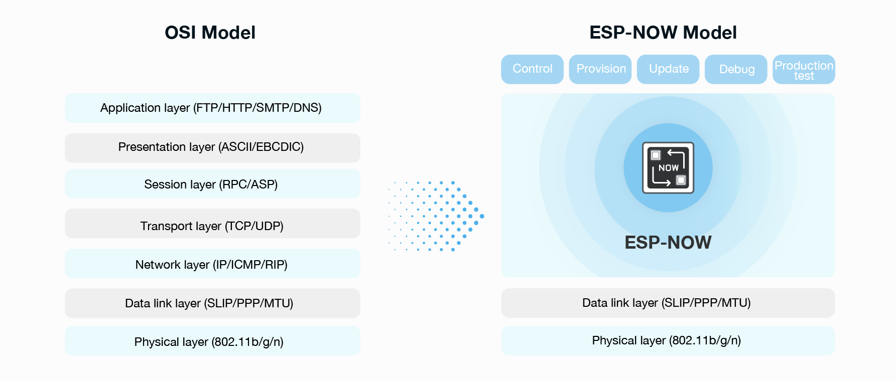

## What is ESP-NOW？

ESP-NOW is a wireless communication protocol defined by Espressif, which enables the direct, quick and low-power control of smart devices, without the need of a router. ESP-NOW can work with Wi-Fi and Bluetooth LE, and supports the ESP8266, ESP32, ESP32-S and ESP32-C series of SoCs. It’s widely used in smart-home appliances, remote controlling, sensors, etc.

ESP-NOW is a wireless communication protocol based on the data-link layer, which reduces the five layers of the OSI model to only one. This way, the data need not be transmitted through the network layer, the transport layer, the session layer, the presentation layer, and the application layer. Also, there is no need for packet headers or unpackers on each layer, which leads to a quick response reducing the delay caused by packet loss in congested networks.



* Coexists with Wi-Fi and Bluetooth LE, and supports various series of Espressif SoCs with Wi-Fi connectivity.
* It has a fast and user-friendly pairing method that is suitable for connecting “one-to-many” and “many-to-many” devices, while also controlling them.
* Occupies fewer CPU and flash resources.
* Can be used as an independent protocol that helps with device provisioning, debugging, and firmware upgrades.
* ECDH and AES algorithms make data transmission more secure.
* The window synchronization mechanism greatly reduces power consumption.

MicroPython has merged feature support for ESP-NOW into GitHub master, [#6515](https://github.com/micropython/micropython/pull/6515).

[MicroPython ESP-NOW API Documentation](https://docs.micropython.org/en/latest/library/espnow.html)

## Realize the simplest wireless communication, light up NeoPixel

Use two BPI-Leaf-S3 development boards, one as the sender and one as the receiver.No need to connect to any wifi in advance.

The sender will broadcast a piece of information after startup, and then enter a loop to wait for a return message, and turn on the blue light once a return message is received.

The receiving end will enter a loop to receive messages after startup, print the message after receiving the message, turn on the green light once if it receives the message, and return a message to the sending end, and then continue to receive the message.

**Sender**

```py
import network
import espnow
import time
from neopixel import NeoPixel
from machine import Pin

np = NeoPixel(Pin(48), 25)
np[0] = (0, 0, 0)
np.write()

# A WLAN interface must be active to send()/recv()
sta = network.WLAN(network.STA_IF)
sta.active(True)
sta.disconnect()

e = espnow.ESPNow()
e.active(True)
peer = b'\xbb\xbb\xbb\xbb\xbb\xbb'   # MAC address of peer's wifi interface
e.add_peer(peer)      # Must add_peer() before send()

e.send(peer, "Starting...", True)
for i in range(100):
    e.send(peer, str(i)*20, True)
sended = e.send(peer, b'end', True)
print(sended)
while True:
    host, msg = e.recv()
    if msg:             # msg == None if timeout in recv()
        print(host, msg)
        if msg == b'All received.':
            np[0] = (0, 0, 25)
            np.write()
            time.sleep(0.5)
            np[0] = (0, 0, 0)
            np.write()
        break

```

**Receiver**

```py
import network
import espnow
import time
from neopixel import NeoPixel
from machine import Pin

np = NeoPixel(Pin(48), 25)
np[0] = (0, 0, 0)
np.write()

# A WLAN interface must be active to send()/recv()
sta = network.WLAN(network.STA_IF)
sta.active(True)
sta.disconnect()

e = espnow.ESPNow()
e.active(True)

while True:
    host, msg = e.recv()
    if msg:             # msg == None if timeout in recv()
        print(host, msg)

        if msg == b'end':
            try:
                e.add_peer(host)  # Must add_peer() before send()
            except OSError:
                pass
            sended = e.send(host, "All received.", True)
            print(sended)
            np[0] = (0, 25, 0)
            np.write()
            time.sleep(0.5)
            np[0] = (0, 0, 0)
            np.write()

```

