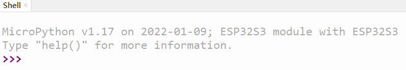

# Micropython runtime environment setup

The Micropython operating environment depends on Python, so we need to install Python before using it. The IDE we use here is Thonny.

## Install Python environment

Open [Python official website](https://www.python.org/).

For Windows systems, the most convenient way to download the installation package is to click the icon shown in the following figure on the homepage of the official website to download.


Other operating systems or other distributions can be selected in the Downloads tab.

It is recommended to use python 3.7 or later.

Be sure to remember to check Add Python 3.x to PATH when starting the installation, so that you can avoid adding it to the PATH manually.


Follow the installation instructions step by step to complete the installation smoothly.

## Install Thonny IDE

Take the specific operation steps of Windows PowerShell as an example.

For other systems or installation methods, please refer to the instructions on the [Thonny official website](https://thonny.org/).

Right-click the Windows Start menu to see Windows PowerShell, click Open.


We install Thonny IDE via pip here.

Pip is a Python package management tool. First, confirm whether pip is the latest version. Use the following command to upgrade pip directly:

```shell
pip install -U pip
```

Install Thonny with the following command:

```shell
pip install thonnyapp
```

If needed in the future, Thonny can be upgraded with the following command:

```shell
pip install -U thonnyapp
```

Thonny can be found quickly with Windows Search, or in the Start menu bar.


## Connect the development board to the computer

Connect the development board to the computer via a USB cable.

The power indicator on the board will light up when properly connected.

We need to know whether the development board is recognized by the computer, and find out which COM port is connected to (for serial communication, downloading programs, etc.).

First find "This PC" on the desktop, right-click, select "Manage", open "Device Manager", and click "Ports (COM and LPT)".

A new COM port will be added to the list (COM21 in the example image).


## Burn MicroPython firmware

The default factory firmware of Leaf-S3 development board is MicroPython. If you need to burn the firmware, you can refer to [Micropython firmware download and burning](Firmware.md).

## Configure Thonny IDE

Open Thonny, click Run, click to select an interpreter:


Set the interpreter to MicroPython (ESP32):


Select the COM port of the development board:


After confirming the settings, the MicroPython REPL is opened in the shell.



The REPL starts and outputs information, which means that the MicroPython firmware is successfully burned and can be used normally.

Click View, check File, you can see the local file directory and the file directory on the development board:


Other view windows can also be used as required.

You can choose your favorite theme style in the settings.

