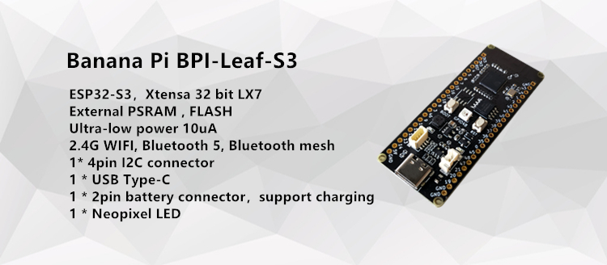

# 【 BPI-Leaf-S3 Development Board 】

## introduce

The Banana Pi Leaf series is a low-power microcontroller development board designed for the Internet of Things.

BPI-Leaf-S3 has an onboard ESP32-S3 chip, supports 2.4 GHz Wi-Fi and Bluetooth® LE dual-mode wireless communication, is compatible with low-power hardware design, and consumes only 10uA in deep sleep mode .

It supports two power supply modes: USB and external 3.7V lithium battery, which can realize automatic power switching function under dual power supply, and supports USB charging mode. Small size, convenient interface, easy to use, and can be directly applied to low-power IoT projects.

The BPI-Leaf-S3 development board supports ESP-IDF, Arduino, MicroPython and other methods for programming and development in terms of software.

All IO pins corresponding to the chip are marked on the BPI-Leaf-S3 development board, and the order of the IO pins is consistent with the Espressif ESP32-S3-DevKitC-1 development board. Developers can support DevKitC-1 according to actual needs. The peripherals are added to the BPI-Leaf-S3, and the development board can also be plugged into the breadboard.

## Programming with MicroPython

Regardless of the programmer is a beginner or not, MicroPython is considered to be less difficult to develop than other MCU programming languages.

Its code is easy to understand compared to other programming languages, and it has various resources accumulated over the years by the open source community.

Just like Python, it has strong vitality and application value.

By uploading the MicroPython firmware, you can use the Python language to program in the development board.

## Programming with Arduino

Provides software tools and best examples to get started with Arduino, lowering the barriers to entry into professional ESP32 embedded development.

>Arduino will not explain too much basic content, please have the language development foundation of C/C++.

## Information and resources

- [WIKI](https://wiki.banana-pi.org/BPI-Leaf-S3)

- [GitHub: BPI-Leaf-S3 Development Board Schematic PDF](https://github.com/BPI-STEAM/BPI-Leaf-S3-Doc/blob/main/sch/BPI-Leaf-S3-Chip- V0.1A.pdf)

- [ESP32-S3 Specifications](https://github.com/BPI-STEAM/BPI-Leaf-S3-Doc/blob/main/Example/Arduino)

- [ESP32-S3 Technical Reference Manual](https://www.espressif.com/sites/default/files/documentation/esp32-s3_technical_reference_manual_cn.pdf)

## Sample purchase

- [Official AliExpress](https://www.aliexpress.com/item/1005004428945296.html?spm=5261.ProductManageOnline.0.0.48af4edfYbyEoI)

- [Official Taobao](https://item.taobao.com/item.htm?spm=a2126o.success.0.0.29034831FGnLQW&id=677287234553)

- OEM&OEM customized service: sales@banana-pi.com