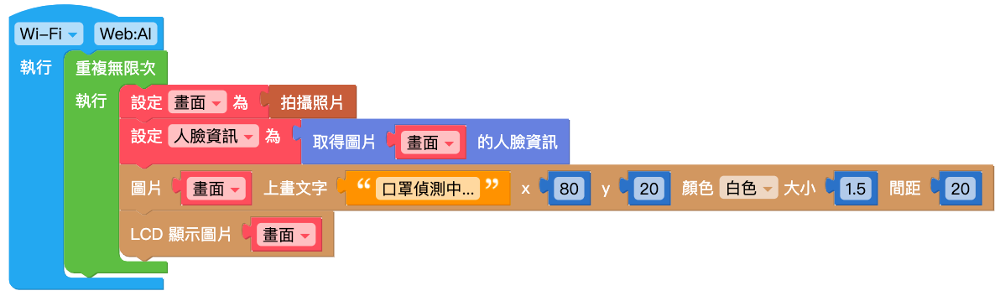

# 人脸追踪

在 AI 人工智能中，人脸识别与追踪是一种很重要的应用，即通过大量的训练集来训练AI使其能从图像中分辨出人的面部特征并做出标记。通过这项技术，可以侦测到是否有人经过以及画面中的人数，进一步做出监视器等应用。

而Web:AI 的人脸追踪技术，可以做到追踪人脸的座标位置，以及人脸在画面中的宽度、高度，更配合疫情时事，增加了口罩辨识的功能，让AI 结合生活应用，更方便用于教学。

## 照相画面

「拍摄照片」积木可以使用镜头拍摄一次画面，配合「无限循环」积木就可以达成相机取景器的效果。

另外也可以使用「变量」积木替拍摄照片命名，通过命名来做出更多变化。

> 以上两种积木组合方式执行后会达到相同的结果，差别在于若是要做出更多应用变化，就需要搭配「变量」积木的命名。

### 画面上画文字

Web:AI 能够在萤幕画面或图片上显示文字，这时就需要搭配「图片上画文字」积木。

> 请特别注意，「图片上画文字」积木需要放在「LCD 显示图片」积木之前！

## 取得图片的人脸信息

「取得图片的人脸信息」积木能够在画面中判断人脸特征，并将侦测到的人脸用白框框起来。

## 取得人脸信息

「取得人脸信息」积木代表从镜头中的人脸读取到的信息，包含位置 ( x 座标、y 座标 )及大小 ( 宽度、高度 )。

## 判断人脸有无戴口罩

读取到画面的人脸后，可以进一步判断是否配戴口罩，通过「判断人脸有无戴口罩」积木，可以针对人脸是否戴着口罩返回「是」或「否」，更能做出口罩侦测机的应用。

## 示例：追踪人脸座标

1. 先使用「变量」积木将拍摄照片命名为「画面」，做出镜头画面。

   

2. 使用「变量」积木，将「取得图片的人脸信息」积木命名为「人脸信息」。
    现在执行后可以在画面中框出人脸。

    

3. 使用「图片上画文字」积木，放入「文字」积木，做出人脸的 xy 座标。

   

4. 按下执行，可以看到开始追踪人脸，并同步显示人脸的位置座标。

## 示例：口罩侦测器

1. 先使用「变量」积木将拍摄照片命名为「画面」，做出镜头画面。

    

2. 使用「变量」积木，将「取得图片的人脸信息」积木命名为「人脸信息」。
    现在执行后可以在画面中框出人脸。

    

3. 使用「图片上画文字」积木，放入「文字」积木，显示「口罩侦测中...」。

    
 
4. 在这里加入「逻辑」积木，用来判断人脸是否配戴口罩。
    - 配戴口罩 = 真
    - 配戴口罩 = 假

    

5. 在「逻辑」积木后放入后续要执行的动作，如：
    - 配戴口罩 = 真：显示绿色「安全」
    - 配戴口罩 = 假：显示红色「警告！」

    

6. 按下执行后，就能够开始进行口罩辨识。
可以看到没配戴口罩时，萤幕显示红色「警告！」，配戴着口罩时，萤幕显示绿色「安全」。