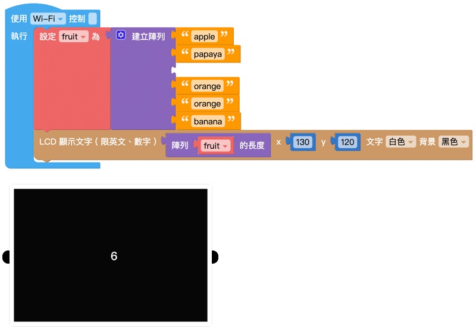
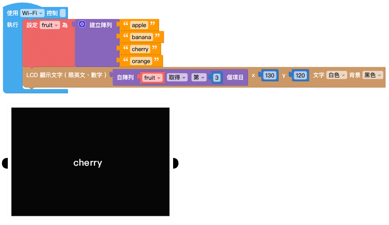

# 数组

数组可以将数字、文本、列表或变量，按照顺序组合起来，这些按序排列资料集合就称作数组。一个数组可以再细分为多个项目，或是一个数组内还包含其他数组。在进行比较复杂的运算时，也会通过数组的操作来实现。

## 建立数组、空数组

- 「建立数组」积木可以通过指定位置放入对应的内容，建立一个带有数值的数组。
- 「空数组」积木会建立一个数组容器，但会是一个里面没有包含任何项目的数组。

点击积木的「设定」按钮，可以改变量组内的项目数量，当数量为 0，积木就会变成空数组，可以藉由后续操作改变量组内的项目内容。

### 示例：展示数组内的所有水果

1. 将「变量 fruit」设定为数组，并在数组项目中放入各种水果名称。
2. 使用「LCD 显示文字」积木显示「变量 fruit」。
3. 避免文字显示超出屏幕，调整 x 成 50。
4. 按下执行，可以看到 Web:AI 屏幕显示 **['apple', 'orange', 'banana']**。

   

## 重复数组内项目

「重复数组内项目」积木可以建立一个数组，并让数组内的项目重复特定数量。当数组内需要填入大量重复的项目时，就只需要设定一次。

### 示例：铅笔盒内有 5 支笔

1. 使用「变量 pencil box」，后面放入「重复数组内项目」积木。
2. 将「文字」积木放入数组中，并输入「pen」。
3. 使用「LCD 显示文字」积木显示「变量 pencil box」。
4. 避免文字显示超出屏幕，调整 x 成 50。
5. 按下执行，可以看到 Web:AI 屏幕显示 **['pen', 'pen', 'pen', 'pen', 'pen']**。

   

## 数组长度

「数组长度」积木可以取得个数组的项目总数。

如果是空数组则数组长度为 0。

### 示例：查看数组中有多少水果栏位？

1. 将「变量 fruit」设定为数组，并在数组项目中放入各种水果名称。
2. 使用「变量 number」作为水果栏位的数量，放入「数组长度」积木，后方放入「变量 fruit」。
3. 使用「LCD 显示文字」积木显示「变量 number」。
4. 按下执行，可以看到 Web:AI 屏幕显示 **6**。

   

5. 因为「数组长度」积木读取的是数组的项目数量 ( 水果栏位数量 )，所以即使项目中没有放入水果，屏幕也会显示相同的数字。

   

## 索引项目位置

「索引项目位置」积木能在一个数组中，从最前面或最后面，找到特定项目所在的位置，并返回该位置的顺序号码。

### 示例：水果数组中，第一颗橘子出现在什么位置？

1. 使用「变量 fruit」和「数组」积木，并在数组项目中放入各种水果名称。
2. 设定「变量 order」，后方放入「索引项目位置」积木，从「fruit」数组最前面索引项目「orange」。
3. 使用「LCD 显示文字」积木显示「变量 order」。
4. 按下执行，可以看到 Web:AI 屏幕显示 **4**，代表第一颗橘子出现在 **第 4 个位置**。

   

## 取得数组内容

「取得数组内容」积木可以取得数组中某个项目的值、或是取得某个项目的值之后，同时移除该项目。 ( 项目取得方式包含：第几个、倒数第几个、第一个、最后一个和随机 )

### 示例：找到第 3 个水果

1. 使用「变量 fruit」和「数组」积木，并在数组项目中放入各种水果名称。
2. 使用「LCD 显示文字」积木，显示「取得数组」积木取得数组中的第 3 项。
3. 按下执行，可以看到 Web:AI 屏幕显示 **cherry**，代表数组中的第 3 个项目是 cherry。

   

### 示例：移除第 3 个水果，并说出后来的第 3 个水果

1. 接续上一个示例，完成建立数组。
2. 在数组后面使用自「数组 fruit」移除第 3 个项目。
3. 使用「LCD 显示文字」积木，显示「取得数组」积木取得数组中的第 3 项。
4. 按下执行，可以看到 Web:AI 屏幕显示 **orange**，代表原本数组中的第 3 个项目 cherry 被移除，改由原本的第 4 个项目 orange 递补。

   

## 设定数组内容

「设定数组内容」积木可以针对数组的项目进行设定或移除。 ( 项目取得方式包含：第几个、倒数第几个、第一个、最后一个和随机 )

### 示例：将第 3 个水果改为 cherry

1. 使用「变量 fruit」和「数组」积木，并在数组项目中放入各种水果名称。
2. 下方使用自「数组 fruit」中设定第 3 个项目为 cherry。
3. 使用「LCD 显示文字」积木，显示「数组 fruit」，并设定 x 为 40，避免文字超出屏幕。
4. 按下执行，可以看到 Web:AI 屏幕显示 **[‘apple’, ‘banana’, ‘cherry’]**，代表第 3 个水果已经被改为 **cherry**。

   

<!-- ## 取得指定区间的项目

「取得指定区间的项目」积木会取出一段指定区间内的项目，并将这些项目建立成一个子数组。

> 请注意第一个空格的数字需要比第二个空格内的数字小！

### 示例：取得第 2 个水果 ~ 倒数第 2 个水果

1. 使用「变量 fruit」和「数组」积木，并在数组项目中放入各种水果名称。
2. 加入另一个变量「变量 list」，在后方使用：自「数组 fruit」中取得第 2 个项目至倒数第 2 个项目。
3. 使用「LCD 显示文字」积木，显示「数组 list」，并设定 x 为 40，避免文字超出屏幕。
4. 按下执行，可以看到 Web:AI 屏幕显示 **[‘banana’, ‘orange’, ‘cherry’]**。

 -->

## 文字与数组转换

「文字与数组转换」积木可以将带有「分隔符」( 类似空白、逗号、分号...等分隔符号 ) 的文字转换为数组，或是将数组合并为一串文字。

- 从文本制作数组：文字 → 数组
- 从数组拆出文本：数组 → 文字

### 示例：用文字展示水果数组，并用逗号分开

1. 使用「变量 fruit」和「数组」积木，并在数组项目中放入各种水果名称。
2. 使用「把数组合并为文字」，将数组变成文字形式。
3. 使用「LCD 显示文字」积木，并设定 x 为 40，避免文字超出屏幕。
4. 按下执行，可以看到 Web:AI 屏幕显示 **apple,banana,orange,cherry,guava**。
 
   

5. 如果将「分隔符」改成「/」符号，可以看到 Web:AI 屏幕显示 **apple/banana/orange/cherry/guava**。

    

## 数组排序

「数组排序」积木会将指定的数组做数字、字母的排序，排序后会形成一个新的数组，不会影响原本数组的排序。

>- 依英文升序：a ~ z
>- 依英文降序：z ~ a
>- 依数字升序：小 ~ 大
>- 依数字降序：大 ~ 小

### 示例：让水果依英文字母顺序排列

1. 使用「变量 fruit」和「数组」积木，并在数组项目中放入各种水果名称。
2. 加入另一个变量「变量 text」，使用「数组排序」积木让数组依照英文字母排序。
3. 使用「LCD 显示文字」积木，显示「order」，并设定 x 为 40，避免文字超出屏幕。
4. 按下执行，可以看到 Web:AI 屏幕显示 **[‘apple’, ‘guava’, ‘orange’]**，数组中的项目依照 a~z 的顺序排列。

   