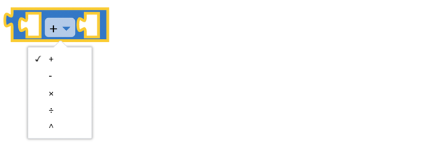
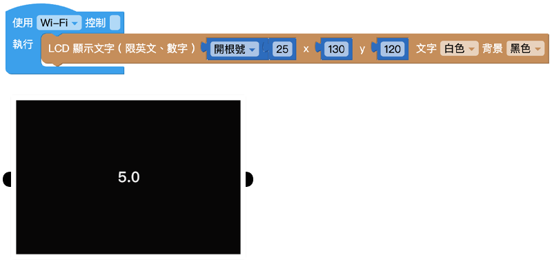
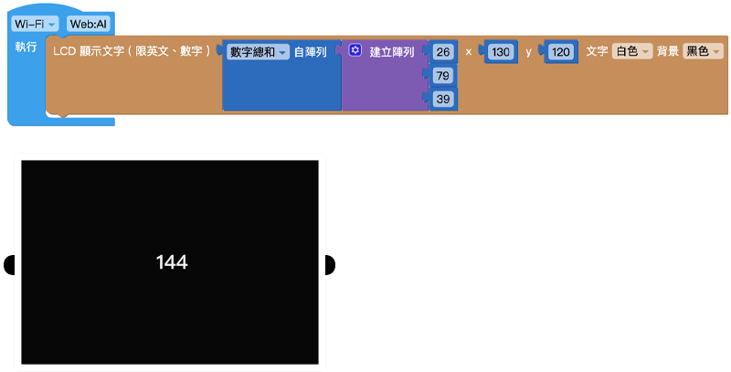

# 数学式

数学积木包含了许多数学运算，从基本的加减乘除，到四舍五入、平均值、中位数...等应有尽有，不论是简单的程序或复杂应用，都能通过各式各样的数学运算实现。

## 指定数字

「指定数字」积木用来让我们输入数字，可输入整数或是带有小数点的浮点数，常用于运算式或判断式。

## 数学运算

「数学运算」积木可以针对数字进行加、减、乘、除和次方五种运算。

## 常用数学函数

「常用数学函数」提供常用的数学计算积木，常用数学函数包含以下几种：开根号、绝对值、负数(-)、对数函数(ln)、log10 函数(log10)、指数函数(e^)和10 的几次方(10^)。

### 示例：算出根号 25

## 三角函数

「三角函数」积木里头提供了两种三角函数用法，分别是角度 ( sin、cos、tan ) 以及径度 ( asin、acos、atan )，三角函数可以从下拉选单中选择切换。

### 示例：算出 sin(30)

## 常数

「常数」积木会表现是一个不会变动的常数数值，常数包含了以下几种：圆周率(π)、指数(e)、黄金分割率(φ)、sqrt(2)、sqrt(½) 和无限大(∞)。

## 数学性质判定 ( 是否 )

 「数学性质判定」积木可以判断数字的性质，包含偶数、奇数、质数、整数、正值、负数、可被整除。如果数字符合这项性质 ( 是、true )，能够执行后续动作。

## 四舍五入 ( 进位、舍去 )

「四舍五入」积木可以对带有小数点的数字进行四舍五入、无条件舍去或无条件进位三种运算，舍去或进位到整数。

## 数组运算

「数组运算」积木能针对以数字组成的数组，进行加总、取出最小值、取出最大值、计算平均值、取得中位数、取得比较众数、计算标准差和随机抽取的计算。

### 示例：算出数字总和

## 取得余数

「取得余数」积木可以取得两个数字相除的余数。

## 限制数字范围

「限制数字范围」积木可以将设定最大值与最小值，并将数字限制在这个指定的范围内。

## 随机取数 ( 整数 )

指定一个数字范围，在每次执行时，就会从这个数字范围内取出随机的整数。

## 随机取数 ( 分数 )

每次执行这块积木时，随机取得一个 0 到 1 之间的浮点数。

