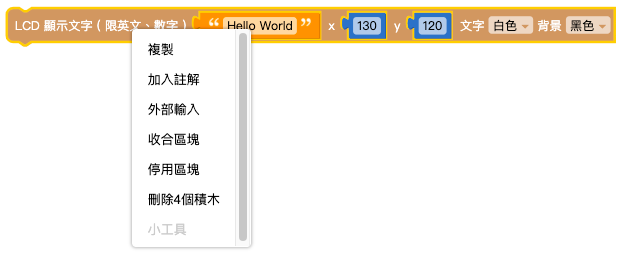
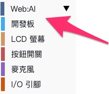

# 图形编程平台介绍

Web:AI图形编程分成网页版和安装版两种，可通过Wi-Fi和USB进行控制，使用上功能几乎相同，可以选择符合自己需求的版本作使用。

关于**网页版**与**安装版**的区别，欢迎参考以下介绍：

## 网页版

网页版不需要安装任何软件，只要电脑有连接上网络，通过浏览器打开就能使用，不论是Windows或Mac都能运作，适合快速体验的使用者。

#### -网页版链接：[Web:AI图形编程](https://ai-blockly.webduino.io)

### 分享功能(网页版专属)

「分享」功能可以快速存盘产生一段「网址」，下次再开启这个网址就可以开启此项目。因为安装版无法开启网址，所以无法使用该选项。

>网页版限定Google Chrome浏览器，目前**不支持USB联机**控制!

## 安装版

安装版可以在没有网络的环境下使用，下载后运行，将Web:AI开发板通过USB连接即可使用。

#### -安装版连接：[Web:AI安装版](https://drive.google.com/file/d/1m4qGyWGae-2yytYrSorrJKaP-XBBarHR/view)

>安装版目前仅限定在**Windows系统**使用。

## 界面

### 基本功能

Web:AI图形编程平台的操作界面分成下列几个功能区：

- **积木编辑区**：所有图形编程的组装、编辑都会在这个区域内执行。

- **积木清单**：包含基本功能、进阶功能、Web:AI开发板操控和扩充功能积木。

- **主功能菜单**：包含各种常用功能以及程序的下载。

-文件：开启、储存json文件，以及将积木做成网址储存分享。

-示例：多种现成的积木示例，可以直接打开使用。

-扩充：具有特殊功能的积木，可以将积木加入使用。

-教学：前往教学手册。

-清空：将积木编辑区的积木全部清除。

-更多：包含Wi-Fi设定、网页互动区、进入商城、下载安装版、切换语言。

-执行：将积木编辑区做好的积木下载至Web:AI开发板中。

- **积木/代码切换**：将写好的程序转换为python代码，让学习程序更简单。

- **功能按钮**：够快速缩放画面或删除积木。

## 积木介绍

「积木」是翻译自「block」这个英文单字，其操作方式类似「组装积木」或「拼图」的概念。通过互相堆叠和搭配组合，就能判断不同程序的逻辑或依据指定的排列顺序，实现对应的程序功能。

### 编辑积木

使用鼠标在指定的积木上按**右键**，就能开启积木的功能列表，功能如下：

-复制：复制这块积木。

-加入注释：如同程序的注释功能，替这块积木加入注释。

-外部输入/单行输入：切换积木的样式。(不影响程序执行)

-收合积木/展开积木：当积木编辑区有太多积木时，可以将积木收合，减少画面中的积木数量。

-删除积木：删除这块积木。

-教学：查看积木的教学说明。

-小工具：特定积木需要配合小工具以作进阶功能使用，点击后可以打开。

## 开始执行第一支程序

1.首先从左侧的**积木清单**中找到「Web:AI」，下方有「开发板」。

2.点击「开发板」，可以看到「开发板」积木，将积木拉出。

3.在「开发板」积木中输入当前所要使用的开发板Device ID。

>关于开发板的Device ID，欢迎参考：[初始化设定 ( 第一次使用请看这里 )](https://bpi-steam.com/WebAI/zh/Unboxing/Initialization.html)。

4.从左侧的**积木清单**中找到「Web:AI」，点击下方的「LCD屏幕」。

5.拉出「LCD显示文字」积木，放进「开发板」积木内。

6.按下右上角「执行」，即可将程序下载到Web:AI中。

7.当下载成功后，可以看到Web:AI开发板的LCD屏幕显示「Hello World」。

8.成功执行第一支程序后，就可以开始体验后续的更多更强大的Web:AI程序了!
