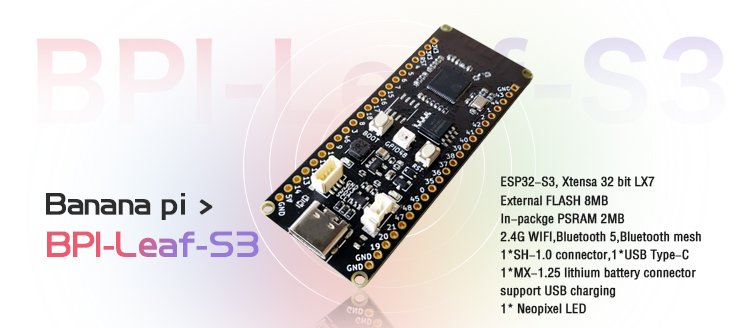

# 【 BPI-Leaf-S3 开发板 】

## 介绍

香蕉派Leaf系列是专为物联网设计的低功耗微控制器开发板。

BPI-Leaf-S3板载ESP32-S3芯片，支持 2.4 GHz Wi-Fi 和低功耗蓝牙 (Bluetooth® LE) 双模无线通信，外围兼容低功耗硬件设计，深度睡眠模式下功耗仅为10uA。

## 使用 MicroPython 编程

MicroPython实现了大部分Python 3 特性和语法，易学易上手，验证程序效果无需编译直接下载进芯片运行。

无论是否有编程基础，MicroPython的上手难度绝对远低于其他编程语言，其代码易读性高，且开源社区有多年积累的丰富资源，就如同Python一样拥有极强的生命力与应用价值。

通过烧写 MicroPython 固件，就可以在开发板中使用 Python 语言进行编程。

## 使用 Arduino 编程

提供了入门 Arduino 的软件工具和最佳示例，降低进入 ESP32 嵌入式专业开发的门槛。

>Arduino 将不会阐述过多基础内容，请具备 C/C++ 的语言开发基础。

## 资料与资源

- [官方WIKI](https://wiki.banana-pi.org/BPI-Leaf-S3_%E5%BC%80%E5%8F%91%E6%9D%BF) 

- [GitHub: BPI-Leaf-S3 开发板原理图PDF](https://github.com/BPI-STEAM/BPI-Leaf-S3-Doc/blob/main/sch/BPI-Leaf-S3-Chip-V0.1A.pdf) 

- [ESP32-S3 技术规格书](https://www.espressif.com/sites/default/files/documentation/esp32-s3_datasheet_cn.pdf)

- [ESP32-S3 技术参考手册](https://www.espressif.com/sites/default/files/documentation/esp32-s3_technical_reference_manual_cn.pdf)

## 样品购买

- [官方速卖通](https://www.aliexpress.com/item/1005004428945296.html?spm=5261.ProductManageOnline.0.0.48af4edfYbyEoI)

- [官方淘宝](https://item.taobao.com/item.htm?spm=a2126o.success.0.0.29034831FGnLQW&id=677287234553)

- OEM&OEM 定制服务 ： sales@banana-pi.com