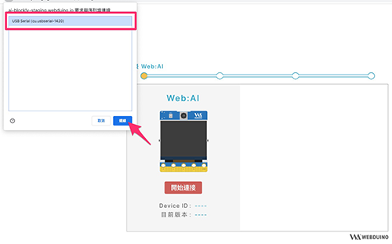
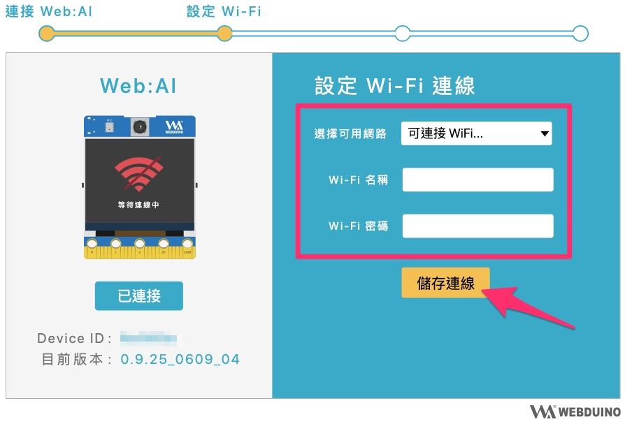

# 初始化设定 ( 第一次使用请看这里 )

Web:AI 开发板的固件分为2种芯片的固件，分別是主芯片 ( K210 ) 和 Wi-Fi 芯片 ( ESP8285 )。
第一次使用 Web:AI 开发板之前，需要先设定 Wi-Fi 及对芯片进行固件更新，將开发板固件升级到最新版本，才能顺利使用最全面的功能。

#### [Wi-Fi 设定页面](https://webai.webduino.io) ( 需要通过电脑的Chrome浏览器打开此网页 )

## 教学影片

欢迎参考下方教学影片：

<iframe src="https://www.youtube.com/embed/ZSGkZUQQXcI" allowfullscreen width="100%" style="aspect-ratio:728/410;border:none " ></iframe>

## 教学步骤：Wi-Fi 设定

当拿到 Web:AI 开发板后，只要按照教学步骤或上方影片一步步操作，就可以完成初始化设定咯!

1. 首先使用电脑打开 Chrome 浏览器进入 [Wi-Fi 设定页面](https://webai.webduino.io)。

    > 如果 Chrome 版本低于 89，需要先將浏览器更新到最新版本!

2. 將 Web:AI 开发板通过 USB 数据线连接到电脑。

3. 按下「点击开始设定」。
    

4. 点击「开始连接」。

    

5. 选择连接 Web:AI 的 USB，点击「连接」。

    

6. 电脑连接上 Web:AI 后会出现开发板的 Device ID 和现在的固件版本。

    

7. 在 Wi-Fi 连接画面，选择 Wi-Fi 并输入密码，按下「储存连接」。

    

8. 成功完成 Wi-Fi 设定!

    

> 如果需要进行固件更新，则要接着进行后续步骤。

## 教学步骤：更新固件

1. 设定完 Wi-Fi 后，如果画面有「已有新版本，点击更新」，代表有新版本可以更新。

   点击「更新固件」。

    

2. 等待固件更新，开发板屏幕会显示更新进度，在此期间请勿中断USB连接或是停止供电。

    
    

3. 更新完成后，重新开机就可以开始使用 Web:AI 了!

    

## 小提醒

- 当开发板LCD屏幕呈现下图所示的**相同内容**时，才能在 Wi-Fi 设定页面进行初始化设定。

    

- 想要再次设定 Wi-Fi 时，请先将开发板 [恢复预设状态](https://bpi-steam.com/WebAI/zh/Unboxing/Mode.html#%E5%9B%9E%E5%BE%A9%E9%A0%90%E8%A8%AD%E7%8B%80%E6%85%8B)，当开发板显示和上图相同时就可以进行操作。

- 如果通过上述步骤无法更新固件，可以參考：[安装版更新固件](https://bpi-steam.com/WebAI/zh/Unboxing/Update.html) 来完成设定!

- 如果设定页面文字显示为「网络：人工智能」，如下图，代表 Chrome 浏览器有经过网页自动翻译。网页自动翻译可能会造成 Wi-Fi 设定出错，需要将语言设定到「英文」并重新加载网页才能正常使用。

    

    
