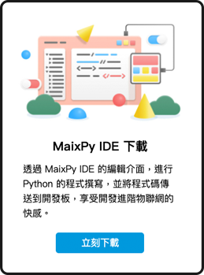

# Web:AI 介绍

Web:AI 使用 AI 芯片 ( K210 ) 以及 Wi-Fi 芯片 ( ESP8285 )，能够做出人脸追踪，影像分类，物件追踪，语音辨识，QRcode扫描等应用，只需要一块开发板就能让AI人工智能融入生活。

不论是联网或是离线，只要通过[Webduino 教育平台](https://account.webduino.io/dashboard)，就能够用最简单的方式上手AIoT人工智能物联网。

## 产品内容

除了 Web:AI 开发板外，也包含了扬声器和 USB 线，让开发板能够立即使用扬声器播放音频效；另外更附赠了教学示例卡，只要进入QRcode模式进行二维码识别，就能马上使用内建的程序示例，搭配小怪兽卡做出各种不同的互动效果。
- Web:AI 开发板
- USB 线
- 扬声器
- 教学示例卡 ( 部分示例需要搭配扬声器及登月小车 )
- 小怪兽卡

## Web:AI 开发板

### 硬件规格

Web:AI 开发板硬件内含摄像镜头和LCD屏幕，可即使做出影像互动；板载的麦克风与扬声器插座能够做出录音，播放音频等语音互动；和 Web:Bit 兼容的金手指引脚可以直接接上 Web:Bit 扩充版，用于连接各类传感器，控制器等外设，完美达成AI与IoT的结合。

- 尺寸：51.6 x 67mm
- LCD 屏幕：8bit MCU 2.3"，分辨率 320x240
- 电源输入:
    - Micro USB ( 5VDC / 2A )
    - 锂电池插座 ( 3.7~4.2V )
- CPU：双核 64bit RISC-V，内建浮点运算器、神经网络处理器，标准频率 400MHz
- 鏡頭：500万像素
- 插座：金手指兼容 ( Web:Bit / micro:bit )、TF card、扬声器、锂电池
- 按钮：L 按钮、R 按钮、Reset 按钮
- 无线网络：内建 ESP8285 模组，支持 2.4G 802.11.b/g/n
- 音频：内建 MEMS 麦克风，扬声器插座支持 3W 扬声器输出

### 腳位定義

有关 Web:AI 的引脚和使用的芯片如下：

### 主芯片 ( K210 ) & Wi-Fi 芯片 ( ESP8285 )

### 开发板指示灯

- 蓝灯：通电中，不论是接电池或是电源都会闪烁。
- 黃灯：电源开时灯亮，电源关时熄灭。
- 紅灯：电池缺电。
- 綠灯：电池蓄满或没接上电池。

## Webduino 教育平台

Web:AI 的开发和程序编程可以通过图形编程平台以及IDE来进行，图形编程平台可以让人从最简单的方式入门程序编程；而IDE则是能够让有编程基础的人编写程序代码并下载到开发板上。

### 操作环境

首先进入 [Webduino 教育平台](https://account.webduino.io/dashboard)。

### Web:AI 图形编程

选择「Web:AI 图形编程」，进入图形编程平台。

   >- 链接：[图形编程平台](https://ai-blockly.webduino.io/)。

   

### Webduino 影像训练平台

选择「Webduino 影像训练平台」。

>- 关于影像训练平台的使用，欢迎参考：[三、影像训练](https://bpi-steam.com/WebAI/zh/Train/Train.html)。

   

### MaixPy IDE 下载

选择「MaixPy IDE 下载」。

>- 关于IDE的开发使用，欢迎参考：[四、使用 IDE 开发 Web:AI](https://bpi-steam.com/WebAI/zh/IDE/Dev.html)。

   