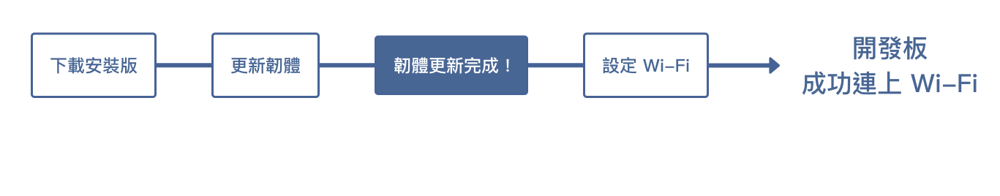
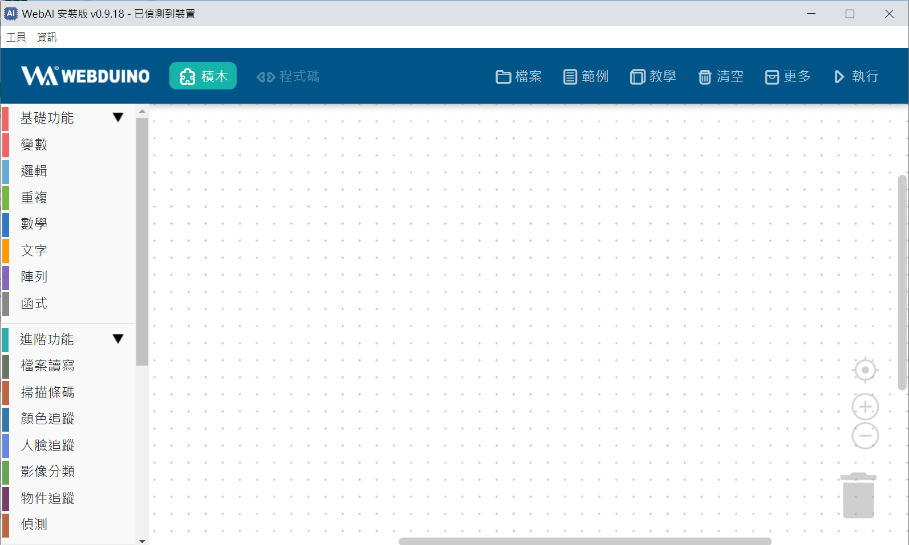

# 安装版更新固件

Web:AI开发板的固件中使用了2种芯片，分别是主芯片(K210)和Wi-Fi芯片(ESP8285)。

第一次使用Web:AI开发板之前，需要先对芯片做固件更新，将开发板升级到最新版本，才能顺利使用最全面的功能。

#### 连接：[Web:AI安装版](https://drive.google.com/file/d/1m4qGyWGae-2yytYrSorrJKaP-XBBarHR/view)

## 教学视频

欢迎参考下方教学视频：

<iframe src="https://www.youtube.com/embed/vl6XY0iCCuM" allowfullscreen width="100%" style="aspect-ratio:728/410;border:none " ></iframe>

## 通过Web:AI安装版进行固件更新

1.首先下载[Web:AI安装版](https://drive.google.com/file/d/1m4qGyWGae-2yytYrSorrJKaP-XBBarHR/view)。

2.下载后点击执行，安装完成后就可以启动Web:AI安装版了。

-启动Web:AI安装版，可以看到窗口最上方显示「正在搜寻装置…」，代表并未连接上开发板。

-通过USB线将Web:AI开发板连接上电脑，当Web:AI安装版窗口显示「已侦测到装置」，代表成功读取到开发板信息。

3.侦测到装置后，点击左上角「工具」>「更新固件」，开始进行主芯片固件更新，窗口上方会显示目前更新进度。

:::danger
恢复原厂固件时，请勿按下Reset按钮及拔除电源!
:::

4.固件更新完成后，开发板会重启。这时LCD屏幕画面如下图，需要进一步完成Wi-Fi设定才能开始使用。

>完成固件更新后，欢迎参考[初始化设定 ( 第一次使用请看这里 )](https://bpi-steam.com/WebAI/zh/Unboxing/Initialization.html)来完成Wi-Fi设定。