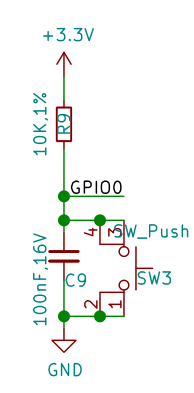

# 基礎功能使用

>[GitHub BPI-Leaf-S3 例程](https://github.com/BPI-STEAM/BPI-Leaf-S3-Doc/tree/main/Example/MicroPython-zh/02.Use_Peripherals)

## 點亮板載LED燈珠

在完成[MicroPython 運行環境設置](Environment.md)後，可以立即嘗試編程。

新建一個 main.py 腳本文件，在其中輸入以下代碼：

```py
from machine import Pin
from neopixel import NeoPixel
import time 
pin_48 = Pin(48) 
np = NeoPixel(pin_48, 1,bpp=3, timing=1)
while True:
    np[0] = (25,25,25)
    np.write()
    time.sleep_ms(250)
    np[0] = (0,0,0)
    np.write()
    time.sleep_ms(250)
```

保存文件到MicroPython設備中，點擊“Run”運行按鈕，即可讓板載彩色LED燈珠閃爍。

修改 `np[0] = (25,25,25)`等號右側元組內的數據，可以改變顏色，分別對應R，G，B三色亮度等級，設定範圍是0-255，建議使用範圍0-25，亮度過高時請勿長時間直視！

[neopixel — control of WS2812 / NeoPixel LEDs — MicroPython 文檔](https://docs.micropython.org/en/latest/library/neopixel.html)

## 使彩燈循環顯示九種顏色

```py
from machine import Pin
from neopixel import NeoPixel
import time

pin_48 = Pin(48, Pin.OUT)
np = NeoPixel(pin_48, 1,bpp=3, timing=1)

RED = (255, 0, 0)
ORANGE = (255, 100, 0)
YELLOW = (255, 255, 0)
GREEN = (0, 255, 0)
CYAN = (0, 255, 255)
BLUE = (0, 0, 255)
PURPLE = (180, 0, 255)
WHITE = (255, 255, 255)
OFF = (0, 0, 0)

color_list = [RED,ORANGE,YELLOW,GREEN,CYAN,BLUE,PURPLE,WHITE,OFF]
brightness = 0.1

while True:
    for i in color_list:
        color = (round(i[0]*brightness),round(i[1]*brightness),round(i[2]*brightness))
        np[0] = color
        np.write()
        time.sleep(1)

```

## 全彩LED燈珠循環顯示彩虹色

基於上一節，我們可以更進一步，編寫循環自動改變燈珠顏色。

```py
from machine import Pin
from neopixel import NeoPixel
import time

def rainbow(num=1,level=25,delay=100):
    def write_all(num,delay,red,green,blue):
        for j in range (num):
            np[j] = (red,green,blue)
        np.write()
        time.sleep_ms(delay)
    
    red,green,blue = level,0,0
    
    rainbow_step_list2 = [(0,1,0),(-1,0,0),(0,0,1),(0,-1,0),(1,0,0),(0,0,-1)]
    
    for step in rainbow_step_list2:
        for i in range (level):
            red+=step[0]
            green+=step[1]
            blue+=step[2]
            write_all(num,delay,red,green,blue)
            

np = NeoPixel(Pin(48, Pin.OUT), 1,bpp=3, timing=1)

while True:
    rainbow(num=1,level=25,delay=10)

```
此例程可適用於任意長度的ws2812燈帶。

修改 `NeoPixel(Pin(48, Pin.OUT), 1,bpp=3, timing=1)` 中第一個參數至任意想要串接燈帶的GPIO管腳。

修改 `rainbow(num=1,level=25,delay=100)` 中的num參數為燈帶上對應燈珠的數量。

當然我們也可以根據自己的想法使用for循環或while循環製作自己想要的顏色變化規律。

## 設計按鍵中斷程序,控制彩燈

BPI-Leaf-S3 有兩顆按鍵，BOOT 與 RST，RST控制芯片硬件復位，而BOOT則與GPIO0相連，其電路如下圖所示。



可見當開發板正常通電工作時，GPIO0在BOOT按鍵未按下時，串聯一顆電阻接到3.3v，此時為高電位；當BOOT按鍵按下時，GPIO0將直接接地，此時則為低電位。 ESP32-S3芯片通過檢測此GPIO管腳的電位即可判斷按鈕是否被按下。

[MicroPython GPIO中斷程序 machine.Pin.irq 文檔](https://docs.micropython.org/en/latest/library/machine.Pin.html#machine.Pin.irq)

在程序中，通過檢測 GPIO中斷的觸發方式，即可設計一套記錄按鍵被按壓的次數的中斷程序，用判斷當前已經按壓的次數來控制彩燈的顏色。

<iframe src="//player.bilibili.com/player.html?aid=345819290&bvid=BV1Nd4y1M7oW&cid=841776119&page=1" scrolling="no" border="0" frameborder="no" framespacing="0" allowfullscreen="true"> </iframe>

```python
from machine import Pin
from neopixel import NeoPixel
from array import array
import time
import micropython

micropython.alloc_emergency_exception_buf(100)

p_48 = Pin(48, Pin.OUT)
np = NeoPixel(p_48, 1,bpp=3, timing=1)

p0 = Pin(0,Pin.IN,Pin.PULL_UP)
trig_locks = array('B',[0])
trig_timeticks_list = array('L',[0,0])
count = array('L',[0])

def p0_irq(pin):
    if pin.value()==0 and trig_locks[0]==0:
        trig_timeticks_list[0]=time.ticks_ms()
        trig_locks[0]=1
    elif pin.value()==1 and trig_locks[0]==1:
        trig_timeticks_list[1]=time.ticks_diff(time.ticks_ms(),trig_timeticks_list[0])
        trig_locks[0]=0
        if trig_timeticks_list[1] >= 20:
            count[0] = count[0] + 1
            if count[0] > 8:
                count[0] = 0

p0.irq(handler=p0_irq,trigger= Pin.IRQ_FALLING | Pin.IRQ_RISING )

RED = (255, 0, 0)
ORANGE = (255, 100, 0)
YELLOW = (255, 255, 0)
GREEN = (0, 255, 0)
CYAN = (0, 255, 255)
BLUE = (0, 0, 255)
PURPLE = (180, 0, 255)
WHITE = (255, 255, 255)
OFF = (0, 0, 0)

color_list = [RED,ORANGE,YELLOW,GREEN,CYAN,BLUE,PURPLE,WHITE,OFF]
brightness = 0.1

while True:
    print (count)
    i = color_list[count[0]]
    color = (round(i[0]*brightness),round(i[1]*brightness),round(i[2]*brightness))
    np[0] = color
    np.write()
    time.sleep(0.1)
```

## PWM 單色LED呼吸燈

### 外部硬件需求

一個可以在3.3v電壓下工作的LED燈。

### 連接方法

例程中使用的是GPIO13管腳，將LED燈正極與GPIO13管腳連接，負極與GND連接。

### Code

```py
from machine import Pin, PWM
import time

PWM_LED = PWM(Pin(13))
PWM_LED.freq(1000)
PWM_LED.duty(0)

while True:
    for i in range(0,1024,1):
       PWM_LED.duty(i)
       time.sleep_ms(2)
    for i in range(1022,0,-1):
       PWM_LED.duty(i)
       time.sleep_ms(1)
    
```

## TB6612FNG模塊 PWM驅動電機

### 外部硬件需求

一個TB6612FNG模塊，一個3.3~5V直流電機。

### 連接方法

TB6612FNG | BPI-Leaf-S3    
:---:|:---:
PWMA | 11
AIN2 | 13
AIN1 | 12
STBY | 10
VM   | 5V
VCC  | 3.3V
GND  | GND
AO1  | 電機N極
AO2  | 電機S極

> AO1/AO2 與電機的連接可任意調換接線順序，以此改變旋轉方向。

### 運行效果

電機將啟動朝一個方向旋轉並在7秒逐漸加速到當前電流可達到的最大轉速，然後在5秒內逐漸減速至停轉，隨後反向旋轉並重複這個過程。

### Code

```py
from machine import Pin,PWM
import time

PWM_A = PWM(Pin(11)) #Set PWM output pin
PWM_A.freq(20000) #Set PWM frequency
PWM_A.duty(0) #Set PWM duty cycle
AIN1 = Pin(12,Pin.OUT)
AIN2 = Pin(13,Pin.OUT)
STBY = Pin(10,Pin.OUT)
STBY.on() #When STBY pin is at high level, TB6612FNG starts.

def MOTOR_Forward():
    AIN1.on()
    AIN2.off()
def MOTOR_Reverse():
    AIN1.off()
    AIN2.on()

while True:
    MOTOR_Forward()
    #for cycle is used to control the PWM duty cycle change.
    #The PWM duty cycle control precision is 10bit, ie 0~1023.
    #Some motors require a certain PWM duty cycle to start.
    for i in range(350,1024,1):
       PWM_A.duty(i)
       time.sleep_ms(10)
    for i in range(1022,0,-1):
       PWM_A.duty(i)
       time.sleep_ms(5)
    
    MOTOR_Reverse()
    for i in range(350,1024,1):
       PWM_A.duty(i)
       time.sleep_ms(10)
    for i in range(1022,0,-1):
       PWM_A.duty(i)
       time.sleep_ms(5)

```

## 使用ADC檢測電位器電壓

### 外部硬件需求

一個電位器。


### ESP32-S3的ADC

ESP32-S3芯片內部集成了兩個**ADC模數轉換器** ，測量範圍 0mV-3100mV，分辨率為12bit，即將0mV-3100mV分為2^12=4096級，每一級為一個數字量。

兩個ADC模數轉換器各有10個測量通道，ADC1為GPIO1 ~ 10,ADC2為GPIO11 ~ 20 。

### 連接方法

GND接GND，VCC接3V3，S輸出端接GPIO11管腳，使用的是ADC2的通道1進行測量。

GPIO1~20管腳都可做ADC輸入管腳。

### Code

```py
from machine import Pin,ADC
import time
adc11 = ADC(Pin(11),atten=ADC.ATTN_11DB)
#adc11 = ADC(Pin(11)）
#adc11.atten(ADC.ATTN_11DB)
while True:
    read=adc11.read()
    read_u16=adc11.read_u16()
    read_uv=adc11.read_uv()
    print("read={0},read_u16={1},read_uv={2}".format(read,read_u16,read_uv))
    time.sleep_ms(100)
```

| 衰減值 | 可測量的輸入電壓範圍 |
| -------- | -------- |
| ADC.ATTN_0DB     | 0 mV ~ 950 mV     |
| ADC.ATTN_2_5DB   | 0 mV ~ 1250 mV     |
| ADC.ATTN_6DB     | 0 mV ~ 1750 mV     |
| ADC.ATTN_11DB     | 0 mV ~ 3100 mV     |

 1. `ADC(*，atten)`初始化一個GPIO管腳的ADC通道，可以選擇使用`atten`設定衰減值，它控制芯片可測量的輸入電壓範圍，如果不設置，將為默認值`atten=ADC.ATTN_0DB`或上一次所設定的值。
 2. 可以在初始化一個ADC通道後通過`ADC.atten()`修改衰減值。
 3. `ADC.read()`讀取ADC並返回讀取結果，ESP32-S3芯片的ADC所返回的是12位精度的數據。
 4. `ADC.read_u16()`讀取ADC並將返回16位的數據。
 5. `ADC.read_uv()`根據ADC的特性以`uV`微伏為單位返回校準的輸入電壓。返回值只有`mV`毫伏分辨率（即，將始終是1000微伏的倍數）。

WiFi功能也使用了ADC2，因此在WiFi處於活動狀態時嘗試從ADC2的測量通道GPIO11 ~ 20讀取模擬值將引發異常。

建議使用`ADC.read_uv()`來讀取電壓值，它是根據ADC模數轉換器的特性經過校准後返回的十進制常數，較比另外兩個讀取方法更加準確，同時也建議使用時直接經過整除運算：`ADC.read_uv()//1000` 獲取`mV`毫伏分辨率的數據。

直接打印輸出`ADC.read()`或`ADC.read_u16()`得到的是十進制數值，可用`hex()`函數將數據類型轉化為十六進制，例如`hex(ADC.read())`，或用`bin()`函數將數據類型轉化為二進制。

## 用電位器無極調控彩燈亮度

在 [使彩燈循環顯示九種顏色](#使彩燈循環顯示九種顏色) 小節的基礎上，可使用電位器來控制彩燈的亮度。

<iframe width="720" height="405" frameborder="0" src="https://www.ixigua.com/iframe/7130573075816383014?autoplay=0" referrerpolicy="unsafe-url" allowfullscreen></iframe>

### Code
```py
from machine import Pin,ADC
from neopixel import NeoPixel
from array import array
import time
import micropython

adc1 = ADC(Pin(1),atten=ADC.ATTN_11DB)

micropython.alloc_emergency_exception_buf(100)

p_48 = Pin(48, Pin.OUT)
np = NeoPixel(p_48, 1,bpp=3, timing=1)

p0 = Pin(0,Pin.IN,Pin.PULL_UP)
trig_locks = array('B',[0])
trig_timeticks_list = array('L',[0,0])
count = array('L',[0])

def p0_irq(pin):
    if pin.value()==0 and trig_locks[0]==0:
        trig_timeticks_list[0]=time.ticks_ms()
        trig_locks[0]=1
    elif pin.value()==1 and trig_locks[0]==1:
        trig_timeticks_list[1]=time.ticks_diff(time.ticks_ms(),trig_timeticks_list[0])
        trig_locks[0]=0
        if trig_timeticks_list[1] >= 20:
            count[0] = count[0] + 1
            if count[0] > 8:
                count[0] = 0

p0.irq(handler=p0_irq,trigger= Pin.IRQ_FALLING | Pin.IRQ_RISING )

RED = (255, 0, 0)
ORANGE = (255, 100, 0)
YELLOW = (255, 255, 0)
GREEN = (0, 255, 0)
CYAN = (0, 255, 255)
BLUE = (0, 0, 255)
PURPLE = (180, 0, 255)
WHITE = (255, 255, 255)
OFF = (0, 0, 0)

color_list = [RED,ORANGE,YELLOW,GREEN,CYAN,BLUE,PURPLE,WHITE,OFF]

while True: 
    adc1_read = adc1.read() # 12bit
    adc1_read_mv = adc1.read_uv()/1000
    adc1_read_u16 = adc1.read_u16() # 16bit
    brightness = adc1_read/4095
    i = color_list[count[0]]
    color = (round(i[0]*brightness),round(i[1]*brightness),round(i[2]*brightness))
    np[0] = color
    np.write()
    print(adc1_read,adc1_read_u16,adc1_read_mv,"mv",count[0],color)
    time.sleep(0.1)
```

## 使用ADC測量電位器，用以調整電機轉速

### 外部硬件需求

* 電位器 x 1
* TB6612FNG電機驅動模塊 x 1
* 5v直流電機 x 1
* 一些連接線材

### 連接方法

|Potentiometer|BPI-Leaf-S3|
|---|---|
|GND|GND|
|VCC|3V3|
|S|14|

|TB6612FNG|BPI-Leaf-S3|
|---|---|
|PWMA|11|
|AIN2|13|
|AIN1|12|
|STBY|10|
|VM|5V|
|VCC|3.3V|
|GND|GND|

|TB6612FNG|Motor|
|---|---|
|AO1|Motor N pole|
|AO2|Motor S pole|

### 運行效果

開發板將間隔100ms在REPL輸出ADC讀取到的電壓值，單位為mv，以及對應控制的PWM佔空比。

用手調整電位器，改變其輸出電壓，電壓越大，開發板輸出的PWM佔空比越高，電機轉速越快。

<iframe width="720" height="405" frameborder="0" src="https://www.ixigua.com/iframe/7094798929295835681?autoplay=0" referrerpolicy="unsafe-url" allowfullscreen></iframe>

### Code
```py
from machine import Pin,ADC,PWM
import time

adc14 = ADC(Pin(14),atten=ADC.ATTN_11DB)

PWM_A = PWM(Pin(11)) #Set PWM output pin
PWM_A.freq(20000) #Set PWM frequency
PWM_A.duty(0) #Set PWM duty cycle
AIN1 = Pin(12,Pin.OUT)
AIN2 = Pin(13,Pin.OUT)
STBY = Pin(10,Pin.OUT)
AIN1.on() #MOTOR forward
AIN2.off()
STBY.on() #When STBY pin is at high level, TB6612FNG starts.

while True:
    read_mv=adc14.read_uv()//1000
    if read_mv <= 3000:
        duty_set = int(1023/3000 * read_mv)
    else:
        duty_set = 1023
    PWM_A.duty(duty_set)
    Duty_cycle = int(duty_set/1023*100)
    print("ADC_read={0}mv,Duty_cycle={1}%".format(read_mv,Duty_cycle))
    time.sleep_ms(100)

```