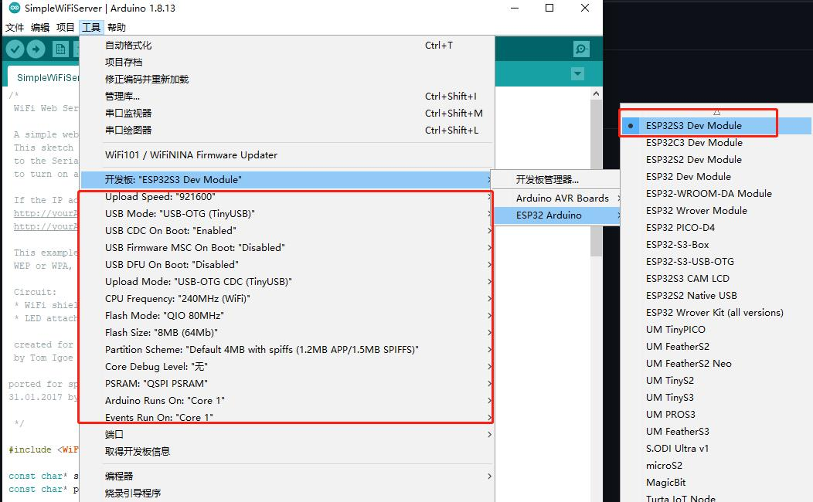

# Environment build

Due to the board size, the Arduino usage of PicoW-S3 will be more complicated, we do not recommend you to use PicoW-S3 to learn Arduino. This article will guide you through installing Arduino support for the PicoW-S3.


> Refer to [arduino-esp32 DOC Getting Started » Installing](https://docs.espressif.com/projects/arduino-esp32/en/latest/installing.html)

## Install support using Arduino IDE

Here's how to install the Arduino-ESP32 directly from the Arduino IDE.

> Starting with Arduino IDE version 1.6.4, Arduino allows the use of the Boards Manager to install third-party platform packages. There are packages for Windows, macOS and Linux.

Arduino IDE download address: https://www.arduino.cc/en/software

> The UI of Arduino IDE 2.0 is slightly different from that of Arduino IDE 1.8.x. This article is based on version 1.8.13, but it does not affect the reference of users who use version 2.0.

To install the esp32 platform package using Boards Managaer, follow these steps:

- Install the current upstream Arduino IDE 1.8 or higher.

- Start Arduino and open the File > Preferences window and find Additional Board Manager URLs.


- Stable version link:
````
https://raw.githubusercontent.com/espressif/arduino-esp32/gh-pages/package_esp32_index.json
````
- Development version link:
````
https://raw.githubusercontent.com/espressif/arduino-esp32/gh-pages/package_esp32_dev_index.json
````
- Enter one of the above publish links after Additional Board Manager URLs. You can add multiple URLs, one per line.


Open Tools > Board > Board Manager from the menu to search for and install the esp32 platform.


After restarting the arduino IDE, you can see that there are more ESP32 Arduino options in the development board options.

Select the model `ESP32S3 Dev Module`, and then configure it according to the content shown in the figure below. Improper configuration cannot be used. Please be sure to configure it according to the content shown in the figure below!

