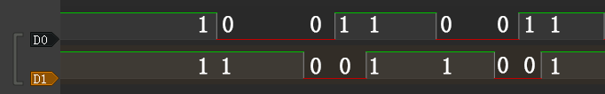
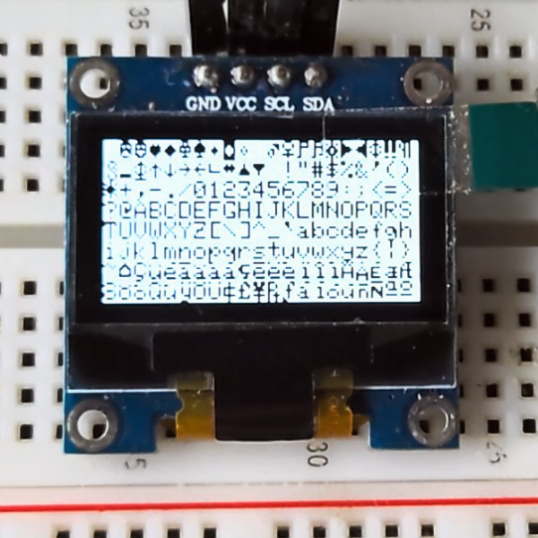

# Basic function usage　

## REPL simple to use

### Hello World!

1. Make sure that the development board is correctly connected in the Mu editor, refer to [Configuring the environment (Mu editor)](config_mu-editor.md).
2. The following information usually appears in the CircuitPython REPL window. The appearance of the `>>>` symbol means that we can start to enter commands to interact with it.
```
]0;🐍Wi-Fi: off | Done | 8.0.0-beta.0-49-g14fc4a079\Auto-reload is on. Simply save files over USB to run them or enter REPL to disable.

Press any key to enter the REPL. Use CTRL-D to reload.
]0;🐍Wi-Fi: off | Done | 8.0.0-beta.0-49-g14fc4a079\]0;�Wi-Fi: off | REPL | 8.0.0-beta.0-49-g14fc4a079\
Adafruit CircuitPython 8.0.0-beta.0-49-g14fc4a079 on 2022-09-20; BPI-PicoW-S3 with ESP32S3
>>>
```
3. Start typing the command on the right side of the `>>>` symbol, for example: `print("Hello World!")`.
> Note that using the English input method, Chinese characters cannot be recognized by the REPL.
```py
>>> print("Hello World!")
Hello World!
>>>
```

### REPL shortcut keys

1. Copy `ctrl + shift + c`.
2. Paste `ctrl + shift + v`.
    Use the left mouse button to drag and select the command to be copied in the REPL, press the copy shortcut key on the keyboard, and then press the paste shortcut key to copy and paste the command.
3. Soft reset `ctrl + d`.
4. Interrupt `ctrl + c`, interrupt the currently executing program, but will not restart and reset.

### View built-in modules

1. Entering `help("modules")` in the REPL will list all modules in the current CircuitPython development board.
2. After importing the module, you can use the `help()` function to view the function names or variable names available inside the module. For example, if you view the `board` module, you can see all the available pins and peripheral functions of the development board.
```py
>>> import board
>>> help(board)
object <module 'board'> is of type module
  __name__ -- board
  board_id -- bpi_picow_s3
  GP0 -- board.GP0
  GP1 -- board.GP1
  GP2 -- board.GP2
  GP3 -- board.GP3
  GP4 -- board.GP4
  GP5 -- board.GP5
  GP6 -- board.GP6
  GP7 -- board.GP7
  GP8 -- board.GP8
  GP9 -- board.GP9
  GP10 -- board.GP10
  GP11 -- board.GP11
  GP12 -- board.GP12
  GP13 -- board.GP13
  GP14 -- board.GP14
  GP15 -- board.GP15
  GP16 -- board.GP16
  GP17 -- board.GP17
  GP18 -- board.GP18
  GP19 -- board.GP19
  GP20 -- board.GP20
  GP21 -- board.GP21
  GP22 -- board.GP22
  GP25 -- board.GP25
  LED -- board.GP25
  GP26 -- board.GP26
  GP26_A0 -- board.GP26
  A0 -- board.GP26
  GP27 -- board.GP27
  GP27_A1 -- board.GP27
  A1 -- board.GP27
  GP28 -- board.GP28
  GP28_A2 -- board.GP28
  A2 -- board.GP28
  GP29 -- board.GP29
  GP29_A3 -- board.GP29
  A3 -- board.GP29
  NEOPIXEL -- board.NEOPIXEL
  TX -- board.GP0
  RX -- board.GP1
  BOOT0 -- board.BOOT0
  UART -- <function>
>>> 
```

## Edit code.py to make the RGB LED blink

1. Click the Load button, select the code.py file on the CircuitPython development board, and click Open to start editing code.py .

2. Enter the following code in the editor:

```python
import time
import board
import neopixel

pixels = neopixel.NeoPixel(board.NEOPIXEL, 1, brightness=0.1)

while 1:
    pixels[0] = (255,0,0)
    pixels.show()
    time.sleep(0.5)
    pixels[0] = (0,255,0)
    pixels.show()
    time.sleep(0.5)
    pixels[0] = (0,0,255)
    pixels.show()
    time.sleep(0.5)
    pixels[0] = (255,255,255)
    pixels.show()
    time.sleep(0.5)
```

3. Click the **Save** button, the edited content will be saved to the CircuitPython development board. If the code is correct, the color LED on the development board will flash red, green, blue and white in a cycle. Reset the development board or power it on again, and the program will start running again.
4. Use the interrupt shortcut key in the REPL to stop the program from running.
5. The code can also be directly copied and pasted into the REPL to run.

> All subsequent examples can be edited in the code.py file or copied and pasted into the REPL to run. However, after the program code in the code.py file is executed, the development board will return to the state when it is not running, and the state will not be retained, but the state will be retained when executed in the REPL.

## Make pins output high or low level, control the LED

1. `board.LED` controls a single-color LED on PicoW-S3, high level is on, low level is off, enter the following code in the REPL:
```py
import board
import digitalio
ledpin = digitalio.DigitalInOut(board.LED)
ledpin.direction = digitalio.Direction.OUTPUT
ledpin.value = True
```

1. Or:
```py
import board
import digitalio
ledpin = digitalio.DigitalInOut(board.LED)
ledpin.switch_to_output(value=True) # value=1
```

3. Make the LED blink every 0.5 seconds:
```py
import board
import digitalio
import time
ledpin = digitalio.DigitalInOut(board.LED)
while True:
    ledpin.switch_to_output(value=1)
    time.sleep(0.5)
    ledpin.switch_to_output(value=0)
    time.sleep(0.5)

```
4. Use the KeyboardInterrupt(ctrl+c) in REPL to stop the running of the program.

5. Enter `import board;help(board)` in the REPL interface of the Mu editor to list all controllable pins.

6. `board.GP25` is exactly the same as `board.LED`.

## PWM output, control LED brightness

1. The brightness of the LED light can be controlled by controlling the PWM duty cycle. The control duty cycle is from 0% to 100%, using 16-bit precision, 0 to 65535 in decimal and 0 to FFFF in hexadecimal. Enter the following code in the REPL:
```py
import board
import pwmio
ledpin = pwmio.PWMOut(board.LED, frequency=25000, duty_cycle=0)
ledpin.duty_cycle = 32768  # mid-point 0-65535 = 50 % duty-cycle
```
2. Just enter the last line of code again in the REPL to change the PWM duty cycle to bring the LED to maximum brightness:：
```py
ledpin.duty_cycle = 65535
```
3. Use `while` and `for` loops to make breathing lights:
```py
import board
import pwmio
import time

ledpin = pwmio.PWMOut(board.LED, frequency=25000, duty_cycle=0)

while True:
    for i in range(0, 65535, 1):
        ledpin.duty_cycle = i
    for i in range(65535, 0, -1):
        ledpin.duty_cycle = i
```

## PWM Controlled Servo


以MG90S舵机为例，其他各种舵机参考其对应的使用手册，在以下代码中修改相应的参数。

1. The key parameters of MG90S servo:
   * Control angle, 0° ~ 180°
   * PWM duty time control, 500us ~ 2500us corresponds to 0° ~ 180°
   * Operating Voltage: 4.8V to 6V (5V typical)
   * Stall torque: 1.8 kg/cm (4.8V)
   * Maximum stall torque: 2.2 kg/cm (6V)
   * Operating speed is 0.1s/60° (4.8V)
2. The expression of the duty time required to find any rotation angle is:
   ```
    Let y be the duty time and x be the rotation angle
    y=(2500-500)/180*x+500
    y=(100*x+4500)/9
    ```
3. According to the parameters, it can be determined that the angle of the steering gear is controlled by the duration of the high level of the PWM wave. And since the control of the steering gear must be controlled by a periodic PWM waveform, the duration of one cycle must exceed the duty time required to control the steering gear to reach 180°, that is, if it exceeds 2500us, the PWM frequency should be lower than 400hz.
4. Set the PWM frequency to 200hz, then the cycle duration is 5000us, and the corresponding duty cycle for controlling the servo to rotate from 0° to 180° is 10% to 50%.
5. The PWM duty cycle control precision of CircuitPython is 16bit, 100% duty cycle is expressed as 1111 1111 1111 1111 in binary, FFFF in hexadecimal, and 65535 in decimal.
6. The expression for finding the duty cycle required for any rotation angle is:
    ```
    Let y be the duty cycle and x the rotation angle
    y=((50-10)/180*x+10)/100*65535
    y=(4369*x+196605)/30
    ```
7. The wiring method of the servo and BPI-PicoW-S3:
    > The VBUS pin of BPI-PicoW-S3 can output +5V; except GP0, all GP pins can be used to output PWM, just need to modify the corresponding pin in the program.

|MG90S|BPI-PicoW-S3|
| --- | --- |
|GND brown|GND|
|+5V red|VBUS|
|PWM orange|GP0|

8. According to the above expressions and parameters, design a program that can arbitrarily control the rotation angle of this servo:
    ```py
    import board
    import pwmio
    import time
    servo_1 = pwmio.PWMOut(board.GP0, frequency=200, duty_cycle=0)#200hz, one cycle 5000us

    def get_duty_cycle(x):
        return int((4369*x+196605)/30)

    servo_1.duty_cycle = get_duty_cycle(90)# 90 degrees
    ```
9. The PWM duty time of the output controlled by this program can be read out through a logic analyzer, which should be consistent with the calculated value.
   
   

10. Use a list to design a set of consecutive servo actions:
    ```py
    import board
    import pwmio
    import time
    servo_1 = pwmio.PWMOut(board.GP0, frequency=200, duty_cycle=0)#200hz, one cycle 5000us

    def get_duty_cycle(x):
        return int((4369*x+196605)/30) 

    action_list1 = [0,45,90,135,180,0,180,45,135,90]

    while True:
        for i in action_list1:
            servo_1.duty_cycle = get_duty_cycle(i)
            time.sleep(0.5)
    ```

## ADC input, use a dual-axis joystick


This is a common dual-axis XY joystick module, which uses two potentiometers as its core components. Read their respective voltage values through the ADC analog/digital converter of the chip, and then convert the reading to its position on the XY coordinate axis.

**Wiring reference**

|Joystick|BPI-PicoW-S3|
| --- | --- |
|GND|GND|
|+5V|3V3|
|VRx|GP27_A1|
|VRy|GP26_A0|

1. The ADC accuracy provided in CircuitPython is 16bit, that is, the hexadecimal expression of the maximum value is FFFF, the decimal expression is 65535, and the corresponding voltage range is 0mv ~ 3300mv. The actual ADC voltage range of the EPS32S3 chip used by BPI-PicoW-S3 is 0mv ~ 3100mv, so it can only measure 3100mv in actual application.

2. Basic ADC readings, read the values of the two potentiometers, and convert them to voltage values.
> Note that the xy axis is reversed in the code, and the dual-axis joystick module can be used after rotating it counterclockwise by 90°. This method can make the ADC reading increase when the joystick moves up the y-axis, and vice versa, which conforms to the law of the common rectangular coordinate system.
```python
import board,analogio,time

x_axis_pin = analogio.AnalogIn(board.A0)
y_axis_pin = analogio.AnalogIn(board.A1)

while True:
    x_axis = x_axis_pin.value
    y_axis = y_axis_pin.value
    # print((x_axis,y_axis))
    x_value = x_axis / 65535 * 3300
    y_value = y_axis / 65535 * 3300
    print("{0}mv,{1}mv".format(x_value,y_value))
    time.sleep(0.1)
```

3. In the Mu editor, click the `Plotter` icon to display the plotter, which can display the value output by REPL as a time-related line graph in real time.

   
4. The following program can realize the function of calibrating the coordinate zero point. In the first five seconds of running, please stop the joystick and wait for the zero point value to be obtained.

```python
import board,analogio,time

x_axis_pin = analogio.AnalogIn(board.A0)
y_axis_pin = analogio.AnalogIn(board.A1)

def get_zero(times =500, sleep = 0.01):
    x_total = 0
    y_total = 0
    for i in range (times):
        x_axis = x_axis_pin.value
        y_axis = y_axis_pin.value
        x_total += x_axis
        y_total += y_axis
        time.sleep(sleep)
    x_zero = x_total // times
    y_zero = y_total // times
    return (x_zero,y_zero)

zero = get_zero(times =500, sleep = 0.01)
print(zero)

while True:
    x_axis = x_axis_pin.value - zero[0]
    y_axis = y_axis_pin.value - zero[1]
    print((x_axis,y_axis))
    time.sleep(0.1)
```
5. The following program gets the joystick direction, which is the most common application for dual-axis joysticks.
```python
import board,analogio,time

x_axis_pin = analogio.AnalogIn(board.A0)
y_axis_pin = analogio.AnalogIn(board.A1)

direction_list = ["East","Southeast","South","Southwest","West","Northwest","North","Northeast","Centre"]

def get_zero(times =500, sleep = 0.01):
    x_total = 0
    y_total = 0
    for i in range (times):
        x_axis = x_axis_pin.value
        y_axis = y_axis_pin.value
        x_total += x_axis
        y_total += y_axis
        time.sleep(sleep)
    x_zero = x_total // times
    y_zero = y_total // times
    return (x_zero,y_zero)

def get_direction(zero = (32767,32767)):
    x_axis = x_axis_pin.value - zero[0]
    y_axis = y_axis_pin.value - zero[1]
    if x_axis >= 10000 and -10000 < y_axis < 10000:
        return direction_list[0]
    elif x_axis >= 10000 and y_axis <= -10000:
        return direction_list[1]
    elif -10000 < x_axis < 10000 and y_axis <= -10000:
        return direction_list[2]
    elif x_axis <= -10000 and y_axis <= -10000:
        return direction_list[3]
    elif x_axis <= -10000 and -10000 < y_axis < 10000:
        return direction_list[4]
    elif x_axis <= -10000 and y_axis >= 10000:
        return direction_list[5]
    elif -10000 < x_axis < 10000 and y_axis >= 10000:
        return direction_list[6]
    elif x_axis >=10000 and y_axis >= 10000:
        return direction_list[7]
    else :
        return direction_list[8]

zero = get_zero(times =50, sleep = 0.01)
print(zero)

while True:
    x_axis = x_axis_pin.value - zero[0]
    y_axis = y_axis_pin.value - zero[1]
    print((x_axis,y_axis))
    print(get_direction(zero = zero))
    time.sleep(0.1)
```
6. The following program can set the coordinate accuracy level, calculate the span of each level, eliminate the jitter as required, and enhance the practicality of the data.
```python
import board,analogio,time

x_axis_pin = analogio.AnalogIn(board.A0)
y_axis_pin = analogio.AnalogIn(board.A1)

def get_zero(times =500, sleep = 0.01):
    x_total = 0
    y_total = 0
    for i in range (times):
        x_axis = x_axis_pin.value
        y_axis = y_axis_pin.value
        x_total += x_axis
        y_total += y_axis
        time.sleep(sleep)
    x_zero = x_total // times
    y_zero = y_total // times
    return (x_zero,y_zero)

def get_extremum(times =500, sleep = 0.01):
    x_list = []
    y_list = []
    for i in range (times):
        x_axis = x_axis_pin.value
        y_axis = y_axis_pin.value
        x_list.append(x_axis)
        y_list.append(y_axis)
        time.sleep(sleep)
    x_extremum = (min(x_list),max(x_list))
    y_extremum = (min(y_list),max(y_list))
    return (x_extremum,y_extremum)
    
def get_spacing(level = 16 , zero =(32767,32767) ,x_extremum = (0,65535),y_extremum = (0,65535)):
    x_temp_1 = (zero[0] - x_extremum[0]) // level
    x_temp_2 = (x_extremum[1] - zero[0] ) // level
    y_temp_1 = (zero[1] - y_extremum[0]) // level
    y_temp_2 = (y_extremum[1] - zero[1] ) // level
    x_spacing = (x_temp_1,x_temp_2)
    y_spacing = (y_temp_1,y_temp_2)
    return (x_spacing,y_spacing)

def get_coordinates(zero = (32767,32767), x_spacing = (2048,2048),y_spacing = (2048,2048)):
    x_value = x_axis_pin.value - zero[0]
    y_value = y_axis_pin.value - zero[1]
    if x_value >= 0:
        x_axis = x_value // x_spacing[1]
    else:
        x_axis = - ((-x_value) // x_spacing[0])
    if y_value >= 0:
        y_axis = y_value // y_spacing[1]
    else:
        y_axis = - ((-y_value) // y_spacing[0])
    return (x_axis,y_axis)
    
zero = get_zero(times =500, sleep = 0.01)
print(zero)
(x_extremum,y_extremum) = get_extremum(times = 500, sleep = 0.01)
print((x_extremum, y_extremum))
(x_spacing,y_spacing) = get_spacing(level = 128 , zero = zero, x_extremum = x_extremum,y_extremum = y_extremum)
print((x_spacing, y_spacing))

while True:
    coordinates = get_coordinates(zero = zero, x_spacing = x_spacing, y_spacing = y_spacing)
    print(coordinates)
    time.sleep(0.1)
```

## Using incremental rotary encoders
 

**Wiring reference**

|**Incremental rotary encoder**|**BPI-PicoW-S3**|
| --- | --- |
|GND|GND|
|+|VBUS|
|SW||
|DT|GP0|
|CLK|GP1|

1. The appearance of the incremental rotary encoder is similar to some common rotary potentiometers, but there are three key differences.

   1. The microcontroller uses the ADC peripheral to read the analog signal (voltage value) output by the rotary potentiometer to determine the current angular position of the shaft. The microcontroller receives the digital signal output by the incremental rotary encoder through GPIO, and can judge the movement of the rotating shaft corresponding to the signal through the software program.
   2. Within a certain range of accuracy, the microcontroller can determine the current angular position of the rotary potentiometer shaft, but due to the continuity of the analog signal and poor anti-interference ability, it cannot accurately determine whether it has an action. The incremental rotary encoder sends a digital signal to the microcontroller only when the rotating shaft moves to a contact point, if an incremental rotary encoder has 20 contacts in one revolution, it will trigger 20 action signals for one revolution, and the microcontroller can accurately determine whether it moves, in which direction it turns, and how many times the signal is triggered.

   3. Rotary potentiometers usually cannot rotate infinitely in any direction, and will stop at the maximum or minimum limit points. But incremental rotary encoders can rotate infinitely in any direction.

2. Incremental rotary encoders use quadrature encoders to generate their A and B output signals. The pulses emitted from the A and B outputs are encoded in quadrature, which means that when the incremental encoder is moving at a constant velocity, the A and B waveforms are square waves with a 90 degree phase difference between A and B. Eventually the A and B signals will be delivered to the microcontroller from two pins.
    

3. Theoretically, at any given time, for a rotary encoder, there is a phase difference of +90° for clockwise rotation and −90° for counterclockwise rotation between the A and B signals, it depends on the design of the quadrature encoder inside the device.

4. The pulse frequency on the A or B output is proportional to the speed (rate of change of position) of the shaft. A higher frequency means a faster speed, while a lower frequency means a slower speed. When the shaft is stationary, the static, constant signal output is on A and B, so there are many speed measurement schemes using incremental rotary encoders.

> See [Wikipedia:Incremental encoders](https://en.wikipedia.org/wiki/Incremental_encoder#Quadrature_decoder) .

5. Use CircuitPython to design a program to read the signals on the GP0 and GP1 pins, and when one of them changes, output the values of the two pins at the same time, connect the development board and the incremental rotary encoder and run the program.
```python
import board
import digitalio

dt = digitalio.DigitalInOut(board.GP0)
clk = digitalio.DigitalInOut(board.GP1)
dt.switch_to_input()
clk.switch_to_input()
dt_last_value = 0
clk_last_value = 0

while True:
    if dt.value != dt_last_value or clk.value != clk_last_value:
        dt_last_value = int(dt.value)
        clk_last_value = int(clk.value)
        print((dt_last_value,clk_last_value))
```
6. Turn the rotating shaft step by step to observe the output signal. If there is a logic analyzer or oscilloscope, it can also be connected to observe.

   1. When the shaft rotates counterclockwise, the REPL output:

   ```
   (1, 1)
   (1, 0)
   (0, 0)
   (0, 1)
   (1, 1)
   (1, 0)
   (0, 0)
   (0, 1)
   (1, 1)
   ```

    2. When the shaft rotates counterclockwise, the waveform observed by the logic analyzer:
   

   3. When the shaft rotates clockwise, the REPL output:
   ```
   (1, 1)
   (0, 1)
   (0, 0)
   (1, 0)
   (1, 1)
   (0, 1)
   (0, 0)
   (1, 0)
   (1, 1)
   ```
   4. When the shaft rotates clockwise, the waveform observed by the logic analyzer:
   


7. The first thing that can be observed is that the signals on the two pins are both 1 after the shaft completes the first level of motion. Based on this, the program can be designed to output a count value when both the values of the two pins become 1, and this count value can be used as the basis for judging that the encoder has completed an action.
```python
import board
import digitalio

dt = digitalio.DigitalInOut(board.GP0)
clk = digitalio.DigitalInOut(board.GP1)
dt.switch_to_input()
clk.switch_to_input()
dt_last_value = 0
clk_last_value = 0
count = 0

while True:
    if dt.value != dt_last_value or clk.value != clk_last_value:
        dt_last_value = int(dt.value)
        clk_last_value = int(clk.value)
        print((dt_last_value,clk_last_value))
        if (dt_last_value,clk_last_value) == (1,1):
            print('--',count_1,'--')
            count += 1
```
8. Then determine the law and difference of the signal output on the two pins when the encoder rotates clockwise and counterclockwise.

   1. The law of counterclockwise rotation is (1, 1)>(1, 0)>(0, 0)>(0, 1)>(1, 1) .

   2. The law of clockwise rotation is (1, 1)>(0, 1)>(0, 0)>(1, 0)>(1, 1) .

   From this, we can design a program that rotates clockwise to make the count +1, and rotates counterclockwise to make the count -1, and add the function of debounce and error correction.

```python
import board
import digitalio
import time
dt = digitalio.DigitalInOut(board.GP0)
clk = digitalio.DigitalInOut(board.GP1)
dt.switch_to_input()
clk.switch_to_input()
dt_last_value = 0
clk_last_value = 0
count = 0
start_sign = 0
clockwise_sign = 0
while True:
    if dt.value != dt_last_value or clk.value != clk_last_value:
        dt_last_value = int(dt.value)
        clk_last_value = int(clk.value)
        print((dt_last_value,clk_last_value))
        if start_sign == 0 and (dt_last_value,clk_last_value) == (0,0):
            start_sign = 1
        elif start_sign == 1:
            if (dt_last_value,clk_last_value) == (1, 0):
                clockwise_sign = 1
            elif (dt_last_value,clk_last_value) == (0, 1):
                clockwise_sign = -1
            elif (dt_last_value,clk_last_value) == (1, 1):
                count = count + clockwise_sign
                clockwise_sign = 0
                start_sign = 0
                print('--',count,'--')
```
9. The implementation of the debounce and error elimination function in this program is not to gradually judge whether the verification conforms to the signal law. There may be more ways to achieve debounce and error elimination. Welcome to discuss.

10. In addition, the `rotaryio` module of CircuitPython can directly realize the function of counting the forward and reverse. There are some differences in the internal procedures, but the final functions are basically the same.
```python
import rotaryio
import board

encoder = rotaryio.IncrementalEncoder(board.GP0,board.GP1) 
last_position = 0

while True:
    position = encoder.position
    if position != last_position:
        print(position)
    last_position = position
```

## Download and install the CircuitPython library to drive the ssd1306 oled display module



[CircuitPython library official website](https://circuitpython.org/libraries)

[Adafruit CircuitPython Library Documentation Page](https://docs.circuitpython.org/projects/bundle/en/latest/index.html)

[Adafruit SSD1306 Library Documentation Page](https://docs.circuitpython.org/projects/ssd1306/en/latest/index.html)

[Adafruit framebuf Library Documentation Page](https://docs.circuitpython.org/projects/framebuf/en/latest/)

This section takes ssd1306 driver library and framebuf library as examples to guide how to download and install CircuitPython library.

1. Open the [Adafruit CircuitPython Library Documentation Page](https://docs.circuitpython.org/projects/bundle/en/latest/index.html) in a new page.
2. Find and open the **SSD1306 OLED (framebuf)** item on the page, then click the **Download from GitHub** item on the left to jump to its GitHub releases page, click the **adafruit-circuitpython-ssd1306-8.x-mpy-2.12.12.zip** item to download it locally.


3. Go back to the Adafruit CircuitPython library documentation page, find and open the Framebuf Module item on the page, then click the Download from GitHub item on the left to jump to its GitHub releases page, click the adafruit-circuitpython-framebuf-8.x-mpy-1.4.14.zip item to download it locally.
> Just download the latest version.
4. Unzip the downloaded two compressed packages, the internal folder structure is as follows:
```
├─examples
│  ├─xxx.py
│  ├─xxx.py
│  └─......
├─lib
│  ├─a.mpy
│  ├─b.mpy
│  └─......
└─requirements
   ├─a
   │ └─requirements.txt
   ├─b
   │ └─requirements.txt
   └─......
```
5. In the examples folder are some library usage routines, in the lib folder the file with the extension `.mpy` is the library file, the requirements.txt file in the requirements folder records the names of other necessary library files that each library file depends on, some of which are already included in the CircuitPython firmware, and those that are not included need to be downloaded and installed separately. Such as, the methods of drawing graphics and text in the adafruit_ssd1306 library all depend on the adafruit_framebuf library, so we also download it to the local in step 3.
7. The adafruit_framebuf library also needs to copy the **font5x8.bin** file in its examples folder to the root of the **CIRCUITPY** disk, where the code.py file is located. This is a font file, and it is needed to display text.
8. Connect an i2c protocol ssd1306 oled display module to the development board.

**Wiring Reference**

| ssd1306 | BPI-PicoW-S3 |
| :----: | :----: |
| GND  | GND |
| VCC  | 3V3 |
| SCL  | GP0 |
| SDA  | GP1 |

9. Edit the code.py file and enter the following codes to drive the display module to output graphics and characters. Modify the value of the variable `bgColor` in the code to 1 to make the display background white and the display graphics black. You can find the API reference in the documentation of the two libraries, and you can quickly understand it with the routines, and get started with the ssd1306 display module.
```python
import board
import busio
import adafruit_ssd1306
import time

i2c = busio.I2C(board.GP0, board.GP1)
display = adafruit_ssd1306.SSD1306_I2C(128, 64, i2c, addr=0x3C)
bgColor=0

display.fill(bgColor)
for i in range(0,display.height,4):
    for j in range(0,display.width,4):
        display.pixel(j, i, not bgColor)
    display.show()

display.fill(bgColor)
for i in range(0,display.height,4):
    display.hline(0, i,display.width, not bgColor)
    display.show()

display.fill(bgColor)
for i in range(0,display.width,8):
    display.vline(i, 0,display.height, not bgColor)
    display.show()

display.fill(bgColor)
for i in range(0,display.height,4):
    display.line(0, 0, display.width, i, not bgColor)
    display.line(display.width, display.height, 0, display.height-i, not bgColor)
    display.show()

display.fill(bgColor)
for i in range(0,display.width//2,4):
    display.circle(display.width//2, display.height//2, i, not bgColor)
    display.show()

display.fill(bgColor)
for i in range(0,display.height,16):
    for j in range(0,display.width,16):
        display.rect(j, i, 12, 12, not bgColor)
        display.show()

for i in range(0,display.height,16):
    for j in range(0,display.width,16):
        display.fill_rect(j+2, i+2, 8, 8, not bgColor)
        display.show()

display.fill(bgColor)
display.text("Hello", 0, 24, not bgColor, font_name='font5x8.bin', size=2)
display.show()
time.sleep(0.25)
display.text("World!", 0, 40, not bgColor, font_name='font5x8.bin', size=3)
display.show()
time.sleep(0.25)
display.text(">>>", 60, 0, not bgColor, font_name='font5x8.bin', size=4)
display.show()
time.sleep(1)

display.fill(bgColor)
char_width = 6
char_height = 8
chars_per_line = display.width // 6
for i in range(255):
    x = char_width * (i % chars_per_line)
    y = char_height * (i // chars_per_line)
    display.text(chr(i), x, y, not bgColor, font_name='font5x8.bin', size=1)
display.show()
```

# Multi function application

## OLED real-time animation display of dual-axis joystick position

Based on the previous chapters :

[ADC input, use a dual-axis joystick](#adc-input-use-a-dual-axis-joystick)

[Download and install the CircuitPython library to drive the ssd1306 oled display module](#download-and-install-the-circuitpython-library-to-drive-the-ssd1306-oled-display-module)

A program can be designed to make the OLED real-time animation display the position of the dual-axis joystick.

**Wiring Reference**

| ssd1306 | BPI-PicoW-S3 |
| :----: | :----: |
| GND  | GND |
| VCC  | 3V3 |
| SCL  | GP0 |
| SDA  | GP1 |

| Joystick | BPI-PicoW-S3 |
| :----: | :----: |
| GND  | GND |
| +5V  | 3V3 |
| VRx  | GP27_A1 |
| VRY  | GP26_A0 |

```python
import time
import board
import busio
import analogio
import adafruit_ssd1306

def get_zero(times =500, sleep = 0.01):
    x_total = 0
    y_total = 0
    for i in range (times):
        x_axis = x_axis_pin.value
        y_axis = y_axis_pin.value
        x_total += x_axis
        y_total += y_axis
        time.sleep(sleep)
    x_zero = x_total // times
    y_zero = y_total // times
    return (x_zero,y_zero)

def get_extremum(times =500, sleep = 0.01):
    x_list = []
    y_list = []
    for i in range (times):
        x_axis = x_axis_pin.value
        y_axis = y_axis_pin.value
        x_list.append(x_axis)
        y_list.append(y_axis)
        time.sleep(sleep)
    x_extremum = (min(x_list),max(x_list))
    y_extremum = (min(y_list),max(y_list))
    return (x_extremum,y_extremum)

def get_spacing(level = 16 , zero =(32767,32767) ,x_extremum = (0,65535),y_extremum = (0,65535)):
    x_temp_1 = (zero[0] - x_extremum[0]) // level
    x_temp_2 = (x_extremum[1] - zero[0] ) // level
    y_temp_1 = (zero[1] - y_extremum[0]) // level
    y_temp_2 = (y_extremum[1] - zero[1] ) // level
    x_spacing = (x_temp_1,x_temp_2)
    y_spacing = (y_temp_1,y_temp_2)
    return (x_spacing,y_spacing)

def get_coordinates(zero = (32767,32767), x_spacing = (2048,2048),y_spacing = (2048,2048)):
    x_value = x_axis_pin.value - zero[0]
    y_value = y_axis_pin.value - zero[1]
    if x_value >= 0:
        x_axis = x_value // x_spacing[1]
    else:
        x_axis = - ((-x_value) // x_spacing[0])
    if y_value >= 0:
        y_axis = y_value // y_spacing[1]
    else:
        y_axis = - ((-y_value) // y_spacing[0])
    return (x_axis,y_axis)

# i2c init
i2c = busio.I2C(board.GP0, board.GP1)
display = adafruit_ssd1306.SSD1306_I2C(128, 64, i2c, addr=0x3C)

# Uniformly set the color and background color of displayed characters or graphics.
# Monochrome OLEDs only need to set one and then negate the other.
display_color = 0
bg_color = not display_color

# Fill background color.
display.fill(bg_color)
display.show()

# Set 2-axis rocker pin.
x_axis_pin = analogio.AnalogIn(board.A0)
y_axis_pin = analogio.AnalogIn(board.A1)

# Calibrate the zero point.
# Take the xy-axis reading when the dual-axis joystick is at rest and set it to zero point.
display.text('Zero adjustment', 0, 20, display_color, font_name='font5x8.bin', size=1)
display.text('Do not touch', 0, 28, display_color, font_name='font5x8.bin', size=1)
display.show()
zero = get_zero(times =200, sleep = 0.01)
display.text('Do not touch', 0, 28, bg_color, font_name='font5x8.bin', size=1)
str_zero = "x={},y={}".format(zero[0],zero[1])
display.text(str_zero, 0, 28, display_color, font_name='font5x8.bin', size=1)
display.show()
print(str_zero)
time.sleep(2)

# Different hardware measures different extreme values.
display.fill(bg_color)
display.text('Extremum adjustment', 0, 20, display_color, font_name='font5x8.bin', size=1)
display.text('Rotary rocker', 0, 28, display_color, font_name='font5x8.bin', size=1)
display.show()
(x_extremum,y_extremum) = get_extremum(times = 400, sleep = 0.01)
display.text('Extremum adjustment', 0, 20, bg_color, font_name='font5x8.bin', size=1)
display.text('Rotary rocker', 0, 28, bg_color, font_name='font5x8.bin', size=1)
str_x_extremum = "x_min={},x_max={}".format(x_extremum[0],x_extremum[1])
str_y_extremum = "y_min={},y_max={}".format(y_extremum[0],y_extremum[1])
display.text(str_x_extremum, 0, 20, display_color, font_name='font5x8.bin', size=1)
display.text(str_y_extremum, 0, 28, display_color, font_name='font5x8.bin', size=1)
print((str_x_extremum, str_y_extremum))
display.show()
time.sleep(2)

# Setting the scale spacing can eliminate unnecessary jitter.
(x_spacing,y_spacing) = get_spacing(level = 32 , zero = zero, x_extremum = x_extremum,y_extremum = y_extremum)
print((x_spacing, y_spacing))

display.fill(bg_color)
display.text('x=', 70, 16, display_color, font_name='font5x8.bin', size=2)
display.text('y=', 70, 32, display_color, font_name='font5x8.bin', size=2)
(x_axis,y_axis) = (0,0)
(x_axis_1,y_axis_1) = (1,1)
(x_axis_2,y_axis_2) = (0,0)
display.show()
while True:
    # Get the coordinate value in a loop.
    (x_axis,y_axis) = get_coordinates(zero = zero, x_spacing = x_spacing, y_spacing = y_spacing)
    # Only refresh the display when the coordinates change.
    if (x_axis,y_axis) == (x_axis_1,y_axis_1):
        pass
    else:
        # Using background color inversion for identical pixels,
        # pixels can be refreshed with minimal performance cost.
        display.fill_rect(x_axis_2-3, y_axis_2-3, 6, 6, bg_color)
        display.text(str(x_axis_1), 90, 16, bg_color, font_name='font5x8.bin', size=2)
        display.text(str(y_axis_1), 90, 32, bg_color, font_name='font5x8.bin', size=2)
        (x_axis_1,y_axis_1) = (x_axis,y_axis)
        (x_axis_2,y_axis_2) = (x_axis+32, -y_axis+32)
        display.fill_rect(x_axis_2-3, y_axis_2-3, 6, 6, display_color)
        display.text(str(x_axis_1), 90, 16, display_color, font_name='font5x8.bin', size=2)
        display.text(str(y_axis_1), 90, 32, display_color, font_name='font5x8.bin', size=2)
        display.show()

```
