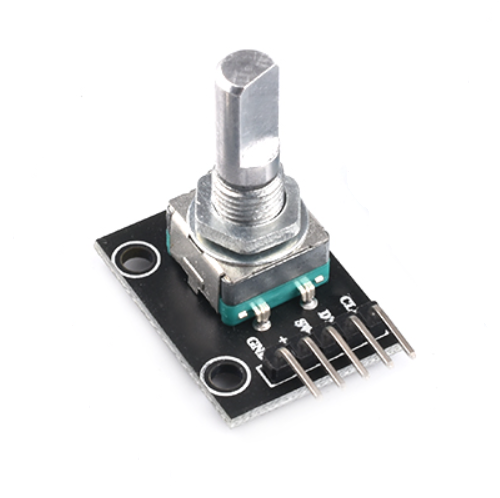
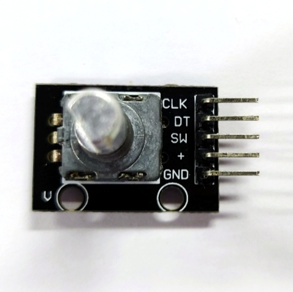
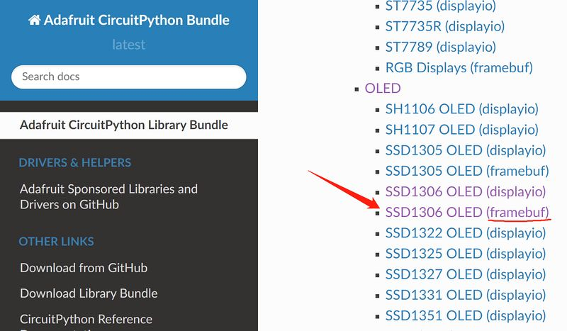

# 基础功能使用

## REPL简单使用

###  Hello World!

1. 确保已在Mu编辑器中正确连接开发板，参考[配置使用环境(Mu编辑器)](config_mu-editor.md)。
2. 在CircuitPython REPL窗口中通常会出现如下信息，`>>>`符号的出现即代表我们可以开始在其后输入命令与其交互了。
```
]0;🐍Wi-Fi: off | Done | 8.0.0-beta.0-49-g14fc4a079\Auto-reload is on. Simply save files over USB to run them or enter REPL to disable.

Press any key to enter the REPL. Use CTRL-D to reload.
]0;🐍Wi-Fi: off | Done | 8.0.0-beta.0-49-g14fc4a079\]0;�Wi-Fi: off | REPL | 8.0.0-beta.0-49-g14fc4a079\
Adafruit CircuitPython 8.0.0-beta.0-49-g14fc4a079 on 2022-09-20; BPI-PicoW-S3 with ESP32S3
>>> 
```
3. 在`>>>`符号右侧开始输入命令，例如：`print("Hello World！")`。
> 注意使用英文输入法，中文字符无法被REPL识别。
```py
>>> print("Hello World!")
Hello World!
>>> 
```

### REPL快捷键

1. 复制 `ctrl + shift + c`。
2. 粘贴 `ctrl + shift + v`。
   使用鼠标左键在REPL中拖选需要复制的命令，键盘按下复制快捷键，再按下粘贴快捷键即可复制粘贴命令。
3. 软复位 `ctrl + d`。
4. 中断 `ctrl + c`, 中断当前正在执行的程序，但不会重启复位。

### 查看内置模块

1. 在REPL中输入 `help("modules")` 将列出当前CircuitPython开发板内所有模块。
2. 导入模块后可再使用`help()`函数查看该模块内部可用的函数名或变量名，例如查看`board`模块，即可看到开发板所有可用的引脚与外设功能。
```py
>>> import board
>>> help(board)
object <module 'board'> is of type module
  __name__ -- board
  board_id -- bpi_picow_s3
  GP0 -- board.GP0
  GP1 -- board.GP1
  GP2 -- board.GP2
  GP3 -- board.GP3
  GP4 -- board.GP4
  GP5 -- board.GP5
  GP6 -- board.GP6
  GP7 -- board.GP7
  GP8 -- board.GP8
  GP9 -- board.GP9
  GP10 -- board.GP10
  GP11 -- board.GP11
  GP12 -- board.GP12
  GP13 -- board.GP13
  GP14 -- board.GP14
  GP15 -- board.GP15
  GP16 -- board.GP16
  GP17 -- board.GP17
  GP18 -- board.GP18
  GP19 -- board.GP19
  GP20 -- board.GP20
  GP21 -- board.GP21
  GP22 -- board.GP22
  GP25 -- board.GP25
  LED -- board.GP25
  GP26 -- board.GP26
  GP26_A0 -- board.GP26
  A0 -- board.GP26
  GP27 -- board.GP27
  GP27_A1 -- board.GP27
  A1 -- board.GP27
  GP28 -- board.GP28
  GP28_A2 -- board.GP28
  A2 -- board.GP28
  GP29 -- board.GP29
  GP29_A3 -- board.GP29
  A3 -- board.GP29
  NEOPIXEL -- board.NEOPIXEL
  TX -- board.GP0
  RX -- board.GP1
  BOOT0 -- board.BOOT0
  UART -- <function>
>>> 
```

## 使WS2812彩灯闪烁

1. 在Mu编辑器中点击**Load**按钮，选择CircuitPython开发板上的 code.py 文件，点击 **打开**，即可开始编辑 code.py 。

2. 在编辑器中输入如下代码：

```python
import time
import board
import neopixel

pixels = neopixel.NeoPixel(board.NEOPIXEL, 1, brightness=0.1)

while 1:
    pixels[0] = (255,0,0)
    pixels.show()
    time.sleep(0.5)
    pixels[0] = (0,255,0)
    pixels.show()
    time.sleep(0.5)
    pixels[0] = (0,0,255)
    pixels.show()
    time.sleep(0.5)
    pixels[0] = (255,255,255)
    pixels.show()
    time.sleep(0.5)
```

3. 点击**Save**按钮，编辑的内容将保存到CircuitPython开发板，代码无误的情况下，开发板上的彩色LED将循环闪烁 红绿蓝白。将开发板复位或重新上电，程序将重新开始运行。
4. 在REPL中使用中断快捷键即可停止程序的运行。
5. 代码也可直接复制粘贴到REPL中运行。

> 后续所有示例都可如此编辑code.py文件或复制粘贴到REPL中运行。但在code.py文件中的程序代码执行完毕后，开发板会恢复未运行时的状态，不会保留状态，但在REPL中执行则会保留状态。

## 使引脚输出高低电平，控制LED

1. `board.LED`控制着PicoW-S3上的一颗单色LED发光二极管，高电平点亮，低电平熄灭，在REPL中输入以下代码：
```py
import board
import digitalio
ledpin = digitalio.DigitalInOut(board.LED)
ledpin.direction = digitalio.Direction.OUTPUT
ledpin.value = True
```

2. 或者这么做：
```py
import board
import digitalio
ledpin = digitalio.DigitalInOut(board.LED)
ledpin.switch_to_output(value=True) # value=1
```

3. 让LED间隔0.5秒闪烁：
```py
import board
import digitalio
import time
ledpin = digitalio.DigitalInOut(board.LED)
while True:
    ledpin.switch_to_output(value=1)
    time.sleep(0.5)
    ledpin.switch_to_output(value=0)
    time.sleep(0.5)

```
4. 在REPL中使用中断快捷键即可停止程序的运行。

5. 在REPL中输入`import board;help(board)`即可列出所有可控制的引脚。`board.GP25` 与 `board.LED`完全相同。

## PWM输出，控制LED亮度

1. 可通过控制PWM占空比来控制LED灯亮度，控制占空比从0%~100%，采用16位精度，十进制为 0~65535 ，16进制为 0~FFFF 。在REPL中输入以下代码：
```py
import board
import pwmio
ledpin = pwmio.PWMOut(board.LED, frequency=25000, duty_cycle=0)
ledpin.duty_cycle = 32768  # mid-point 0-65535 = 50 % duty-cycle
```
2. 仅需在REPL中再次输入最后一行代码即可改变PWM占空比，使LED达到最大亮度：
```py
ledpin.duty_cycle = 65535
```
3. 呼吸灯：
```py
import board
import pwmio
import time

ledpin = pwmio.PWMOut(board.LED, frequency=25000, duty_cycle=0)

while True:
    for i in range(0, 65535, 1):
        ledpin.duty_cycle = i
    for i in range(65535, 0, -1):
        ledpin.duty_cycle = i
```

## PWM输出，控制180度舵机


以MG90S舵机为例，其他各种舵机参考其对应的使用手册，在以下代码中修改相应的参数。

1. MG90S舵机关键参数：
   * 控制角度，0° ~ 180°
   * PWM 占空时长控制，500us ~ 2500us 对应 0° ~ 180°
   * 工作电压：4.8V 至 6V（典型值为 5V）
   * 失速扭矩：1.8 kg/cm (4.8V)
   * 最大失速扭矩：2.2 kg/cm (6V)
   * 工作速度为 0.1s/60° (4.8V)
2. 求取任意一个旋转角度所需的占空时长的表达式为：
   ```
    设y为占空时长，x为旋转角度
    y=(2500-500)/180*x+500
    y=(100*x+4500)/9
    ```
3. 根据参数，可以确定舵机角度由PWM波的高电平持续时长所控制，且由于舵机的控制必须由周期性的PWM波形控制，所以一个周期时长必须超过控制此舵机达到180°所需的占空时长，即超过2500us，则PWM频率要低于400hz。
4. 设定PWM频率为200hz，则周期时长为5000us，对应控制此舵机旋转 0° ~ 180°的占空比为10% ~ 50% 。
5. circuitpython的PWM占空比控制精度为16bit，100%占空比在 2进制中表达为 1111 1111 1111 1111，16进制表达为 FFFF，10进制表达为 65535。
6. 求取任意一个旋转角度所需的占空比的表达式为：
    ```
    设y为占空比，x为旋转角度
    y=((50-10)/180*x+10)/100*65535
    y=(4369*x+196605)/30
    ```
7. 舵机与BPI-PicoW-S3的接线方式:
   > BPI-PicoW-S3的VBS引脚可输出+5V；除GP0以外，所有GP引脚都可以用于输出PWM，仅需在程序中修改到对应引脚即可。

| 舵机 | BPI-PicoW-S3 |
| :----: | :----: |
| GND 棕色 | GND |
| +5V 红色 | VBS |
| PWM 橙色 | GP0 |


8. 根据以上表达式与参数设计一个可以任意控制此舵机旋转角度的程序：
    ```py
    import board
    import pwmio
    import time
    servo_1 = pwmio.PWMOut(board.GP0, frequency=200, duty_cycle=0)#200hz, one cycle 5000us

    def get_duty_cycle(x):
        return int((4369*x+196605)/30)

    servo_1.duty_cycle = get_duty_cycle(90)# 90 degrees
    ```
9. 通过一个逻辑分析仪可以读出此程序所控制输出的PWM占空时长，与计算的数值应当相符。
   
   

10. 使用列表设计一套连续的舵机动作：
   ```py
   import board
   import pwmio
   import time
   servo_1 = pwmio.PWMOut(board.GP0, frequency=200, duty_cycle=0)#200hz, one cycle 5000us

   def get_duty_cycle(x):
       return int((4369*x+196605)/30) 

   action_list1 = [0,45,90,135,180,0,180,45,135,90]

   while True:
       for i in action_list1:
           servo_1.duty_cycle = get_duty_cycle(i)
           time.sleep(0.5)
   ```

## ADC输入，读取双轴摇杆坐标


这是一个常见的双轴XY摇杆模块，使用了两个电位器最为其核心器件，通过芯片的ADC 模/数转换器 读取它们各自的电压数值，即可将读数转化为其在XY坐标轴上的位置。

| 双轴摇杆 | BPI-PicoW-S3 |
| :----: | :----: |
| GND  | GND |
| +5V  | 3V3 |
| VRx  | GP27_A1 |
| VRY  | GP26_A0 |

1. 在CircuitPython中提供的ADC精度是16bit，即最大值的16进制表达为 FFFF，10进制表达为 65535，对应的电压量程为0mv ~ 3300mv。BPI-PicoW-S3所使用的EPS32S3芯片实际ADC电压量程为0mv ~ 3100mv，所以实际应用时仅能测量到3100mv。

2. 基础ADC读数，读取两个电位器的数值，转换为电压数值。
```python
import board,analogio,time

x_axis_pin = analogio.AnalogIn(board.A0)
y_axis_pin = analogio.AnalogIn(board.A1)

while True:
    x_axis = x_axis_pin.value
    y_axis = y_axis_pin.value
    # print((x_axis,y_axis))
    x_value = x_axis / 65535 * 3300
    y_value = y_axis / 65535 * 3300
    print("{0}mv,{1}mv".format(x_value,y_value))
    time.sleep(0.1)
```

3. 在Mu编辑器中，点击`Plotter`图标即可显示绘图仪，可以实时将REPL输出的数值显示为与时间相关的折线图。

   
4. 以下程序可实现校准坐标零点的功能。开始运行的前五秒，请静止摇杆等待获取零点数值。
> 注意代码中将xy轴对换了，将双轴摇杆模块逆时针旋转90°即可对应使用。此做法可使摇杆在y轴上移时ADC读数增加，反之减少，符合常见直角坐标系的规律。
```python
import board,analogio,time

x_axis_pin = analogio.AnalogIn(board.A0)
y_axis_pin = analogio.AnalogIn(board.A1)

def get_zero(times =500, sleep = 0.01):
    x_total = 0
    y_total = 0
    for i in range (times):
        x_axis = x_axis_pin.value
        y_axis = y_axis_pin.value
        x_total += x_axis
        y_total += y_axis
        time.sleep(sleep)
    x_zero = x_total // times
    y_zero = y_total // times
    return (x_zero,y_zero)

zero = get_zero(times =500, sleep = 0.01)
print(zero)

while True:
    x_axis = x_axis_pin.value - zero[0]
    y_axis = y_axis_pin.value - zero[1]
    print((x_axis,y_axis))
    time.sleep(0.1)
```
5. 以下程序可获取摇杆方向，这是双轴摇杆最常见的应用。
```python
import board,analogio,time

x_axis_pin = analogio.AnalogIn(board.A0)
y_axis_pin = analogio.AnalogIn(board.A1)

direction_list = ["East","Southeast","South","Southwest","West","Northwest","North","Northeast","Centre"]

def get_zero(times =500, sleep = 0.01):
    x_total = 0
    y_total = 0
    for i in range (times):
        x_axis = x_axis_pin.value
        y_axis = y_axis_pin.value
        x_total += x_axis
        y_total += y_axis
        time.sleep(sleep)
    x_zero = x_total // times
    y_zero = y_total // times
    return (x_zero,y_zero)

def get_direction(zero = (32767,32767)):
    x_axis = x_axis_pin.value - zero[0]
    y_axis = y_axis_pin.value - zero[1]
    if x_axis >= 10000 and -10000 < y_axis < 10000:
        return direction_list[0]
    elif x_axis >= 10000 and y_axis <= -10000:
        return direction_list[1]
    elif -10000 < x_axis < 10000 and y_axis <= -10000:
        return direction_list[2]
    elif x_axis <= -10000 and y_axis <= -10000:
        return direction_list[3]
    elif x_axis <= -10000 and -10000 < y_axis < 10000:
        return direction_list[4]
    elif x_axis <= -10000 and y_axis >= 10000:
        return direction_list[5]
    elif -10000 < x_axis < 10000 and y_axis >= 10000:
        return direction_list[6]
    elif x_axis >=10000 and y_axis >= 10000:
        return direction_list[7]
    else :
        return direction_list[8]

zero = get_zero(times =50, sleep = 0.01)
print(zero)

while True:
    x_axis = x_axis_pin.value - zero[0]
    y_axis = y_axis_pin.value - zero[1]
    print((x_axis,y_axis))
    print(get_direction(zero = zero))
    time.sleep(0.1)
```
6. 以下程序可设置坐标精度等级，计算每级跨度，可以按需求消除抖动，增强数据的实用性。
```python
import board,analogio,time

x_axis_pin = analogio.AnalogIn(board.A0)
y_axis_pin = analogio.AnalogIn(board.A1)

def get_zero(times =500, sleep = 0.01):
    x_total = 0
    y_total = 0
    for i in range (times):
        x_axis = x_axis_pin.value
        y_axis = y_axis_pin.value
        x_total += x_axis
        y_total += y_axis
        time.sleep(sleep)
    x_zero = x_total // times
    y_zero = y_total // times
    return (x_zero,y_zero)

def get_extremum(times =500, sleep = 0.01):
    x_list = []
    y_list = []
    for i in range (times):
        x_axis = x_axis_pin.value
        y_axis = y_axis_pin.value
        x_list.append(x_axis)
        y_list.append(y_axis)
        time.sleep(sleep)
    x_extremum = (min(x_list),max(x_list))
    y_extremum = (min(y_list),max(y_list))
    return (x_extremum,y_extremum)
    
def get_spacing(level = 16 , zero =(32767,32767) ,x_extremum = (0,65535),y_extremum = (0,65535)):
    x_temp_1 = (zero[0] - x_extremum[0]) // level
    x_temp_2 = (x_extremum[1] - zero[0] ) // level
    y_temp_1 = (zero[1] - y_extremum[0]) // level
    y_temp_2 = (y_extremum[1] - zero[1] ) // level
    x_spacing = (x_temp_1,x_temp_2)
    y_spacing = (y_temp_1,y_temp_2)
    return (x_spacing,y_spacing)

def get_coordinates(zero = (32767,32767), x_spacing = (2048,2048),y_spacing = (2048,2048)):
    x_value = x_axis_pin.value - zero[0]
    y_value = y_axis_pin.value - zero[1]
    if x_value >= 0:
        x_axis = x_value // x_spacing[1]
    else:
        x_axis = - ((-x_value) // x_spacing[0])
    if y_value >= 0:
        y_axis = y_value // y_spacing[1]
    else:
        y_axis = - ((-y_value) // y_spacing[0])
    return (x_axis,y_axis)
    
zero = get_zero(times =500, sleep = 0.01)
print(zero)
(x_extremum,y_extremum) = get_extremum(times = 500, sleep = 0.01)
print((x_extremum, y_extremum))
(x_spacing,y_spacing) = get_spacing(level = 128 , zero = zero, x_extremum = x_extremum,y_extremum = y_extremum)
print((x_spacing, y_spacing))

while True:
    coordinates = get_coordinates(zero = zero, x_spacing = x_spacing, y_spacing = y_spacing)
    print(coordinates)
    time.sleep(0.1)
```

## 使用增量型旋转编码器
 

**接线参考**

|**增量型旋转编码器**|**BPI-PicoW-S3**|
| --- | --- |
|GND|GND|
|+|VBUS|
|SW||
|DT|GP0|
|CLK|GP1|

1. 增量型旋转编码器外观粗看与一些常见的旋转电位器相似，其关键的不同之处大致分为三点。
   1. 微控制器使用ADC外设来读取旋转电位器输出的模拟信号（电压值），确定转轴当前角位；微控制器通过GPIO接收增量型旋转编码器输出的数字信号，可通过软件程序判断信号所对应的转轴动作。
   2. 微控制器可在一定精度下，确定旋转电位器转轴当前角位，但因为模拟信号的持续性与抗干扰能力差的原因，无法准确判断它是否有动作；增量型旋转编码器仅在转轴运动到一个触点时，向微控制器发出一段动作数字信号，如果一个增量型旋转编码器一周有20个触点，它旋转一周就触发20次动作信号，微控制器可以精确的判断它是否动作，向哪个方向转动，信号触发了多少次。
   3. 旋转电位器通常不可向任意转向进行无限旋转，会停止在最大或最小限位点；增量型旋转编码器可向任意转向进行无限旋转。
2. 增量型旋转编码器采用正交编码器生成其A和B的输出信号。从A和B输出发射的脉冲是正交编码的，这意味着当增量编码器以恒定速度运动时，A和B波形是方波，A和B之间存在90度的相位差。最终A和B信号将从两个管脚传输给微控制器。
    


3. 理论上，在任何特定时间，对于旋转编码器，A和B信号之间，顺时针旋转的相位差为+90°，逆时针旋转的相位差为−90°，具体则取决于设备内部的正交编码器设计。
4. A或B输出上的脉冲频率与转轴的速度（位置变化率）成正比。较高的频率表示较快的速度，而较低的频率表示较慢的速度。当转轴静止时，静态、不变的信号输出在A和B上，所以有很多测速方案使用增量型旋转编码器。
> 参考 [维基百科: 增量编码器](https://en.wikipedia.org/wiki/Incremental_encoder#Quadrature_decoder) 。
5. 用CircuitPython设计一个程序读取在GP0与GP1引脚上的信号，当其中一个发生变化时同时输出两个引脚当前的值，连接开发板与增量型旋转编码器后运行程序。
```python
import board
import digitalio

dt = digitalio.DigitalInOut(board.GP0)
clk = digitalio.DigitalInOut(board.GP1)
dt.switch_to_input()
clk.switch_to_input()
dt_last_value = 0
clk_last_value = 0

while True:
    if dt.value != dt_last_value or clk.value != clk_last_value:
        dt_last_value = int(dt.value)
        clk_last_value = int(clk.value)
        print((dt_last_value,clk_last_value))
```
6. 逐级转动转轴，观察输出信号，如果有逻辑分析仪或示波器也可接入观察。

   1. 转轴逆时针旋转时，REPL的输出。
   ```
   (1, 1)
   (1, 0)
   (0, 0)
   (0, 1)
   (1, 1)
   (1, 0)
   (0, 0)
   (0, 1)
   (1, 1)
   ```
   2. 转轴逆时针旋转时，逻辑分析仪所观察到的波形。
   

   3. 转轴顺时针旋转时，REPL的输出。
   ```
   (1, 1)
   (0, 1)
   (0, 0)
   (1, 0)
   (1, 1)
   (0, 1)
   (0, 0)
   (1, 0)
   (1, 1)
   ```
   4. 转轴逆时针旋转时，逻辑分析仪所观察到的波形。
   


7. 首先可以观察到的现象是，转轴完成一级动作后，两个引脚上的信号都为1，可以设计程序，当值都变为1时输出一次计数值，计数值可作为判断编码器完成一次动作的依据。
```python
import board
import digitalio

dt = digitalio.DigitalInOut(board.GP0)
clk = digitalio.DigitalInOut(board.GP1)
dt.switch_to_input()
clk.switch_to_input()
dt_last_value = 0
clk_last_value = 0
count = 0

while True:
    if dt.value != dt_last_value or clk.value != clk_last_value:
        dt_last_value = int(dt.value)
        clk_last_value = int(clk.value)
        print((dt_last_value,clk_last_value))
        if (dt_last_value,clk_last_value) == (1,1):
            print('--',count_1,'--')
            count += 1
```
8. 再确定编码器顺时针旋转与逆时针旋转的动作，在两个引脚上输出的信号变化的规律与差异。
  1. 逆时针旋转的规律为(1, 1)>(1, 0)>(0, 0)>(0, 1)>(1, 1)。
  2. 顺时针旋转的规律为(1, 1)>(0, 1)>(0, 0)>(1, 0)>(1, 1)。
  由此可设计一个顺时针旋转使计数+1，逆时针旋转使计数-1的程序，并加入消抖除错的功能。
```python
import board
import digitalio
import time
dt = digitalio.DigitalInOut(board.GP0)
clk = digitalio.DigitalInOut(board.GP1)
dt.switch_to_input()
clk.switch_to_input()
dt_last_value = 0
clk_last_value = 0
count = 0
start_sign = 0
clockwise_sign = 0
while True:
    if dt.value != dt_last_value or clk.value != clk_last_value:
        dt_last_value = int(dt.value)
        clk_last_value = int(clk.value)
        print((dt_last_value,clk_last_value))
        if start_sign == 0 and (dt_last_value,clk_last_value) == (0,0):
            start_sign = 1
        elif start_sign == 1:
            if (dt_last_value,clk_last_value) == (1, 0):
                clockwise_sign = 1
            elif (dt_last_value,clk_last_value) == (0, 1):
                clockwise_sign = -1
            elif (dt_last_value,clk_last_value) == (1, 1):
                count = count + clockwise_sign
                clockwise_sign = 0
                start_sign = 0
                print('--',count,'--')
```
9. 此程序中的消抖除错功能的实现，并不是逐步判断验证是否符合信号规律，或许还有更多办法可以实现消抖除错，欢迎讨论。
10. 另外 CircuitPython 的rotaryio模块可直接实现正反转计数功能。（内部程序有所差异，但最终实现功能基本一致）。
```python
import rotaryio
import board

encoder = rotaryio.IncrementalEncoder(board.GP0,board.GP1) 
last_position = 0

while True:
    position = encoder.position
    if position != last_position:
        print(position)
    last_position = position
```

## 下载安装CircuitPython库，驱动ssd1306 oled屏幕


[CircuitPython库 官网页面](https://circuitpython.org/libraries)
[Adafruit CircuitPython库 文档页面](https://docs.circuitpython.org/projects/bundle/en/latest/index.html)
[Adafruit SSD1306 库 文档页面](https://docs.circuitpython.org/projects/ssd1306/en/latest/index.html)
[Adafruit framebuf 库 文档页面](https://docs.circuitpython.org/projects/framebuf/en/latest/)

本节以ssd1306驱动库与framebuf库为例，指导如何下载安装CircuitPython库。

1. 在新页面打开[Adafruit CircuitPython库 文档页面](https://docs.circuitpython.org/projects/bundle/en/latest/index.html)。
2. 在页面中找到并打开 **SSD1306 OLED (framebuf)** 项，然后点击左侧的**Download from GitHub**项，跳转到其GitHub releases页面，点击 **adafruit-circuitpython-ssd1306-8.x-mpy-2.12.12.zip** 项将其下载到本地。



3. 回到Adafruit CircuitPython库 文档页面，在页面中找到并打开 **Framebuf Module** 项，然后点击左侧的**Download from GitHub**项，跳转到其GitHub releases页面，点击 **adafruit-circuitpython-framebuf-8.x-mpy-1.4.14.zip** 项将其下载到本地。
> 下载最新版本即可。
4. 将下载的两个压缩包解压，内部文件夹结构如下：
```
├─examples
│  ├─xxx.py
│  ├─xxx.py
│  └─......
├─lib
│  ├─a.mpy
│  ├─b.mpy
│  └─......
└─requirements
   ├─a
   │ └─requirements.txt
   ├─b
   │ └─requirements.txt
   └─......
```
5. examples文件夹中的是一些库的使用例程，lib文件夹中扩展名为`.mpy`的即是库文件，requirements文件夹中的 requirements.txt 文件，其中记录了各库文件所依赖的，必要的其他库文件名称，有一些已经包含在CircuitPython固件中，而不在其内的则需另外下载安装。例如 **adafruit_ssd1306** 库绘制图形和文字的方法全部依赖于**adafruit_framebuf** 库，所以我们在第3步中也将其下载到本地。
6. 将两个lib文件夹中扩展名为`.mpy`的库文件复制到 **CIRCUITPY** 磁盘中的lib文件夹内，即可在程序中调用这两个库。
7. adafruit_framebuf 库还需将其examples文件夹中的 **font5x8.bin** 文件复制到**CIRCUITPY** 磁盘中的根目录，即 code.py 文件所在的地方。此为字库文件，显示文字需要使用它。
8. 将一块i2c协议的ssd1306 oled屏幕模块与开发板连接。

**接线参考**

| ssd1306 | BPI-PicoW-S3 |
| :----: | :----: |
| GND  | GND |
| VCC  | 3V3 |
| SCL  | GP0 |
| SDA  | GP1 |

1. 编辑 code.py 文件，在其中输入以下代码即可驱动此屏幕模块输出图形和字符。
    修改代码中的变量 `bgColor`数值为1，即可使显示背景为白色，显示图形为黑色。
    在两个库的文档中可查找到API参考，配合例程即可快速理解，上手使用ssd1306显示模块。
```python
import board
import busio
import adafruit_ssd1306
import time

i2c = busio.I2C(board.GP0, board.GP1)
display = adafruit_ssd1306.SSD1306_I2C(128, 64, i2c, addr=0x3C)
bgColor=0

display.fill(bgColor)
for i in range(0,display.height,4):
    for j in range(0,display.width,4):
        display.pixel(j, i, not bgColor)
    display.show()

display.fill(bgColor)
for i in range(0,display.height,4):
    display.hline(0, i,display.width, not bgColor)
    display.show()

display.fill(bgColor)
for i in range(0,display.width,8):
    display.vline(i, 0,display.height, not bgColor)
    display.show()

display.fill(bgColor)
for i in range(0,display.height,4):
    display.line(0, 0, display.width, i, not bgColor)
    display.line(display.width, display.height, 0, display.height-i, not bgColor)
    display.show()

display.fill(bgColor)
for i in range(0,display.width//2,4):
    display.circle(display.width//2, display.height//2, i, not bgColor)
    display.show()

display.fill(bgColor)
for i in range(0,display.height,16):
    for j in range(0,display.width,16):
        display.rect(j, i, 12, 12, not bgColor)
        display.show()

for i in range(0,display.height,16):
    for j in range(0,display.width,16):
        display.fill_rect(j+2, i+2, 8, 8, not bgColor)
        display.show()

display.fill(bgColor)
display.text("Hello", 0, 24, not bgColor, font_name='font5x8.bin', size=2)
display.show()
time.sleep(0.25)
display.text("World!", 0, 40, not bgColor, font_name='font5x8.bin', size=3)
display.show()
time.sleep(0.25)
display.text(">>>", 60, 0, not bgColor, font_name='font5x8.bin', size=4)
display.show()
time.sleep(1)

display.fill(bgColor)
char_width = 6
char_height = 8
chars_per_line = display.width // 6
for i in range(255):
    x = char_width * (i % chars_per_line)
    y = char_height * (i // chars_per_line)
    display.text(chr(i), x, y, not bgColor, font_name='font5x8.bin', size=1)
display.show()
```

# 多功能应用

## OLED实时动画显示双轴摇杆位置

基于前文 [ADC输入，读取双轴摇杆坐标](#adc输入读取双轴摇杆坐标)与[下载安装CircuitPython库，驱动ssd1306 oled屏幕](#下载安装circuitpython库驱动ssd1306-oled屏幕) 章节，可设计一个使OLED实时动画显示双轴摇杆位置的程序。

**接线参考**

| ssd1306 | BPI-PicoW-S3 |
| :----: | :----: |
| GND  | GND |
| VCC  | 3V3 |
| SCL  | GP0 |
| SDA  | GP1 |

| 双轴摇杆 | BPI-PicoW-S3 |
| :----: | :----: |
| GND  | GND |
| +5V  | 3V3 |
| VRx  | GP27_A1 |
| VRY  | GP26_A0 |

```python
import time
import board
import busio
import analogio
import adafruit_ssd1306

def get_zero(times =500, sleep = 0.01):
    x_total = 0
    y_total = 0
    for i in range (times):
        x_axis = x_axis_pin.value
        y_axis = y_axis_pin.value
        x_total += x_axis
        y_total += y_axis
        time.sleep(sleep)
    x_zero = x_total // times
    y_zero = y_total // times
    return (x_zero,y_zero)

def get_extremum(times =500, sleep = 0.01):
    x_list = []
    y_list = []
    for i in range (times):
        x_axis = x_axis_pin.value
        y_axis = y_axis_pin.value
        x_list.append(x_axis)
        y_list.append(y_axis)
        time.sleep(sleep)
    x_extremum = (min(x_list),max(x_list))
    y_extremum = (min(y_list),max(y_list))
    return (x_extremum,y_extremum)

def get_spacing(level = 16 , zero =(32767,32767) ,x_extremum = (0,65535),y_extremum = (0,65535)):
    x_temp_1 = (zero[0] - x_extremum[0]) // level
    x_temp_2 = (x_extremum[1] - zero[0] ) // level
    y_temp_1 = (zero[1] - y_extremum[0]) // level
    y_temp_2 = (y_extremum[1] - zero[1] ) // level
    x_spacing = (x_temp_1,x_temp_2)
    y_spacing = (y_temp_1,y_temp_2)
    return (x_spacing,y_spacing)

def get_coordinates(zero = (32767,32767), x_spacing = (2048,2048),y_spacing = (2048,2048)):
    x_value = x_axis_pin.value - zero[0]
    y_value = y_axis_pin.value - zero[1]
    if x_value >= 0:
        x_axis = x_value // x_spacing[1]
    else:
        x_axis = - ((-x_value) // x_spacing[0])
    if y_value >= 0:
        y_axis = y_value // y_spacing[1]
    else:
        y_axis = - ((-y_value) // y_spacing[0])
    return (x_axis,y_axis)

# i2c init
i2c = busio.I2C(board.GP0, board.GP1)
display = adafruit_ssd1306.SSD1306_I2C(128, 64, i2c, addr=0x3C)

# Uniformly set the color and background color of displayed characters or graphics.
# Monochrome OLEDs only need to set one and then negate the other.
display_color = 0
bg_color = not display_color

# Fill background color.
display.fill(bg_color)
display.show()

# Set 2-axis rocker pin.
x_axis_pin = analogio.AnalogIn(board.A0)
y_axis_pin = analogio.AnalogIn(board.A1)

# Calibrate the zero point.
# Take the xy-axis reading when the dual-axis joystick is at rest and set it to zero point.
display.text('Zero adjustment', 0, 20, display_color, font_name='font5x8.bin', size=1)
display.text('Do not touch', 0, 28, display_color, font_name='font5x8.bin', size=1)
display.show()
zero = get_zero(times =200, sleep = 0.01)
display.text('Do not touch', 0, 28, bg_color, font_name='font5x8.bin', size=1)
str_zero = "x={},y={}".format(zero[0],zero[1])
display.text(str_zero, 0, 28, display_color, font_name='font5x8.bin', size=1)
display.show()
print(str_zero)
time.sleep(2)

# Different hardware measures different extreme values.
display.fill(bg_color)
display.text('Extremum adjustment', 0, 20, display_color, font_name='font5x8.bin', size=1)
display.text('Rotary rocker', 0, 28, display_color, font_name='font5x8.bin', size=1)
display.show()
(x_extremum,y_extremum) = get_extremum(times = 400, sleep = 0.01)
display.text('Extremum adjustment', 0, 20, bg_color, font_name='font5x8.bin', size=1)
display.text('Rotary rocker', 0, 28, bg_color, font_name='font5x8.bin', size=1)
str_x_extremum = "x_min={},x_max={}".format(x_extremum[0],x_extremum[1])
str_y_extremum = "y_min={},y_max={}".format(y_extremum[0],y_extremum[1])
display.text(str_x_extremum, 0, 20, display_color, font_name='font5x8.bin', size=1)
display.text(str_y_extremum, 0, 28, display_color, font_name='font5x8.bin', size=1)
print((str_x_extremum, str_y_extremum))
display.show()
time.sleep(2)

# Setting the scale spacing can eliminate unnecessary jitter.
(x_spacing,y_spacing) = get_spacing(level = 32 , zero = zero, x_extremum = x_extremum,y_extremum = y_extremum)
print((x_spacing, y_spacing))

display.fill(bg_color)
display.text('x=', 70, 16, display_color, font_name='font5x8.bin', size=2)
display.text('y=', 70, 32, display_color, font_name='font5x8.bin', size=2)
(x_axis,y_axis) = (0,0)
(x_axis_1,y_axis_1) = (1,1)
(x_axis_2,y_axis_2) = (0,0)
display.show()
while True:
    # Get the coordinate value in a loop.
    (x_axis,y_axis) = get_coordinates(zero = zero, x_spacing = x_spacing, y_spacing = y_spacing)
    # Only refresh the display when the coordinates change.
    if (x_axis,y_axis) == (x_axis_1,y_axis_1):
        pass
    else:
        # Using background color inversion for identical pixels,
        # pixels can be refreshed with minimal performance cost.
        display.fill_rect(x_axis_2-3, y_axis_2-3, 6, 6, bg_color)
        display.text(str(x_axis_1), 90, 16, bg_color, font_name='font5x8.bin', size=2)
        display.text(str(y_axis_1), 90, 32, bg_color, font_name='font5x8.bin', size=2)
        (x_axis_1,y_axis_1) = (x_axis,y_axis)
        (x_axis_2,y_axis_2) = (x_axis+32, -y_axis+32)
        display.fill_rect(x_axis_2-3, y_axis_2-3, 6, 6, display_color)
        display.text(str(x_axis_1), 90, 16, display_color, font_name='font5x8.bin', size=2)
        display.text(str(y_axis_1), 90, 32, display_color, font_name='font5x8.bin', size=2)
        display.show()

```
