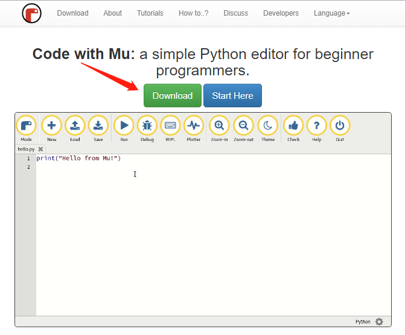
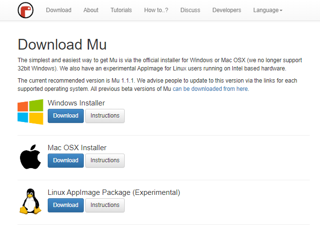
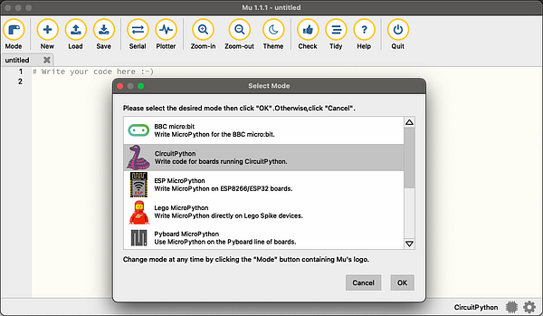

# 配置使用环境(Mu编辑器)

## 下载安装Mu编辑器

1. 进入[**Mu编辑器官网**](https://codewith.mu/)，点击 **Download** 按钮进入新页面。

2. 选择你的电脑当前使用的操作系统，点击对应操作系统的 **Download** 按钮开始下载安装包。

3. 点击对应操作系统的 **Instuctions** 按钮即可查看详细的安装步骤，根据指引安装即可。

## 建立Mu编辑器与开发板的连接

1. 启动Mu编辑器，将模式更改为CircuitPython，如果您已正确连接CircuitPython开发板，将提示您是否直接切换到该模式。

2. 点击**Serrial**按钮，然后按任意键即可进入CircuitPython REPL。

