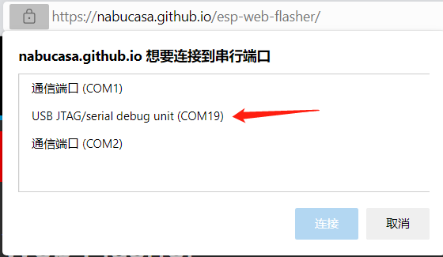

# 烧录tinyUF2固件的方法
## 下载tinyUF2固件
1. 进入[BPI-PicoW-S3 CircuitPython 下载](https://circuitpython.org/board/bpi_picow_s3/)页面。
2. 在页面底部找到`Install, Repair, or Update UF2 Bootloader`栏目，点击最下方的`DOWNLOAD BOOTLOADER ZIP`按钮下载压缩包。
3. 在本地解压压缩包，`combined.bin`文件是我们需要的固件。
## 将开发板置于bootloader模式

1. 通过USB连接开发板与电脑。
2. 使用任何导体（如金属引脚或镊子）将BOOT0触点短路，以将EPS32S3芯片置于bootloader模式。
3. 按一次`Reset`按键。
4. 松开BOOT0触点。
## 在浏览器中烧录固件
> 支持Chrome，Edge浏览器，内核版本需高于89。
1. 打开[ESP Web Flasher](https://nabucasa.github.io/esp-web-flasher/)页面。
2. 点击`Connect`按钮，将弹出一个选项栏，选择开发板所在的串口。
    
    
3. 正常连接后，点击`Erase`按钮擦除开发板的flash内容，这个过程不可逆。
   
4. 点击`Choose a file...`按钮，在弹出的文件选择窗口中跳转到`combined.bin`文件所在的目录，选择此文件并点击确认。
5. 点击`Program`按钮即可开始烧录固件，大约等待五分钟即可完成。
6. 完成后，手动按一次`Reset`按键，成功烧录的标志是彩灯为长绿灯，如果没有得到此结果，可以重试前五步，或尝试下一个烧录方法。

## esptool本地烧录固件

1. 打开[Python官网](https://www.python.org/) 。

    对于Windows 系统来说，最便捷的安装包下载方法就是在官网首页点击如下图所示的图标进行下载。

    

    其他操作系统或是其他发行版本则可以在 Downloads 选项栏中进行选择。

    建议使用python 3.7以上的版本。

2. 开始安装时一定要记得勾选Add Python 3.x to PATH，这样可以免除再手动添加进PATH。

    

    按照安装提示逐步操作即可顺利完成安装 。

3. 以Windows PowerShell的具体操作步骤为例，使用以下命令安装esptool：

   ```shell
   pip install esptool
   ```

    如果未来有需要，则可以使用以下命令升级esptool：

   ```shell
   pip install -U esptool
   ```

4. 通过命令或其他方法在PowerShell中进入固件所在的目录。

5. 可以在Windows文件夹窗口中以按住shift键再单击右键的方式在此文件夹中打开PowerShell窗口。

6. 此时需要设置开发板为bootloader模式，详见上文。

7. 通过以下命令清除flash，需要修改COM接口为对应的接口，此处为COM22。

   ```shell
   python -m esptool --chip esp32s3 --port COM22 erase_flash
   ```

8. 通过以下命令烧录固件，需要修改固件文件名为当前对应需要烧录的文件名。

   ```shell
   python -m esptool --chip esp32s3 --port com22 --baud 460800 --before=default_reset --after=hard_reset write_flash -z 0x0 combined.bin
   ```

9. 完成后，手动按一次`Reset`按键，成功烧录的标志是彩灯为长绿灯，如果没有得到此结果，可以重试前两步命令。