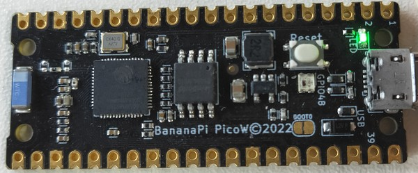

# 更新CircuitPython固件的方法
> 出厂已安装 tinyUF2 + CircuitPython固件，升级circuipython仅需双击复位键进入UF2 bootloader模式，无需擦除flash。
> 本方法适用于已具备tinyUF2固件的开发板，如果开发板的flash被擦除或出现无法进入UF2模式的故障，则需先参考[烧录tinyUF2固件的方法](flash_tinyuf2.md)。
1. 进入[BPI-PicoW-S3 CircuitPython 下载](https://circuitpython.org/board/bpi_picow_s3/)页面。
   
2. 点击DOWNLOAD UF2 NOW 按钮即可下载最新释放的`.uf2`固件。
3. 通过USB连接开发板与电脑，在此电脑文件管理页面将出现一个名为`CIRCUITPY`的磁盘，此为CircuitPython模式下的磁盘，通过双击开发板上的`Reset`按键的方式，使其变更为UF2模式下的磁盘，以下为具体操作步骤。
   1. 快速按一次`Reset`按键。
    
   2. 紫灯亮起时再快速按一次`Reset`按键。
    
   3. 成功触发的标志是彩灯在片刻红灯后转变为长绿灯，如果没有得到此结果，可以重试前两步。
    
4. UF2模式下的磁盘名称为`UF2BOOT`，将第1步下载的`.uf2`固件复制到此磁盘中，过程中彩灯会闪烁橙灯，请勿在此过程中断开连接或对开发板进行任何操作。
5. 完成CircuitPython固件更新后会自动复位，在此电脑文件管理页面将重新出现一个`CIRCUITPY`磁盘，通过REPL可以查看具体的固件版本。