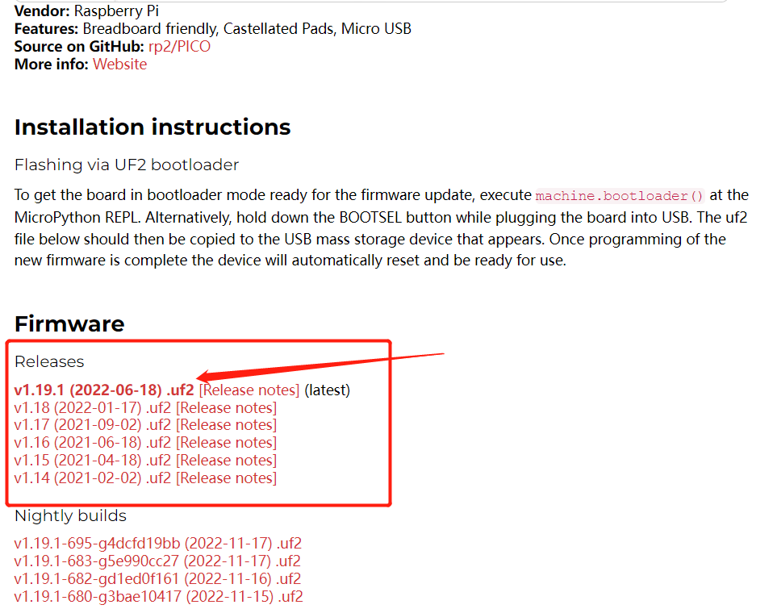

## MicroPython firmware download and burn

On the [MicroPython official website] (https://micropython.org/), you can find the firmware supporting the RP2040 chip. The BPI-Pico-RP2040 is fully compatible with the firmware of the Raspberry Pi Pico: https://micropython.org/download/rp2-pico/

After clicking the link to enter the page, you can see several lists of firmware download addresses below. It is recommended to select the first item in the Releases column to download, taking into account stability and new features. Subsequent routines are written based on v1.19.1 firmware.



The firmware provided in the Nightly builds column is a daily build and will have the latest features, but the stability may be slightly poorer, and there may be no documentation for the latest features.

After the download is complete, you will get a file with a .uf2 extension. The way to burn it to the BPI-Pico-RP2040 development board is very simple. First, make sure there is a type-c data cable, connect one end to the PC, pick up the development board, Keep the above without any connection or peripheral hardware, press and hold the Boot button, connect the type-c data cable to the development board, release the Boot button, a new disk named RPI-RP2 will appear in the PC system, and the .uf2 The files are copied to this disk. After the copy is completed, the development board will automatically reset and enter the MicroPython mode.

## Install Thonny IDE

Take Windows as an example, click the link to download [thonny-3.3.13.zip](../assets/images/thonny-3.3.13.zip), and get `thonny-3.3.13.exe` after decompression.

Run `thonny-3.3.13.exe`, and follow the installation prompts to complete the installation step by step.

It can also be installed through pip, `pip install thonny==3.3.13`, requires [Python](https://www.python.org/) environment, suitable for macOS or Linux.

## Establish a connection between the development board and Thonny

Connect the development board to the computer.

To run Thonny, click Run > Select interpreter.


Select MicroPython(Raspberry Pi Pico).


Select the serial interface where the development board is located, and click OK to confirm the settings.


Check View > Files to open the file management bar.


## Use the REPL to output Hello World

**REPL** is the abbreviation of **Read-Eval-Print-Loop**, translated as **Read-Eval-Output-Loop**.

We can understand its meaning through practical operation.

After connecting the development board with MicroPython firmware installed to the computer, running Thonny IDE and configuring it correctly, the following text will appear in the Shell window:

```
MicroPython v1.19.1 on 2022-06-18; Raspberry Pi Pico with RP2040
Type "help()" for more information.
>>>
```

Pay attention to the `>>>` prompt on the last line, we can directly enter the formula or code after this, and press the `enter` key on the keyboard to get the output result in the next line immediately.

```python
>>> 1+2
3
>>> print("Hello World")
hello world
>>>
```

Now it can be understood very intuitively. It will read the information we input, perform calculation and evaluation, output the result, and then wait for our subsequent input, and keep looping this process. This is why **REPL** is translated into ** The reason for the interactive interpreter is that we can directly interact with the hardware by inputting codes. There is no need to execute the compilation process in the middle like the traditional C language. The information we input is transmitted to the chip for interpretation and operation without compilation. Yes, this is an important feature of the Python language, and MicroPython perfectly inherits it.

If you just use MicroPython REPL, many software with serial port information sending and receiving functions can be operated. If you are interested, you can try various serial port tools, which can give people a deeper understanding of the meaning of "there is no intermediate compilation process".

>About the application of REPL, more detailed and comprehensive content can refer to [MicroPython Documentation: REPL](https://docs.micropython.org/en/latest/reference/repl.html)

## code editor

Of course, Thonny IDE can not only perform REPL operations, but as a python code editor, it still has its own functions.

Create a new file and enter the code in its editing area.

```python
print(1+2)
print("Hello World")
```

After finishing the code editing, click **Save**, you can choose to save the file to the development board, which will directly transfer the entire file to the flash of the development board. You can name the file `main.py`, and the device will execute it after each power-on or reset.


Now click **Run current script** to run. It also does not need to be compiled, and the result will be obtained immediately in the Shell.

```
3
hello world
```

In addition, you can also try the REPL keyboard shortcut **ctrl+D** software reset, you can see that the program is executed immediately after the reset and prints out the information.

## Turn on the LED

The onboard LED on the BPI-Pico-RP2040 is connected to GPIO 25 pin, you can light it on the REPL. When you see the REPL prompt `>>>`, please enter the following code.
```python
>>> from machine import Pin
>>> led = Pin(25, Pin.OUT)
```
> The `machine` module is used to control the hardware on the development board. This is standard across all MicroPython ports, and you can learn more about it in the [MicroPython documentation: machine](https://docs.micropython.org/en/v1.19.1/library/machine.html).

Enter the following code and the LED will light up.
```python
>>> led. value(1)
```

Entering the following code will turn off the LED.
```python
>>> led. value(0)
```

## Use onboard lights

The onboard WS2812 colored light on BPI-Pico-RP2040 is connected to GPIO 3 pin, it only needs one signal line to control, enter the following code in REPL.
```python
>>> from machine import Pin
>>> from neopixel import NeoPixel
>>> neo = NeoPixel(Pin(3), 1)
```
> The `neopixel` module provides drivers for WS2812 colored lights. You can learn more about it in the [MicroPython documentation: neopixel](https://docs.micropython.org/en/v1.19.1/library/neopixel.html).
Enter the code below and the colored light will light up red.
```python
>>> neo[0] = (25,0,0)
>>> neo.write()
```
`neo[0] = (25,0,0)` sets the color of the first lantern.

There are three solid-color LEDs in the WS2812 lantern, and their colors are red, green, and blue. The elements in the `(25,0,0)` tuple control their brightness in turn, and the value range is 0 ~ 255. The value of the element The bigger it is, the brighter the solid color LED it controls.
It is recommended to control the value of the element below 50. When the value is too high, it will be dazzling when viewed directly at close range.

After `neo.write()` is executed, the chip will transmit the control signal to the onboard WS2812 lantern.

You can try to modify the data in the tuple yourself to control the color of the colored lights. For example, continue to enter the following code in the REPL to make the colored lights white.
```python
>>> neo[0] = (25,25,25)
>>> neo.write()
```

## Reference Resources
- [raspberry-pi-pico-python-sdk.pdf](https://datasheets.raspberrypi.com/pico/raspberry-pi-pico-python-sdk.pdf)