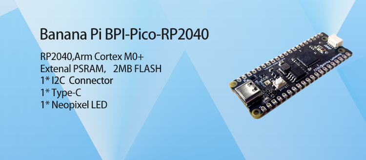

# 【 BPI-Pico-RP2040 Development Board 】

## introduce

The Banana Pi Pico series is a low-power microcontroller development board designed for the Internet of Things.

BPI-Pico-RP2040 has RP2040 chip onboard, adopts Arm Cortex M0+ processor architecture, runs at 133 MHz, has 264K SRAM, and 2MB onboard storage space.

## Programming with MicroPython

Regardless of the programmer is a beginner or not, MicroPython is considered to be less difficult to develop than other MCU programming languages.

Its code is easy to understand compared to other programming languages, and it has various resources accumulated over the years by the open source community.

Just like Python, it has strong vitality and application value.

By uploading the MicroPython firmware, you can use the Python language to program in the development board.

## Programming with CircuitPython

CircuitPython is a programming language designed to simplify programming experiments and learning on microcontroller development boards.

CircuitPython programming with the Mu editor is the least difficult way to get started. Install the software and connect the device to start using it.

## Programming with Arduino

Provides software tools and best examples to get started with Arduino, lowering the barrier to entry for ESP32 embedded professional development.

>Arduino will not explain too much basic content, please have C/C++ language development foundation.

## Materials and Resources

- [Official WIKI]()

- [GitHub: BPI-Pico-RP2040 Development Board Schematic PDF]()

- [RP2040 Technical Specification](https://datasheets.raspberrypi.com/rp2040/rp2040-datasheet.pdf)

- [rp2040-product-brief.pdf](https://datasheets.raspberrypi.com/rp2040/rp2040-product-brief.pdf)

- [raspberry-pi-pico-python-sdk.pdf](https://datasheets.raspberrypi.com/pico/raspberry-pi-pico-python-sdk.pdf)

## Sample Purchase

- [Official AliExpress]()

- [Official Taobao]()

- OEM&OEM customized service: sales@banana-pi.com