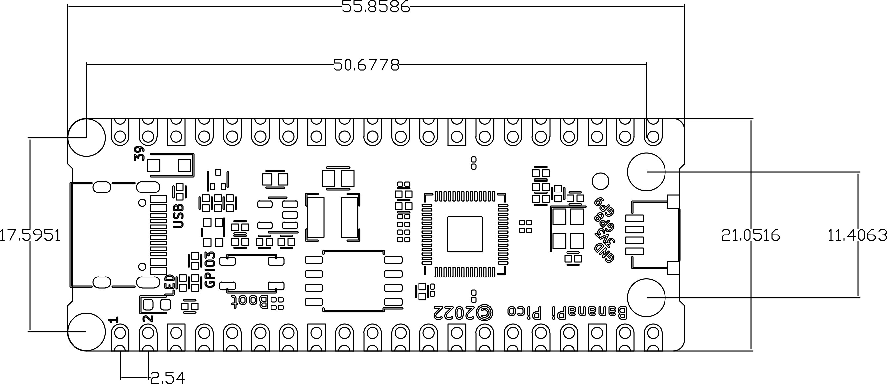

# Development board introduction
The Banana Pi Pico series is a low-power microcontroller development board designed for the Internet of Things.

BPI-Pico-RP2040 is a microcontroller development board launched by Banana Pi equipped with RP2040 chip. Its most notable feature is to add a Onboard WS2812 color LED; replace the 3-Pin DEBUG interface with a JST SH 1mm 4-Pin socket, which can be connected with Qwiic & STEMMA QT or any possible peripherals; replace the micro-USB socket with a USB Type-C socket , supports reversible insertion, and is compatible with the USB Type-C cable of most modern smartphones, no additional purchase is required.

## Key Features

- Dual-core ARM Cortex M0+ CPU cores (up to 133 MHz)
- 264K SRAM
- 2MB Flash
- 26 available GPIO pins, 4 of which support ADC analog input
- Peripherals:
  - 2 x UARTs
  - 2 × SPI controllers
  - 2 × I2C controllers
  - 16 × PWM channels
  - 1 × USB 1.1 controller and PHY, supporting host and device
  - 8 × PIO state machines
- 1 x LED
- 1 x WS2812 LED
- 1 × JST SH 1mm 4-Pin socket
- 1 × USB Type-C socket

## hardware

### Interface diagram

### Hardware Dimensions

<table>
   <tr>
      <td>BPI-Pico-RP2040 Size Chart</td>
   </tr>
   <tr>
      <td>Pin spacing</td>
      <td>2.54mm</td>
   </tr>
   <tr>
      <td>Mounting hole spacing</td>
      <td>17.6mm/ 11.4mm</td>
   </tr>
   <tr>
      <td>Mounting hole size</td>
      <td>Inner diameter 2.1mm/outer diameter 3.4mm</td>
   </tr>
   <tr>
      <td>Motherboard Dimensions</td>
      <td>11.4 × 55.8(mm)</td>
   </tr>
   <tr>
      <td>Board thickness</td>
      <td>1.2mm</td>
   </tr>
   <tr>
      <td></td>
   </tr>
</table>

The pin spacing is compatible with universal boards (perforated boards, dot matrix boards), breadboards, and can be directly attached to other PCBs for easy debugging.

## References and Resources

- [GitHub: BPI-Pico-RP2040 Development Board Schematic PDF]()

- [RP2040 Technical Specification](https://datasheets.raspberrypi.com/rp2040/rp2040-datasheet.pdf)

- [RP2040 Technical Reference Manual](https://datasheets.raspberrypi.com/rp2040/hardware-design-with-rp2040.pdf)

- [rp2040-product-brief.pdf](https://datasheets.raspberrypi.com/rp2040/rp2040-product-brief.pdf)

- [raspberry-pi-pico-python-sdk.pdf](https://datasheets.raspberrypi.com/pico/raspberry-pi-pico-python-sdk.pdf)