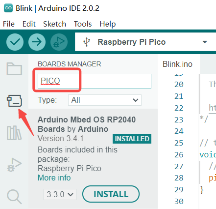

## Arduino 下载与安装

Arduino IDE 下载地址：https://www.arduino.cc/en/software

选择与操作系统对应的版本下载，按照安装提示逐步安装。

## 安装RP2040开发板支持包

以Arduino IDE 2.0.2为例，在Boards Manager的搜索栏中输入`PICO`或`RP2040`，选择`Arduino Mbed OS RP2040 Boards`，单击`Install`安装RP2040开发板支持包，默认安装最新版本即可。



## 设置板型

在上方选项栏中依次点选 Tools > Boards > Arduino Mbed OS RP2040 Boards > Raspberry Pico。


## 连接开发板

初次在BPI-Pico-RP2040开发板上使用Arduino，需要手动让开发板进入一次UF2 Bootloader模式，后续通常可免除此步骤。

确保有一根type-c数据线，一端连接到PC，拿起开发板，保持上面无任何连线或外围硬件，按住Boot按钮，将type-c数据线与开发板连接，松开Boot按钮，PC的系统中将出现一个名为RPI-RP2的新磁盘。

## 点亮LED
在上方选项栏中依次点选 File > Examples > 01.Basics > Blink , 打开 Blink 例程，


或直接在代码编辑区输入以下代码。

```c
void setup() {
  // initialize digital pin LED_BUILTIN as an output.
  pinMode(LED_BUILTIN, OUTPUT);
}

// the loop function runs over and over again forever
void loop() {
  digitalWrite(LED_BUILTIN, HIGH);  // turn the LED on (HIGH is the voltage level)
  delay(1000);                      // wait for a second
  digitalWrite(LED_BUILTIN, LOW);   // turn the LED off by making the voltage LOW
  delay(1000);                      // wait for a second
}

```

点击 `Upload` 按钮，程序将在编译完成后上传至开发板，板载LED将间隔1秒闪烁。