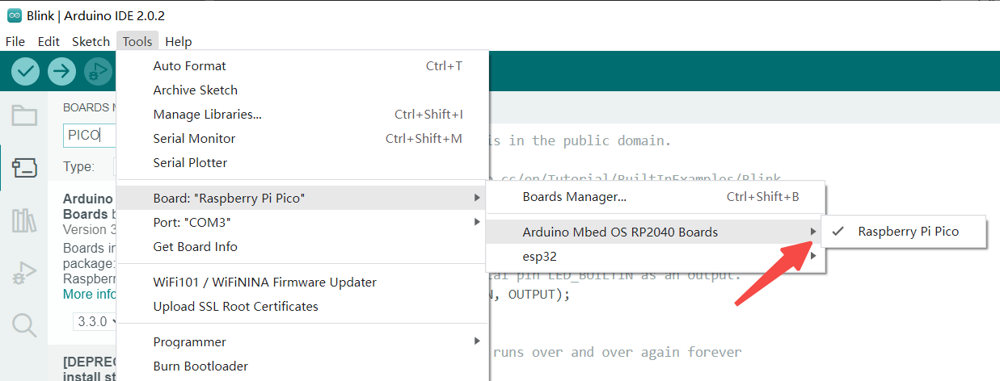

## Arduino 下載與安裝

Arduino IDE 下載地址：https://www.arduino.cc/en/software

選擇與操作系統對應的版本下載，按照安裝提示逐步安裝。

## 安裝RP2040開發板支持包

以Arduino IDE 2.0.2為例，在Boards Manager的搜索欄中輸入`PICO`或`RP2040`，選擇`Arduino Mbed OS RP2040 Boards`，單擊`Install`安裝RP2040開發板支持包，默認安裝最新版本即可。


## 設置板型

在上方選項欄中依次點選 Tools > Boards > Arduino Mbed OS RP2040 Boards > Raspberry Pico。



## 連接開發板

初次在BPI-Pico-RP2040開發板上使用Arduino，需要手動讓開發板進入一次UF2 Bootloader模式，後續通常可免除此步驟。

確保有一根type-c數據線，一端連接到PC，拿起開發板，保持上面無任何連線或外圍硬件，按住Boot按鈕，將type-c數據線與開發板連接，鬆開Boot按鈕，PC的系統中將出現一個名為RPI-RP2的新磁盤。

## 點亮LED
在上方選項欄中依次點選 File > Examples > 01.Basics > Blink , 打開 Blink 例程，


或直接在代碼編輯區輸入以下代碼。

```c
void setup() {
  // initialize digital pin LED_BUILTIN as an output.
  pinMode(LED_BUILTIN, OUTPUT);
}

// the loop function runs over and over again forever
void loop() {
  digitalWrite(LED_BUILTIN, HIGH);  // turn the LED on (HIGH is the voltage level)
  delay(1000);                      // wait for a second
  digitalWrite(LED_BUILTIN, LOW);   // turn the LED off by making the voltage LOW
  delay(1000);                      // wait for a second
}

```

點擊 `Upload` 按鈕，程序將在編譯完成後上傳至開發板，板載LED將間隔1秒閃爍。