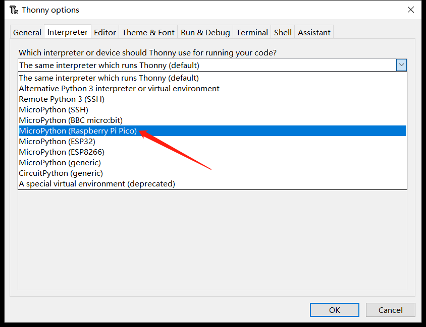

## MicroPython 固件下載與燒錄

在[MicroPython官網](https://micropython.org/)可以找到支持RP2040芯片的固件，BPI-Pico-RP2040完全兼容Raspberry Pi Pico的固件: https://micropython.org/download/rp2-pico/

點擊連接進入頁面後即可在下方看到幾列固件下載地址，推薦選擇下載Releases欄的第一項，兼顧穩定性與新功能特性，後續例程基於v1.19.1固件編寫。


Nightly builds 欄所提供的固件為每日構建，將擁有最新的功能特性，但穩定性可能稍差，且可能尚沒有對應最新功能的使用文檔。

下載完成後將得到一個 .uf2 擴展名的文件，將其燒錄到BPI-Pico-RP2040開發板的方式非常簡單，先確保有一根type-c數據線，一端連接到PC，拿起開發板，保持上面無任何連線或外圍硬件，按住Boot按鈕，將type-c數據線與開發板連接，鬆開Boot按鈕，PC的系統中將出現一個名為RPI-RP2的新磁盤，將.uf2文件複製到此盤中，複製完成後開發板將自動復位，進入 MicroPython 模式。

## 安裝Thonny IDE 

以Windows為例，點擊連接下載 [thonny-3.3.13.zip](../assets/images/thonny-3.3.13.zip)，解壓後得到`thonny-3.3.13.exe`。

運行`thonny-3.3.13.exe`，按照安裝提示逐步操作即可順利完成安裝 。

也可通過pip安裝，`pip install thonny==3.3.13`，需要具備[Python](https://www.python.org/)環境，適用於macOS或Linux。

## 建立開發板與Thonny的連接

連接開發板與電腦。

運行Thonny，點擊 Run > Select interpreter 。


選擇 MicroPython(Raspberry Pi Pico) 。


選擇開發板所在的串行接口，點擊OK確認設置。


勾選 View > Files 即可打開文件管理欄。


## 使用REPL輸出Hello World

**REPL**即**Read-Eval-Print-Loop**的縮寫名詞，譯為 **讀取-求值-輸出-循環**。

我們可以通過實際操作來明白它的意思。

將已經安裝了MicroPython固件的開發板連接電腦，運行Thonny IDE並正確配置後，在Shell窗口中將出現這樣的文本內容：

```
MicroPython v1.19.1 on 2022-06-18; Raspberry Pi Pico with RP2040
Type "help()" for more information.
>>> 
```

注意最後一行的`>>>`提示符，我們可以直接在這後面輸入算式或是代碼，按下鍵盤`enter`回車鍵就會立即在下一行得到輸出結果。

```python
>>> 1+2
3
>>> print("Hello World")
Hello World
>>> 
```

現在可以很直觀的理解了，它會讀取我們輸入的信息，執行運算求值，輸出結果，然後等待我們後續的輸入，一直循環這個過程，這也是**REPL**又被譯為**交互式解釋器**的原因，我們可以直接通過輸入代碼來和硬件交互，沒有像傳統的C語言那樣需要在中間執行編譯的過程，我們輸入的信息沒有經過編譯就傳輸給芯片自行解釋並運行了，這本就是Python語言的一大重要特性，MicroPython完美繼承了它。

如果僅僅是使用MicroPython REPL，很多具有串口信息收發功能的軟件都可以操作，感興趣的話可以試試各種串口工具，這可以令人更深刻的理解 “沒有中間執行編譯的過程” 的意思。

>關於REPL的應用，更詳盡全面的內容可以參考[MicroPython文檔：REPL](https://docs.micropython.org/en/latest/reference/repl.html)

## 代碼編輯器

Thonny IDE當然不僅僅可以進行REPL的操作，作為python代碼編輯器，本職功能還是有的。

新建一個文件並在其編輯區內輸入代碼。

```python
print(1+2)
print("Hello World")
```

完成代碼編輯後，點擊 **Save**，可以選擇將文件保存到開發板中，這將直接將整個文件傳輸到開發板的flash中。可將文件命名為`main.py`，設備會在每次上電或複位後執行它。


現在點擊 **Run current script** 運行，同樣是無需編譯的，在Shell中會立即得到結果。

```
3
Hello World
```

另外也可以嘗試REPL的鍵盤控制快捷鍵**ctrl+D**軟件復位，可以看到復位後程序立即執行並打印出信息。

## 點亮LED

BPI-Pico-RP2040上的板載LED連接到GPIO 25引腳，你可以在REPL上點亮它。當你看到REPL提示`>>>`時，請輸入以下代碼。
```python
>>> from machine import Pin
>>> led = Pin(25, Pin.OUT)
```
> `machine`模塊用於控制開發板上的硬件。這是所有MicroPython端口的標準配置，你可以在[MicroPython文檔：machine](https://docs.micropython.org/en/v1.19.1/library/machine.html)中了解更多有關它的信息。

輸入以下代碼LED將亮起。
```python
>>> led.value(1)
```

輸入以下代碼將熄滅LED。
```python
>>> led.value(0)
```

## 使用板載彩燈

BPI-Pico-RP2040上的板載 WS2812 彩燈連接到GPIO 3引腳，它僅需一個信號線即可控制，在REPL中輸入以下代碼。
```python
>>> from machine import Pin
>>> from neopixel import NeoPixel
>>> neo = NeoPixel(Pin(3), 1)
```
> `neopixel`模塊為 WS2812 彩燈提供驅動程序。你可以在[MicroPython文檔：neopixel](https://docs.micropython.org/en/v1.19.1/library/neopixel.html)中了解更多有關它的信息。
輸入以下代碼，彩燈將亮起紅色。
```python
>>> neo[0] = (25,0,0)
>>> neo.write()
```
`neo[0] = (25,0,0)`設定第一顆彩燈的顏色。

WS2812 彩燈內有三顆純色LED，它們的顏色分別是紅，綠，藍，`(25,0,0)`元組中的元素依次對應控制它們的亮度，數值範圍 0 ~ 255， 元素的數值越大，它所控制的純色LED就越亮。
建議將元素的數值控制在50以下，數值過高時近距離直視會刺眼。

`neo.write()`執行後，芯片會將控制信號傳輸給這顆板載的 WS2812 彩燈。

你可以嘗試自行修改元組中的數據，控制彩燈的顏色，例如繼續在REPL中輸入以下代碼，使彩燈亮白色。
```python
>>> neo[0] = (25,25,25)
>>> neo.write()
```