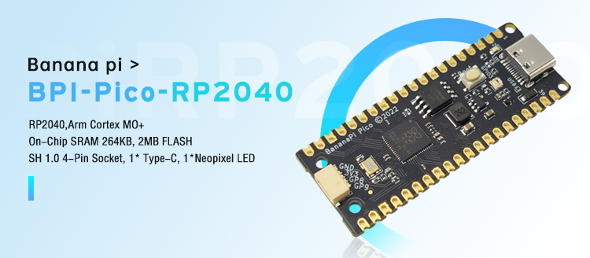

# 【 BPI-Pico-RP2040 開發板 】

## 介紹

香蕉派Pico系列是專為物聯網設計的低功耗微控制器開發板。

BPI-Pico-RP2040 是 Banana Pi 推出的一款搭載RP2040芯片的微控制器開發板，其最顯著的特性是，在盡量保留Raspberry Pi Pico的功能，外形尺寸，引腳佈局的前提下，增加一顆板載 WS2812 彩色LED；將 3-Pin DEBUG 接口替換為一個SH 1mm 4-Pin 插座，可與 Qwiic & STEMMA QT 或任何可能的外設連接；將micro-USB插座替換為USB Type-C插座，支持正反插，與絕大多數現代智能手機的USB Type-C線通用，無需額外購買。

跳轉到 [開箱 BPI-Pico-RP2040 開發板](Unboxing/Introduction.md) 頁面查看詳情。

## 使用 MicroPython 編程

MicroPython實現了大部分Python 3 特性和語法，易學易上手，驗證程序效果無需編譯直接下載進芯片運行。

無論是否有編程基礎，MicroPython的上手難度絕對遠低於其他編程語言，其代碼易讀性高，且開源社區有多年積累的豐富資源，就如同Python一樣擁有極強的生命力與應用價值。

通過燒寫 MicroPython 固件，就可以在開發板中使用 Python 語言進行編程。

## 使用 Arduino 編程

提供了入門 Arduino 的軟件工具和最佳示例，降低進入 ESP32 嵌入式專業開發的門檻。

>Arduino 將不會闡述過多基礎內容，請具備 C/C++ 的語言開發基礎。

## 參考資源

- [BPI-Pico-RP2040 官方 WIKI](https://wiki.banana-pi.org/BPI-Pico-RP2040_%E5%BC%80%E5%8F%91%E6%9D%BF) 

- [GitHub: BPI-Pico-RP2040 開發板原理圖PDF](https://github.com/BPI-STEAM/BPI-Pico-RP2040-Doc/blob/main/BPI-Pico-RP2040-V0.2-SCH.pdf) 

- [rp2040-datasheet.pdf](https://datasheets.raspberrypi.com/rp2040/rp2040-datasheet.pdf)

- [rp2040-product-brief.pdf](https://datasheets.raspberrypi.com/rp2040/rp2040-product-brief.pdf)

## 樣品購買

- [官方速賣通]()

- [官方淘寶]()

- OEM&OEM 定制服務 ： sales@banana-pi.com