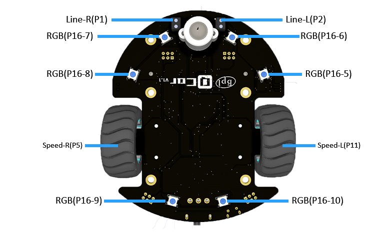

# 硬件介绍

## 产品标配清单

1. 小车本体×1（出厂已安装好电机，车轮，支撑轮）
2. 超声波模块×1

## 硬件参数

* 供电电压：3.6V~3.7V DC(3.6V~3.7V锂电池)
* 红外巡线传感器(高低电平)×2 (P1 P2)
* 蜂鸣器×1 (P0)
* 红外发射×1 (P8)
* 红外接收(NEC编码)×1 (P15)
* RGB氛围灯（全彩1600万色）×10 (P16)
* SR04、SR04P超声波接口(5V)×1 (Trig:P12 Echo:P14)
* I2C接口(3.3V/5V切换）×1
* 舵机专用接口 ×4 (S5 S6 S7 S8)
* IO扩展口 ×2 (P3 P4 P9 P10)
* N20金属减速电机×2 (S5 S6 S7 S8)
* 电机减速比：1：100
* 电机最大转速：133转/分
* 电机驱动方式：PWM电机驱动
* 保护盖及扩展M3螺丝孔×6
* 编程方式：makecode图形化编程、Mind+图形化编程（Webduino）、MicroPython编程
* 产品尺寸：宽9.77mm×长12.09mm×高1.23mm（不含micro:bit主板高度）
* 产品重量：125.5g（不含micro:bit主板及周边配件）

## 硬件接口示意

## 功能引脚定义
| Function | Web:Bit GPIO |
| :----: | :----: |
| IR-Receive | P15 |
| IR-Emission | P8 |
| RGB | P16 |
| I2C | (Address:0x40) |
| Wheel(Left) | I2C(LED0 LED1) |
| Wheel(Right) | I2C(LED2 LED3) |
| Line Following(Left) | P2 |
| Line Following(Right) | P1 |
| Speed Detection(Left) | P11 |
| Speed Detection(Right) | P5 |

<!-- ## 原理图 -->

