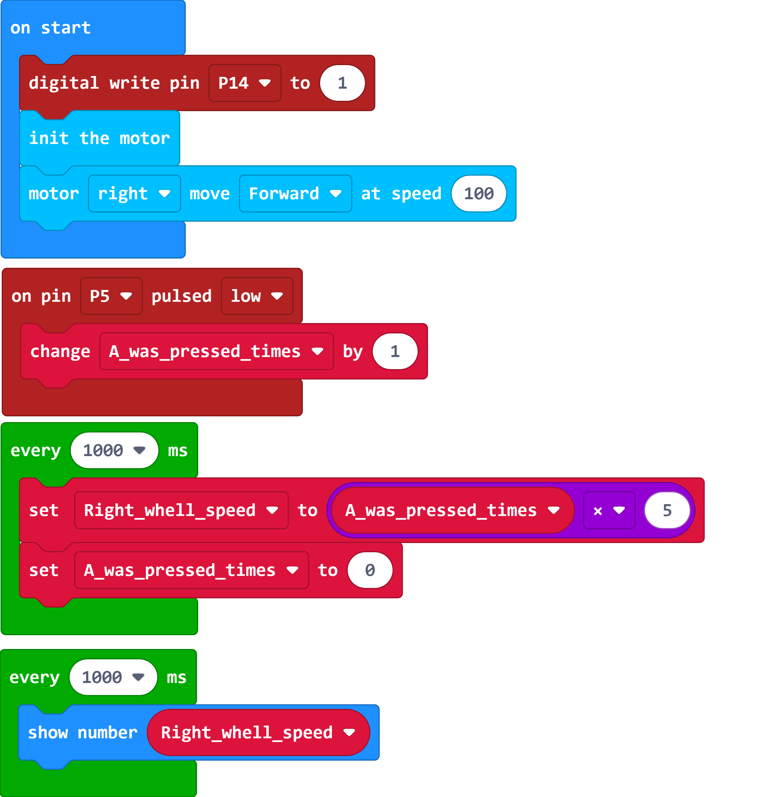

# 利用光电计数器进行转速测量

## RPM转速的定义

每分钟转速，或称之每分钟回转数，英文RPM，全写是Revolution(s) Per Minute，是转动性物体在转动速度上的一种衡量单位，所指的是一个物体在一分钟内的旋转圈数，一圈即是指一次的绕周转动，若以数学上的角度单位来衡量即是转动了360度。

## 推理与设计

现在我们有几个可以明确采集到的条件：

1. 12线编码轮，12道凹槽，12道凸块。
2. 编码轮与红外对管相对处，由凸转凹时，光电计数器程序的计数值加1，车轮带动编码轮向某一方向持续旋转一周，计数值加12。
3. RPM转速为一个物体在一分钟内的旋转圈数。

通过这些已知条件，RPM转速值可以这么计算出来：

**一分钟总计数值 ÷ 12 = RPM**

这个方程式中的 RPM 单位时间是 **旋转圈数/每分钟** ，也可以是 **旋转圈数/每60秒** 。

那么方程式也可以换成这样的：

**60秒总计数值 ÷ 12 = RPM**

这个方程式可以明确，采集60秒的计数值即可算出RPM，如果我们想尽快算出转速值呢？

试试仅采集5秒的计数值，为了保持等式依旧成立，即需要这么做：

**(5秒总计数值 × 12) ÷ 12 = RPM**

**5秒总计数值 = RPM**

采集5秒的总计数值恰好等于 RPM数值，若是仅采集1秒呢？

**1秒总计数值  × 5 = RPM**

至此我们对如何着手设计程序就会很明了了，仅需在光电计数器程序的基础上改进即可。

### 例程1

[在Github上的例程项目文件](https://github.com/Wind-stormger/Makecode/blob/master/microbit-RPM_measurement_1-2.hex)

> 项目文件下载到本地后可导入MakeCode中查看和再编辑，也可直接通过USB烧录到Micro:Bit中运行。

### 设计说明

在程序开始时使用扩展积木初始化PCA9685芯片，使右轮电机全速运行。

every 1000ms 积木即间隔1S执行一次，设置一个变量将计数值通过计算后算出的转速储存起来以便显示，再使计数值清零。

## 换向推理

前文中方程式：

**60秒总计数值 ÷ 12 = RPM**

这其中 **总计数值** 是一个变量，具体多少需要采集60秒钟的计数值才可得知，而时间是我们人为设置且确定的数值。

假设我们将变量设为时间呢？例如我们人为设置一个计数值 24 ，即旋转 2 圈，而从0一直计数到24所需要花费的时间，则设为变量。我们再一次确定 RPM 为单位时间60秒内物体旋转的圈数，那么将有以下方程式：

**计数到24所需要花费的时间 ÷ (24 ÷ 12) = 60秒 ÷ RPM**

等式左边是为了计算出 这段时间内平均每旋转一圈所需要的时间，而等式右边则是为了计算出在这个转速每旋转一圈所需要的时间，等式左右所计算出的时间一定相等。

将方程式转化：

**RPM = 60秒 ÷ (计数到24所需要花费的时间 ÷ (24 ÷ 12))**

**RPM = 60秒 ÷ (计数到24所需要花费的时间 ÷ 2)**

**RPM = 60秒 ÷ 计数到24所需要花费的时间 × 2**

**RPM = 120秒 ÷ 计数到24所需要花费的时间**

此时若改变计数值，即计数到12，那么方程式将如下：

**RPM = 60秒 ÷ 计数到12所需要花费的时间**

依据此方程式，我们需要在程序中添加能采集到时间的积木才可实现功能，即需要采集到计数值为0时的开始时间，和计数值达到12时的结束时间。

### 例程2 

[在Github上的例程项目文件](https://github.com/Wind-stormger/Makecode/blob/master/microbit-RPM_measurement_2-2.hex)

> 项目文件下载到本地后可导入MakeCode中查看和再编辑，也可直接通过USB烧录到Micro:Bit中运行。

### 设计说明

running time(ms) 积木将会获取从程序启动以来至读取这个积木为止的时间，单位为毫秒。

设计一个变量储存计数值为0时的开始时间，而在计数值达到12时，用在那一刻由running time(ms) 积木获取的时间减去变量储存的开始时间，即可得到计数到12所需要花费的时间。

round 积木使计算值化为整数以便显示。

## 总结与发散性思考

我们会发现例程2的程序所算得的RPM转速值比例程1的程序所算得的精度更高一些，如果不进行取整，还能有更高的精度。

这样的差异来源于我们设计所要采集的自变量的信息精度不同。

因为编码盘仅有12线，例程1中每1秒所采集的次数都可能因为凹槽与凸块存在实际物理间距而产生误差，最小精度也就仅局限在 5 ，计算的数值都是 5 的倍数。

而例程2采集的自变量信息为时间，其精度受限于micro:bit的时钟精度，但也能做到1ms，这样相对于我们最终计算的RPM的单位 分钟（min）则已经相当精准了，所以这样设计出的程序所能计算出的结果自然有更高的精度。

但我们的程序还有完善的空间，例如万一中途停转，而计数值仍旧卡在0-12中间，那么上一次存储的开始时间就会一直得不到清零，经过很长时间，再到下一次电机开始运行，这样的问题会导致这个时候的第一圈所算得的转速有极大的错误，该如何改善？

除了 **转速** 这一个物理量以外，还有一个很重要的 **加速度** ，又该如何设计程序？