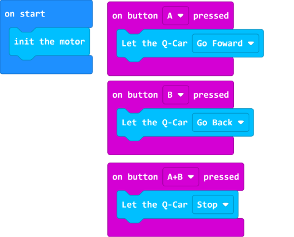

# 用microbit按钮控制电机

## 例程

[在Github上的例程项目文件](https://github.com/Wind-stormger/Makecode/blob/master/microbit-Qcar-demo-button_control-1.hex)

> 项目文件下载到本地后可导入MakeCode中查看和再编辑，也可直接通过USB烧录到Micro:Bit中运行。

## 设计说明

1. 按下A按钮，Q-Car向前行驶。
2. 按下B按钮，Q-Car向后行驶。
3. 同时按下AB按钮，Q-Car停车。

在 on start 积木中加入的 init the motor 积木是用于初始化控制两个电机的PCA9685 芯片，这将在后续文中提到。