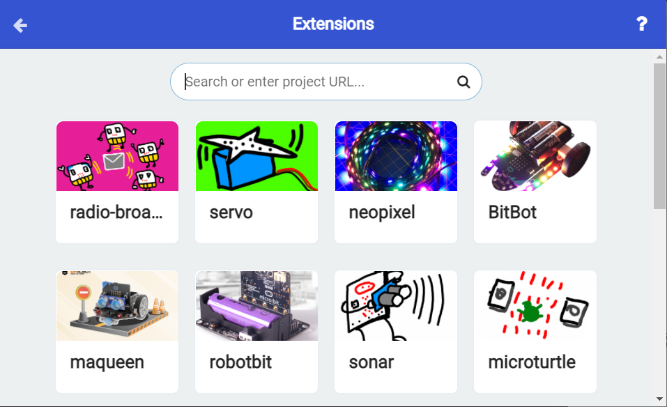

# 导入扩展积木

1.在MakeCode编辑器中，点击网页右上角的齿轮图标，点击 Extensions 扩展。

2.进入一个检索各式各样的扩展积木的页面。

3.在上方搜索栏中输入此链接：`https://github.com/Q-car/Qcar-pxt` 即可看到专用于 Q-Car 的扩展积木。

4.点击即可添加进项目中，在MakeCode编辑器的积木列表里即可看到几块扩展积木。

