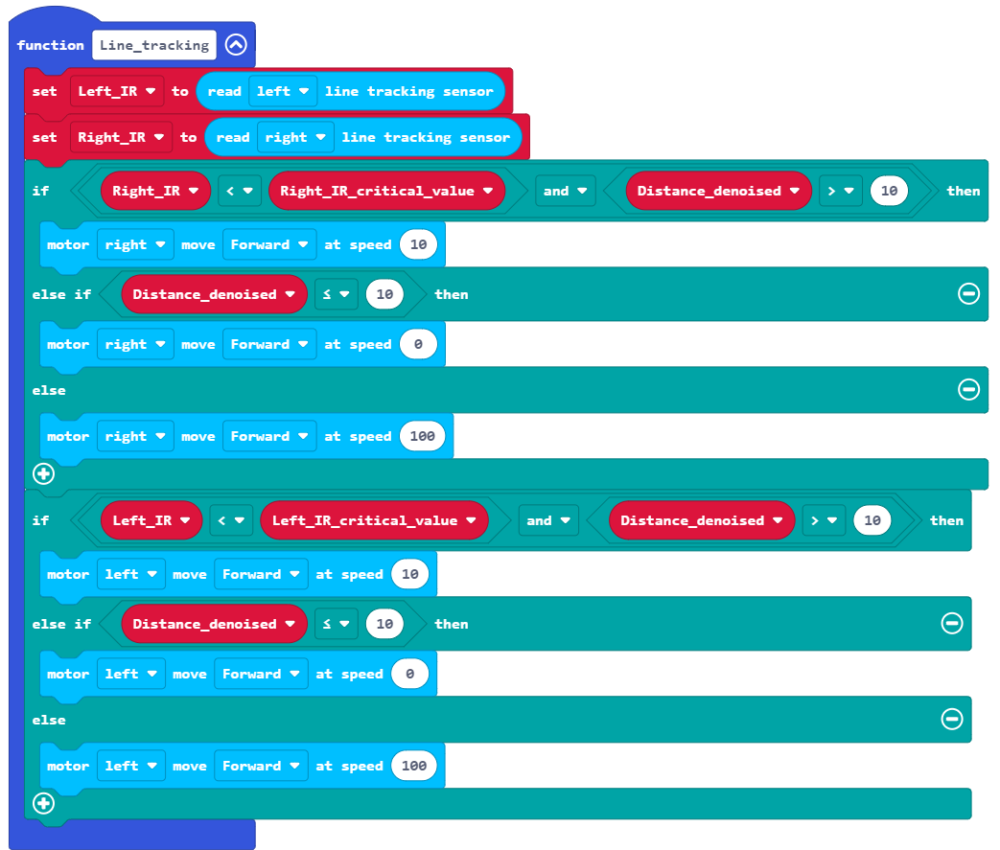
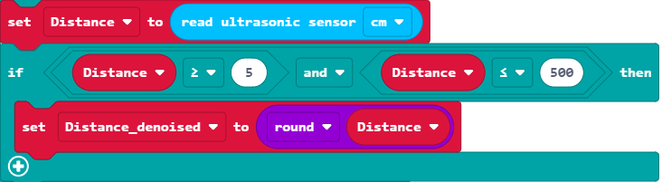

# 巡线行驶（综合应用）

## 红外对管与白纸上的黑色线路

在Q-Car前轮左右侧各有一个 ITR20001/T24 红外对管。

关于红外对管的特性，在前文“设计光电计数器”章节中已经提到过，红外对管一侧发射红外光，一侧接收红外光，接收端将反射回的光线强弱的信息转化为电压高低的信号。

除了利用编码盘的凸块与凹槽相对红外对管距离的不同来改变电压，也可以利用不同颜色或材质的物体表面对红外光反射率的不同来改变电压。

例如，一张纯白色的纸，其红外光反射率相对较高，用纯黑色油墨印刷上一条黑线，这条黑线的红外光反射率则相对白纸而言较低了。

利用这样的关系，我们可以通过不断收集两个红外对管的电压高低信息来判断Q-Car相对线路偏左还是偏右，进而不断修正方向达到巡线行驶的目的。

> 关于红外光反射率绝非肉眼在可见光谱中看见的颜色深浅能简单决定的，更深入的相关学科知识可以继续参考[维基百科：吸收光谱学](https://zh.wikipedia.org/wiki/%E5%90%B8%E6%94%B6%E5%85%89%E8%B0%B1%E5%AD%A6)中的内容或是其他相关的文献资料。

## 简单的控制Q-Car巡线

micro:bit对引脚上电压模拟量的分辨率为10比特，即1024级，对应电压0~3.3v。假设检测电压为 x (0≤x≤3.3)，则micro:bit读取到的模拟量数值为：

f(x) = x ÷ 3.3 × 1024

在黑色线路上方，micro:bit从红外对管读取到的模拟量数值将低于在白色路面上方的数值。

为了实现巡线行驶，我们需要对控制逻辑进行简单分析。

1. 行驶方向偏左时，左侧红外对管在白色路面上方，右侧红外对管在黑色线路上方，需要控制左轮转速大于右轮转速，达到向右修正的目的。
2. 行驶方向偏右时，右侧红外对管在白色路面上方，左侧红外对管在黑色线路上方，需要控制右轮转速大于左轮转速，达到向左修正的目的。
3. 行驶方向与线路重合，左右侧红外对管都在白色路面上方，需要控制左右轮转速相等，保持直行。

### 例程1

[在Github上的例程项目文件](https://github.com/Wind-stormger/Makecode/blob/master/microbit-Q-car_Line_tracking_easy.hex)

> 项目文件下载到本地后可导入MakeCode中查看和再编辑，也可直接通过USB烧录到Micro:Bit中运行。

#### 设计说明

1. 程序开始运行时需要首先进行初始化电机控制，设置红外对管为启动状态。
2. 例程中设置 700 为参考数值，以此判断红外对管此时是否在黑色线路上方。
3. 将从两个红外对管采集到的模拟量数值分别进行if判断，右侧的数值小于700则使右电机停转，else为上述条件以外的情况，此处即为右侧的数值大于或等于700时，使右电机全速正转；左侧的数值判断同理。

## 综合应用

### 设计自动校准程序

在例程1中，直接人为给定了一个模拟量数值 700，当检测到红外对管的电压模拟量小于此数值时判断此时在黑色线路上方。

但在实际应用中，最终决定此数值的是物体表面的红外光反射率，即使是肉眼看起来都是白色的纸，不同原材料制成的，甚至是不同的粗糙程度，其红外光反射率都可能有较大差异。

当然，肉眼看起来是黑色的也是如此，只是在日常常见的纸张和黑色油墨中，被黑色油墨涂过的纸确实相对比没涂过的纸的反射率要低一些。

所以我们可以设计一套程序，自动校准例程1中用判断的模拟量数值，以适应不同的条件。

#### 设计说明

重复对两个红外对管模拟量采样20次，间隔100ms，各自累加并存储到对应的一个变量中，再除以20以求平均值，取此平均值的四分之三作为后续巡线程序的判断数值。

四分之三也是一个人为设定的数值，一方面我们判断巡线过程中，路面的红外光反射率变化不会使数值低于采样平均值的四分之三，另一方面则是判断黑色线路的红外光反射率变化不会使数值高于于采样平均值的四分之三。

### 将遇障停车加入程序

假如巡线路上被障碍物阻挡，而电机依旧在转动驱使撞向障碍物Q-Car，这不是我们愿意看到的，超声波测距模块的加入也正是为了解决这一问题。

#### 设计说明

当检测到前方物体距离小于等于10cm时将停车。

设计了相对比较保守的消噪策略，仅采纳5~500cm以内的数值，确保电机不会因噪声扰动而意外停车或是停车时意外启动。

### 设计限制措施以保障运行

在仅需要实现少数而简单的功能时，我们的程序并不需要太多限制措施，简简单单，通电即用。

当我们想在程序中实现多种功能时，我们不得不面对一些很少去思考的问题，什么功能的程序先执行？如果多个功能的程序一同循环执行，该如何安排优先度？如果需要在运行某些程序时锁定其他的程序使它们不执行，又该如何设计？

我们可以加入额外的判断条件来做限制，以安排程序执行的先后顺序。

例如在开始巡线行驶之前，我们想先执行完校准程序在开始巡线，且限制一定要先完成这个功能，就可以设计一个变量和一个while循环，变量初始值设为False，以变量值为False作为此while循环的条件，在判断校准完成后使此变量值设为True，即可退出此循环执行巡线行驶的程序了。

而多个功能的程序一同循环执行（俗称**多工**），则可以通过定时器来设置优先级，优先度高的循环执行间隔时间短，优先度低的循环执行间隔时间长，这样可以有效分配处理器的运算资源，保证了高时效性的程序的运算资源需求。

### 例程2

[在Github上的例程项目文件](https://github.com/Wind-stormger/Makecode/blob/master/microbit-Q-car_Line_tracking.hex)

> 项目文件下载到本地后可导入MakeCode中查看和再编辑，也可直接通过USB烧录到Micro:Bit中运行。

#### 设计说明

加入了按键控制。开机运行后，当A按钮被按下且判断未完成校准时，执行自动校准程序，执行完成后使IR_corrected变量值设为为True，再按A按钮则不会重复执行自动校准程序，而这之后再按下B按钮，将使Start_tracking变量值设为True，退出此while循环。

三个Every [ ]ms事件处理程序内都有if判断，当Start_tracking变量值为True时才会循环执行内部的程序。而巡线程序的循环时间为1ms，超声波测距程序的循环时间为100ms，串口输出信息程序的循环时间为1000ms，优先级十分明了。