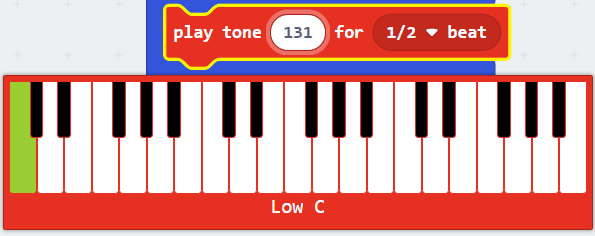

# 编曲并用蜂鸣器播放

## 音乐积木

在MakeCode编辑器中，除了能使蜂鸣器播放预设乐曲的音乐积木外，还有能进行简单编曲的积木可供使用，能模拟36键电子琴。

## 简谱入门

下表为简谱中数字对应的音阶与唱名。

<table>
<tbody>
  <tr>
    <th>音阶</th>
    <td>C</td>
    <td>D</td>
    <td>E</td>
    <td>F</td>
    <td>G</td>
    <td>A</td>
    <td>B</td>
  </tr>
  <tr>
    <th>唱名</th>
    <td>do</td>
    <td>re</td>
    <td>mi</td>
    <td>fa</td>
    <td>sol</td>
    <td>la</td>
    <td>Si</td>
  </tr>
  <tr>
    <th>数字</th>
    <td>1</td>
    <td>2</td>
    <td>3</td>
    <td>4</td>
    <td>5</td>
    <td>6</td>
    <td>7</td>
  </tr>
</tbody>
</table>

如果是高一个八度，就会在数字上方加上一点。如果是低一个八度，就会数字下方加上一点。在中间的那一个八度就什么也不用加。这三个八度对应音乐积木中的三个八度，即从低C 音阶(Low C)到 高B 音阶(High B)。

通常只有数字的是四分音符。数字下加一条横线，就可令四分音符的长度减半，即成为八分音符；两条横线可令八分音符的长度减半，即成为十六分音符，以此类推；简单来说，下加横线数目与五线谱的符尾数目相对应。数字后方的横线延长音符，每加一条横线延长一个四分音符的长度。

全音符占4个节拍，二分音符占2个节拍，四分音符占1个节拍，八分音符占1/2个节拍,十六分音符占1/4个节拍，依此类推。

> 可以继续参考[维基百科：简谱](https://zh.wikipedia.org/wiki/%E7%B0%A1%E8%AD%9C)，或者检索其他相关的文献资料。

## 将一小段简谱编排到程序中

这是一首曲名为《Weight of the World》的简谱的前奏。[曲谱原始链接](http://www.qupu123.com/puyou/jipu/p289352.html)

以第一个简谱音符为例，6指 A音阶，数字下方有一点，即指 低一个八度的 低A音阶(Low A)，数字下加了一条横线，即为八分音符，占1/2个节拍。

用积木表示即为：

## 例程

[在Github上的例程项目文件](https://github.com/Wind-stormger/Makecode/blob/master/microbit-Q-car_Music_Arrangement.hex)

> 项目文件下载到本地后可导入MakeCode中查看和再编辑，也可直接通过USB烧录到Micro:Bit中运行。

## 设计说明

function 函数内的积木会在调用call function积木时执行，可以给这个函数自定义命名，方便人的使用与理解。更多用法及其作用会在后续文中提到。

set tempo to(bpm) 积木用于设置节拍，调节整体节奏快慢，这里设置的 80 来源于原曲谱所示的节拍速度。

按一次A按钮，即可循环播放两次，会从Q-Car的蜂鸣器中发出有很足的电子游戏音乐风格的乐声。

可以依照此法将任何你想听的曲子转录到程序中。

