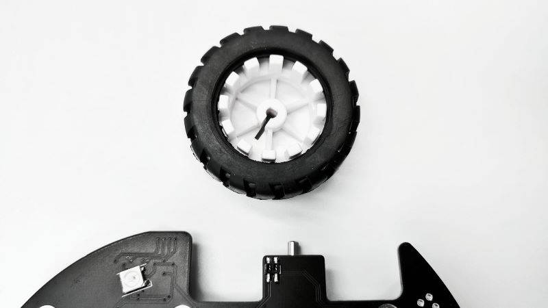
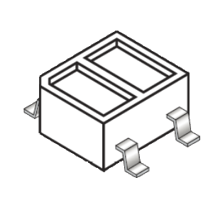
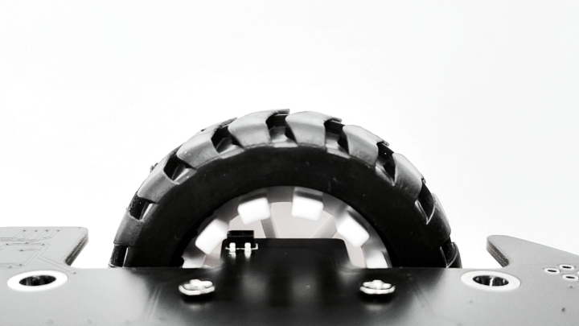
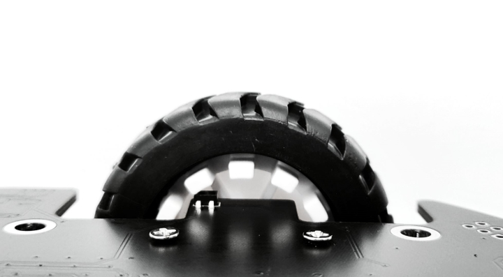
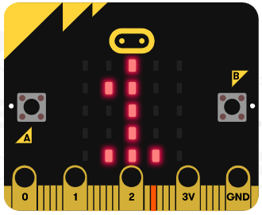

# 设计光电计数器

## 红外对管与编码盘

在Q-Car上有一对D字轴橡胶车轮，各带有12线编码盘，在电路板底部紧贴编码盘的位置放置了红外对管。

红外对管一侧发射红外光，一侧接收红外光，接收端将反射回的光线强弱的信息转化为电压高低的信号。

## 光电开关

micro:bit的P11引脚为高电平时Q-Car上的红外对管才会通电工作。

与右车轮的编码盘紧贴的红外对管与micro:bit的P5引脚相连，而左车轮的编码盘紧贴的红外对管与micro:bit的P11引脚相连。

以右轮为例，可以制作一个测试程序，检测右轮编码盘对应的红外对管向P5引脚输出的高低电平信号，例程如下图。

[在Github上的例程项目文件](https://github.com/Wind-stormger/Makecode/blob/master/microbit-Photoelectric_switch_test.hex)

> 项目文件下载到本地后可导入MakeCode中查看和再编辑，也可直接通过USB烧录到Micro:Bit中运行。

将程序下载进micro:bit，然后保持USB串口连接，将micro:bit插入Q-Car的插槽，旋转右轮使编码盘的凹槽对向红外对管，此时micro:bit显示0，即表明此时红外对管输出给P5引脚的是低电平信号。

旋转右轮使编码盘的凸块对向红外对管，此时micro:bit显示1，即表明此时红外对管输出给P5引脚的是高电平信号。

凸块因为距离近所以使红外反射增强，凹槽因为距离远所以使红外反射减弱，这犹如一个物理开关的接通与关断两个状态，编码盘与红外对管的组合，构成了一套光电开关。

## 用光电开关来制作计数器

从光电开关的特性来看，每当检测到从高电平变为低电平，或者从低电平变为高电平的时候，在程序里使一个变量加1，即为一个计数器了。

[在Github上的例程项目文件](https://github.com/Wind-stormger/Makecode/blob/master/microbit-Photoelectric_counter2.hex)

> 项目文件下载到本地后可导入MakeCode中查看和再编辑，也可直接通过USB烧录到Micro:Bit中运行。

on pin P5 pulsed low 积木在检测到P5引脚从高电平变为低电平时会触发执行内部的积木，即使变量自加1。

every 1000 ms积木每过1000ms就执行一次内部的积木，即显示一次计数值。