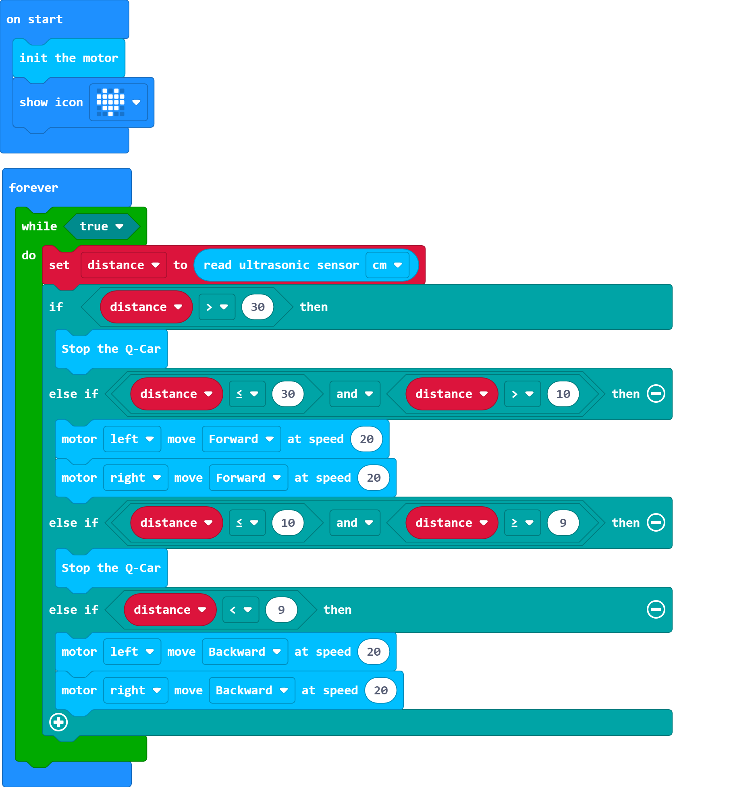

# 利用超声波测距使Q-Car自动保持距离

## 自动控制

自动控制是相对人工控制这一概念而言的，例如为了保持车与物体之间的间距，人眼在看到车与物体的间距小于一个范围时，需要手动控制车后退拉开距离，

接收到"车与物体的间距小于一个范围"这个信息的是人，对收集的信息产生需要如何控制的想法的是人，最后去控制车改变状态的也是人，即是人工控制。

相对的，让设备例如超声波测距传感器接收信息，将信息转化为电讯号传递给处理器，处理器按照既定的程序将与收集到的信息对应该发出的控制信号发给电机驱动模块，

进而改变车的状态使车后退拉开距离，人除了编程和启动这套控制系统以外，再不参与接收信息并反馈控制，这套控制系统即为自动控制系统。

## 例程

[在Github上的例程项目文件](https://github.com/Wind-stormger/Makecode/blob/master/microbit-Qcar-demo_ultrasonic1.hex)

> 项目文件下载到本地后可导入MakeCode中查看和再编辑，也可直接通过USB烧录到Micro:Bit中运行。

## 设计说明

在循环中最开始读取一次超声波测距的数值并赋值给一个变量，然后进行关于这个变量的判断：

1. 大于30cm停车
2. 小于等于30cm且大于10cm则以20%转速前进
3. 小于等于10cm且大于等于9cm则停车
4. 小于9cm则以20%转速后退

这有些类似于“自动倒车系统”。