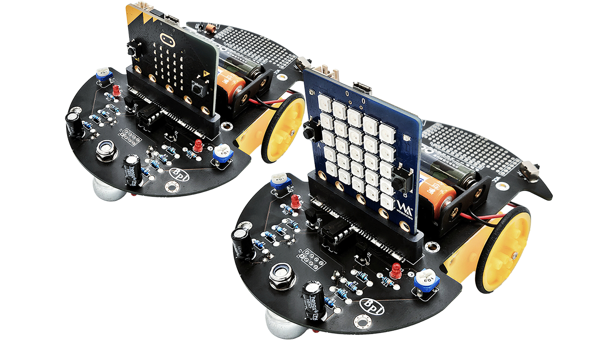

# Triode-Car
The Banana Pi BPI-TriodeCar is a product designed for education on entry-level engineering. Supporting both the BBC Micro:bit and Web:bit(BPI:bit), the TrideCar can also be equipped with peripherals such as, buzzer, and ultrasonic sensor.

## Key Features

*Two switchable modes: a comparator(LM393) or with Micro:bit/ Web:bit.

*Supports MakeCode, Webduino Blockly, and MicroPython programming.

*Provides soldering area for more peripherals extension.
*I2C Connector(3.3V) onboard.

*Screwholes for LEGO blocks extension.

*Line Tracking.